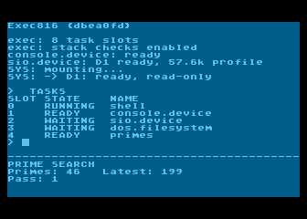
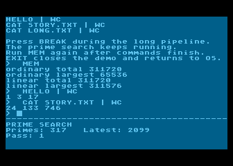
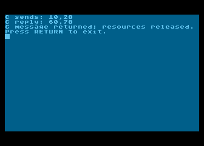
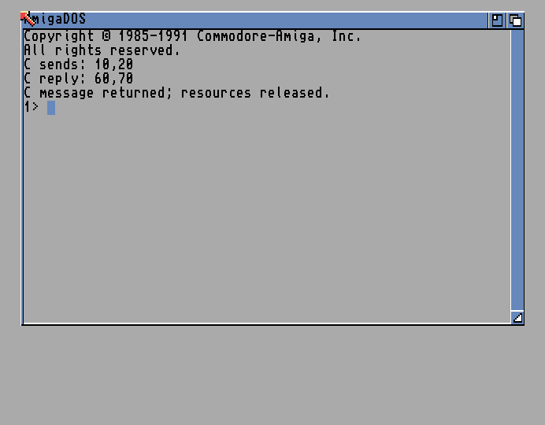

# Exec816

Exec816 is a small Amiga Exec-inspired multitasking system for the WDC 65C816,
written mainly in Action!. It provides Tasks, signals, message ports, memory
allocation and asynchronous device I/O, with DOS, filesystems and a shell built
on those services.

The current target is the dedicated AltirraOS 65816 ROM under a pinned AltirraSDL
configuration. This is a development system; supported profiles and validation
limits are recorded with each build.



Just after boot, `TASKS` lists the running tasks while the startup messages
are still visible.

The demo boots through OF816 into a text shell while a second program searches
for primes. It includes disk-loaded commands, two-command pipes, read-only
MyDOS and SpartaDOS, a shared sector cache and `SYS:` paths.

## Installation

Download [exec816-demo.zip](https://github.com/mkur/exec816/releases/download/v0.1.0-preview.1/exec816-demo.zip)
from the [Releases page](https://github.com/mkur/exec816/releases). Extract the
ZIP; the `exec816-demo/` folder contains:

| File | Purpose |
| --- | --- |
| `Exec-of816.xex` | Exec816 and the OF816 boot monitor |
| `system.atr` | System disk with commands and sample files |
| `altirraos-816.rom` | Matching AltirraOS 3.44 ROM for 65C816 |
| `README.txt`, license notices and `SHA256SUMS` | Boot instructions, licenses and checksums |

Use [AltirraSDL](https://github.com/ilmenit/AltirraSDL) with these settings.
Upstream Altirra will not run this build. The exact tested emulator build is
recorded in the [platform pin](toolchain/altirra-shell-paced.json).

| Setting | Value |
| --- | --- |
| Machine | Atari 800XL |
| CPU | Native 65C816, 8× speed |
| Memory | 64 KiB base RAM plus 15 high banks |
| Video | PAL |
| OS firmware | The included `altirraos-816.rom` |
| BASIC | Disabled |
| ROM shadowing | Enabled |
| D1 drive emulation | Generic + 57600 baud |
| SIO patch and burst I/O | Disabled |

1. Mount the extracted `system.atr` in **D1**.
2. Disable **Unload disks when booting new image** in the emulator.
3. Cold-boot `Exec-of816.xex`, keeping the disk mounted. The ATR is the data
   disk; the XEX starts the system.
4. Wait five seconds for OF816 to start Exec816. To enter the Forth monitor,
   press a key during the countdown; type `EXEC816` to continue booting.

Wait for `SYS: -> D1: ready, read-only` and the `>` prompt. The lower part of
the screen should already be searching for primes. Run these commands in order;
`TASKS` comes first to keep the boot messages visible in the first screenshot:

```text
TASKS
MOUNT
CD SYS:
DIR
HELLO
TYPE README.TXT
MEM
HELLO | WC
CAT STORY.TXT | WC
```

After the commands above, both pipeline results are visible while the prime
search continues:



`HELLO | WC` prints `1 3 17`: lines, words and bytes. Press **BREAK** to cancel
a running command, or enter `EXIT` to stop the demo and restore the OS screen.
Disk access is read-only; keep the same disk mounted until reset. If the system
disk fails to mount, check D1 and its SIO settings, then cold-boot again.

See the [demo guide](docs/guides/demo.md) for the full walkthrough and the
[boot monitor guide](docs/guides/boot-monitor.md) for system-drive and cache settings.

## The same C example on Exec816 and Amiga

The standalone [messages.c](c/examples/messages.c) example compiles from the
same source for Exec816 with Calypsi and for classic AmigaOS with vbcc. It uses
the familiar Exec calls and headers, with no platform conditionals in the example.

The main task creates a worker with `CreateTask` and sends it a message containing
`10,20`. The worker adds 50 to each value and replies with the same message:

```c
WaitPort(port);
request = (struct XYMessage *)GetMsg(port);
request->x += 50;
request->y += 50;
ReplyMsg(&request->message);
```

The main task receives `60,70`, releases its resources and prints through
AmigaDOS-style `Output()` and `Write()`. Signals coordinate worker startup and
completion. Exec816 supplies a small C binding to its native services.

Both screenshots show **one run of the same C source**:

<table>
  <tr>
    <th width="50%">Exec816 / Calypsi 65816</th>
    <th width="50%">AmigaOS / vbcc m68k</th>
  </tr>
  <tr>
    <td valign="top"></td>
    <td valign="top"></td>
  </tr>
</table>

The Amiga run uses FS-UAE with an A500+ and Kickstart 2.04. This demonstrates
source compatibility for the supported Exec and DOS calls; Amiga binaries and
the full AmigaOS API are outside the current scope.

Follow [One C example on Exec816 and classic Amiga](docs/guides/amiga-c.md) to
build and run both versions. The [Calypsi guide](docs/guides/calypsi-c.md) lists
the available C calls and binding details.

## Build from source (optional)

To build your own distribution, install the prerequisites and pinned compiler,
emulator bridge and ROM described in [Build from source](docs/contributing/building.md).
Then run from the repository root:

```sh
CARGO_INCREMENTAL=0 CARGO_PROFILE_DEV_DEBUG=0 CARGO_PROFILE_TEST_DEBUG=0 \
python3 tools/build_demo.py
```

This produces `build/demo/exec816-demo.zip`. Follow the [installation steps](#installation)
above to run it.

## Documentation and development

- [Try the demo](docs/guides/demo.md) — setup, boot and a short walkthrough.
- [Read the documentation](docs/README.md) — guides, architecture and API reference.
- [Understand the system](docs/architecture/overview.md) — what runs where and why.
- [Build from source](docs/contributing/building.md) — pinned tools and artifacts.
- [Write a command](docs/guides/commands.md) or try the [C example](docs/guides/calypsi-c.md).
- [See the remaining work](docs/roadmap.md).

The kernel and libraries are in [lib/](lib/README.md), machine-specific code in
[platform/](platform/), and applications in [examples/](examples/).
[actionc](https://github.com/mkur/actionc) owns the language and compiler; the
[compiler pin](toolchain/actionc.json) selects the revision used here.

Contributions follow the [repository instructions](AGENTS.md),
[Action! style guide](docs/contributing/style.md) and
[two-tier testing policy](docs/contributing/testing.md).
