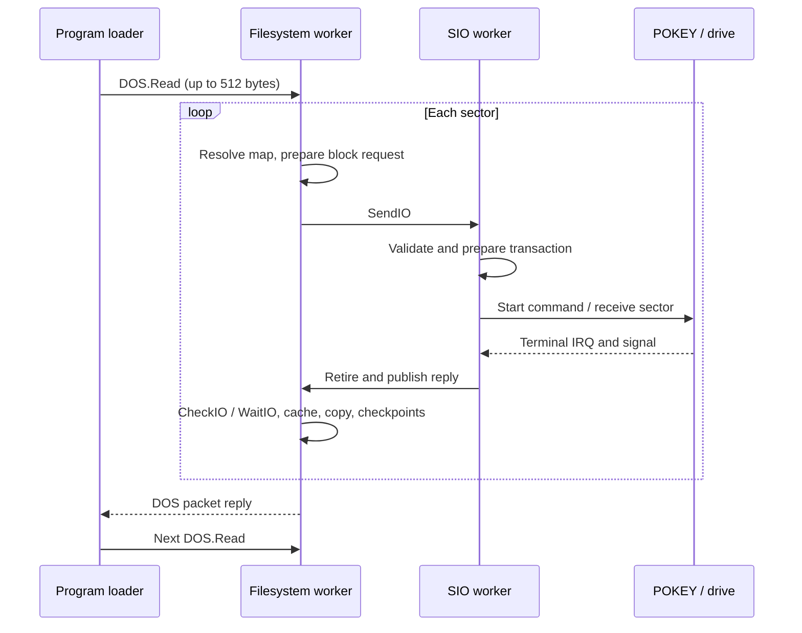

# HELLO filesystem/SIO path analysis

Most of the measured delay is in the filesystem/request path above the
hardware serial engine. With the prime worker stopped, an ordinary gap between
data-sector requests averages **25.20 ms**. At each of the four 512-byte
`DOS.Read` boundaries, the gap averages **68.12 ms**. Across all eighteen gaps,
the mean is **34.74 ms** and the sum is **625.32 ms**.

The serial worker reaches `SIOADAPTER.Retire` about **1.09 ms** after the last
checksum byte. It does not wait for a 20-ms VBI tick. The next request's
validation, descriptor preparation, control call and COMMAND assertion take
**1.70 ms** together. Successful transfers have no recovery sleep; the
three-tick `Sleep` in `SIODRIVER.RunRequest` is conditional on an error.

## What runs for a sector



The loader already allocates a buffer for the whole command, but issues
[512-byte reads](../../lib/dos/programfile.act). Each is a complete DOS packet
round trip. Within a read, [FSWORKER](../../lib/fs/fsworker.act) drives the
backend in bounded steps. [SDFSFILE](../../lib/spartados/sdfsfile.act) resolves
the sector, requests I/O, then copies it from the shared sector buffer.

[BLOCKWIRE.Transfer](../../lib/io/blockwire.act) gets the cancellation mask and
scope, sends a queued SIO request, checks/waits while cancellation remains
serviceable, then collects it with WaitIO. The separate
[SIO worker](../../lib/io/siodriver.act) validates the request, prepares the
descriptor, starts the [assembly engine](../../platform/altirraos/sio.s), waits
for terminal IRQ notification, retires the hardware state and publishes the
reply. It later resumes its recovery/queue loop. That system-worker work is
still present when the prime application is stopped.

## Measured breakdown

These are consecutive **elapsed-time intervals**, averaged over the eighteen
gaps from the end of one sector's checksum byte to the next COMMAND assertion.
They include preemption and other system workers; they are not exclusive CPU
profiles of individual routines.

| Interval | Mean |
| --- | ---: |
| Final byte to SIO worker retirement entry | 1.09 ms |
| Retire, reply, filesystem wake/check/collection | 3.95 ms |
| Finish block/cache and first filesystem checkpoint, up to Consume | 3.34 ms |
| SDFS Consume, including any preemption | 4.27 ms |
| Next filesystem step, including a DOS round trip at read boundaries | 12.33 ms |
| Map lookup and next block preparation | 1.21 ms |
| BLOCKWIRE entry through cancellation setup to SendIO | 2.95 ms |
| SendIO through dequeue to SIO RunRequest entry | 3.89 ms |
| Validate, prepare, active publication and COMMAND assertion | 1.70 ms |
| **Total** | **34.74 ms** |

An ordinary 128-byte copy runs inside `SDFSFILE.Consume`, but that interval
also contains SIO worker resumption in some samples. Its observed 3.20–6.70 ms
must not be quoted as pure copy cost. The trace does establish that the
byte-copy/consume path is worth inspecting after the larger repeated costs.

### Empty cancellation queue checks

[FSOPERATION.Pump](../../lib/fs/fsoperation.act) calls `GetRegistry`, which
enters the kernel through `DOSCORE.Control`, then calls `Forbid`, checks the
queue, and calls `Permit` even when the queue is empty. FSWORKER calls Pump
before each bounded state-machine step, including CPU-only steps.

There are **68 empty Pump calls inside the eighteen measured gaps**, taking
**156.89 ms** in total, about **25%** of those gaps. A typical uninterrupted
empty call takes about **2.0 ms**:

- Registry lookup/setup: usually approximately 0.62 ms.
- Forbid: mean 0.70 ms.
- Actual empty-queue check: mean 0.011 ms.
- Permit: usually approximately 0.67–0.70 ms; some calls switch tasks.

Including preemption, the mean Pump interval is 2.31 ms. These calls use the
general [Task dispatch path](../../lib/exec/taskpolicy.act), including request
validation, service classification, state updates, wake draining and possible
scheduling. This experiment measures the gateway call costs, not how much
each internal dispatch helper contributes. Pump time is already included in
the interval table; it must not be added a second time.

### 512-byte packet boundaries

Four gaps occur after the fourth sector of a loader read. They average
**68.12 ms**, versus **25.20 ms** for the other fourteen gaps. That is about
**42.92 ms extra per boundary**, including packet reply/collection, caller
processing, the next packet's submission/dequeue and the filesystem's dispatch
steps. Many of those steps repeat the empty Pump path.

For the first boundary, measured from the preceding checksum byte:

| Event | Time |
| --- | ---: |
| Sector Consume returns | 10.96 ms |
| Filesystem starts packet reply | 11.04 ms |
| Caller collects that reply | 18.48 ms |
| Caller submits the next DOS packet | 39.34 ms |
| Filesystem dequeues that packet | 45.89 ms |
| Backend starts resolving the next data sector | 65.99 ms |
| Next COMMAND assertion | 74.96 ms |

The **gap**, not the preceding serial transfer, contains this processing.
Larger read requests could reduce packet round trips without changing the
disk geometry or wire speed. Exact savings need measurement because
rotational waiting changes with request timing, and this cost overlaps Pump.

## Optimization priorities

1. **Reduce the cost of empty cancellation checks.** Reuse the worker's
   existing registry/context and design a cheap empty-queue path, preserving
   cancellation publication, bounded checkpoints and wakeup guarantees.
   Do not simply remove Forbid/Permit around shared mutations.
2. **Increase loader read granularity**, for example to 4 KiB, using its
   already allocated staging buffer. Preserve cancellation during a large
   DOS.Read and verify BREAK at the existing sector checkpoints.
3. **Reduce repeated per-sector kernel crossings.** Inspect cancellation
   mask/scope lookup before SendIO and the CheckIO/WaitIO collection sequence.
   Preserve exact request/reply ownership and cancellation behavior.
4. **Inspect emitted copy code and common gateway costs.** The generic Task
   gateway is paid throughout this path. If emission is at fault, fix actionc
   with a focused regression; avoid Exec-routine compiler workarounds.

The measured SIO preparation/IRQ engine is a smaller target than these repeated
operations. Changing baud rate or introducing a new filesystem would not
remove this software overhead. No production optimization is included here.

## Evidence and reproduction

The [record](sio-path-analysis.json) contains the measured intervals, exact
instruction markers, representative event timelines and artifact hashes.
The [earlier comparison](spartados-dos-comparison.md) records the original
SpartaDOS X baseline and the prime-worker control.

```sh
python3 tools/trace_command_io.py \
  --output build/development/spartados-comparison/sio-path-detailed
python3 tools/trace_command_io.py --analyze-only \
  --output build/development/spartados-comparison/sio-path-detailed
```

The runner reuses the S6 optimized diagnostic XEX and the pinned emulator's
passive selected-PC observer. It enables CPU observation only for HELLO, with
the prime worker stopped. It does not modify guest instructions or rebuild
the compiler. Marker addresses are derived from emitted routine entries and
checked JSL call sites. The analyst checks the nineteen expected data sectors
and a complete ordered sequence of markers in each gap.

The detailed trace retains the untraced run's relative phase durations,
transfer counts, serial bit rates, data-sector span and all eighteen gap
lengths. HELLO/DIR/EXIT and the replay's stack/ownership checks pass.
Validation is focused development-tier execution, not a release matrix or
compiler qualification. Reserved bank-zero change: **0 fixed bytes, 0 per
Task**.
