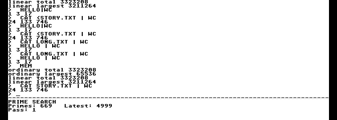

# Bitmap console preview

[Guides](README.md) · [Console contract](../reference/console.md) ·
[Design and open acceptance work](../plans/gem4xe/bitmap-console-design.md)

The optional bitmap console runs the existing shell and prime search in 80×30
cells on a 640×240 VBXE bitmap. It supports disk commands, two-command pipes,
cooked keyboard input, BREAK and clean exit. It is a functional development
preview: measured scrolling and repaint still exceed the responsiveness targets.

Build the complete demo, including standard OF816 boot, with:

```sh
python3 tools/build_demo.py --output build/demo-bitmap --bitmap-console
```

Distribute `build/demo-bitmap/exec816-demo.zip`. Extract it, follow the main
README for the included AltirraOS ROM, PAL, 65C816 ×8 with shadow ROM, and
**64 KiB base RAM plus 63 high banks (4,032 KiB)**. Enable VBXE FX 1.26 at
`$D600`; the [graphics setup](gem-vdi.md) describes the same hardware profile.
Use physical SIO with Generic + 57600 baud disk emulation and disable SIO Patch
and D: burst I/O.

Mount **`bitmap-console/system.atr` as D1:**, then explicitly boot
**`bitmap-console/Exec-bitmap-console.xex`**. Keep the matching disk mounted.
This direct XEX has no OF816 handoff. The standard `Exec-of816.xex` still provides
the five-second autoboot and Forth monitor with the normal text console.

Wait for `SYS: ready` and the prompt. Try the [demo commands](demo.md): `TASKS`,
`MOUNT`, `CD SYS:`, `DIR`, `HELLO`, `TYPE README.TXT`, `MEM`, `HELLO | WC` and
`CAT STORY.TXT | WC`. The last two print `1 3 17` and `108 518 3171`. The shell
uses 80×24 cells; the prime search uses the lower 80×6 tile. `BREAK` cancels an
edited line or a running command. `EXIT`, or Ctrl-D on an empty line, restores
the OS display. A wrong-format disk leaves the console usable; mount the matching
disk and enter `CD SYS:` to retry. A missing disk can leave SIO offline after a
transport timeout. In that case mount the disk and cold-boot again; `EXIT` parks
for reset, following the [SIO contract](../reference/device-io.md).



The [capture and package record](../development/bitmap-console-b9.json) identifies
the exact extracted XEX, disk, emulator, command sequence and screenshot.

The console uses a steady underline caret and draws no mouse pointer. Cooked
editing retains its existing 36-character visible tail and 255-byte command
limit; command history, scrollback, overlapping windows and terminal escape
sequences are unsupported. A single framebuffer can show intermediate updates.
The [B8 measurements](../development/bitmap-console-b8.json) record about 165 ms
for a full-width scroll and 1.86 seconds to fence a full retained repaint.
These miss the 20 ms and 500 ms goals; first-visible input acceptance also
remains open. No general hardware or release qualification is claimed.

Development outputs stay outside the ZIP. For an existing build, refresh its
archive with `tools/package_demo.py --bundle build/demo-bitmap/of816
--output build/demo-bitmap/exec816-demo.zip --bitmap-console
build/demo-bitmap/bitmap-console`. Run an extracted-image check with:

```sh
python3 tools/test_bitmap_package.py --bundle build/demo-bitmap \
  --output build/bitmap-check/walkthrough --case walkthrough
```

The other focused cases are `editing`, `missing`, `wrong` and `of816`.
They cover physical input/EOF, missing media with reset-required exit,
wrong system media with retry, and
both standard OF816 boot routes. Build maps and execution reports remain in the
development directories. Bank-zero reservations do not grow; the bitmap worker
uses an existing 2,560-byte pool and the drawing image reserves upper banks
`$0C/$0D`.
