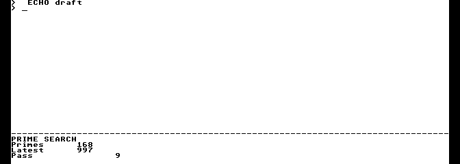

# Bitmap console preview

[Guides](README.md) · [Console contract](../reference/console.md) ·
[Design and open acceptance work](../plans/gem4xe/bitmap-console-design.md)

The bitmap console starts a full-screen shell in 80×30
cells on a 640×240 VBXE bitmap. It supports disk commands, two-command pipes,
cooked keyboard input, BREAK and clean exit. It is a functional development
preview: measured scrolling and repaint still exceed the responsiveness targets.

Build the complete demo, including standard OF816 boot, with:

```sh
python3 tools/build_demo.py --output build/demo-bitmap --bitmap-shell-only
```

Distribute `build/demo-bitmap/exec816-demo.zip`. Extract it, follow the main
README for the included AltirraOS ROM, PAL, 65C816 ×8 with shadow ROM, and
the required **4 MB of RAM: 64 KiB base RAM plus 63 high banks (4,032 KiB)**.
Enable the full VBXE FX core at `$D600` or `$D700`. Startup detects the address
and reports the revision without requiring exactly 1.26. The pinned emulator
profile remains FX 1.26 at `$D600`; the [graphics setup](gem-vdi.md) describes it.
Use physical SIO with Generic + 57600 baud disk emulation and disable SIO Patch
and D: burst I/O.

Mount **`system.atr` as D1:** and a writable copy of **`work.atr` as D8:**,
then boot **`Exec-of816.xex`**. Keep both matching disks mounted. OF816 provides
the five-second autoboot and Forth monitor before the bitmap shell.
The optional `--bitmap-console` selection still packages a separately selected
automatic-primes bitmap demo alongside the text boot.

Wait for `SYS: ready` and the prompt. Try the [demo commands](demo.md): `TASKS`,
`MOUNT`, `CD SYS:`, `DIR`, `HELLO`, `TYPE README.TXT`, `MEM`, `HELLO | WC` and
`CAT STORY.TXT | WC`. The last two print `1 3 17` and `108 518 3171`. The shell
starts with 80×30 cells. `RUN PRIMES` opens the lower 80×6 tile and keeps the
80×24 shell interactive. JOBS lists its identity; `BREAK identity` stops it and
restores the full shell. `PRIMES PASSES 1` runs one foreground pass, finding
1,229 primes through 10,000, with latest prime 9,973. Only changed numeric fields
are redrawn. Ctrl-L clears the shell and restores its prompt and edited input.
Physical BREAK cancels an edited line or a running command. `EXIT`, or Ctrl-D on an empty line, restores
the OS display. A wrong-format disk leaves the console usable; mount the matching
disk and enter `CD SYS:` to retry. A missing disk can leave SIO offline after a
transport timeout. In that case mount the disk and cold-boot again; `EXIT` parks
for reset, following the [SIO contract](../reference/device-io.md).



The [pane and command record](../development/background-pane-primes-p2.json)
identifies the executed preview, drawing observations and screenshot. The
earlier [capture and package record](../development/bitmap-console-b9.json)
retains the original console preview evidence.

The console uses a steady underline caret and draws no mouse pointer. Cooked
editing retains its existing 36-character visible tail and 255-byte command
limit, with the last ten commands available through Ctrl-P/N or Atari up/down.
Scrollback, overlapping console panes and terminal escape sequences are
unsupported. A single framebuffer can show intermediate updates.
The [B8 measurements](../development/bitmap-console-b8.json) record about 165 ms
for a full-width scroll and 1.86 seconds to fence a full retained repaint.
These miss the 20 ms and 500 ms goals; first-visible input acceptance also
remains open. No general hardware or release qualification is claimed.

Development outputs stay outside the ZIP. For an existing build, refresh its
monitor and archive with `tools/build_demo.py --output build/demo-bitmap
--refresh-monitor`. Run the focused background-command walkthrough with:

```sh
python3 tools/test_primes_demo.py --bundle build/demo-bitmap
```

The walkthrough uses physical keys for RUN, foreground commands and a pipeline,
file copy, edited input, Ctrl-L, BREAK, restart, finite completion and EXIT.
It checks pixels and numeric-only redraws on the pinned emulator. Build maps
and execution reports remain in the development directories. Bank-zero
reservations do not grow; the bitmap worker
uses an existing 2,560-byte pool and the drawing image reserves upper banks
`$0C/$0D`.
