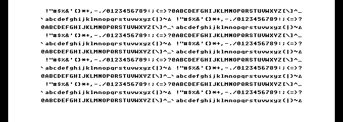

# Optional GEM/VDI graphics workload

[Guides](README.md) · [Supported interface](../reference/gem-vdi.md) ·
[Measurements](../history/gem-vdi.md)

Build the optional graphics program alongside the standard OF816 demo:

```sh
python3 tools/build_demo.py --gem-vdi --output build/gem-vdi/g6-demo
```

This uses the pinned Action! compiler, Calypsi 5.18 and GEM source inputs. See
[build prerequisites](../contributing/building.md) and the
[port instructions](../../ports/gem4xe/README.md) for obtaining and verifying
those inputs. The output is `build/gem-vdi/g6-demo/exec816-demo.zip`.

The ZIP still boots `Exec-of816.xex` into OF816, with its five-second countdown
and standard shell/prime demo. An additional `gem-vdi/` directory contains the
separately selected graphics XEX, its matching SDFS disk and notices. Maps,
manifests, extracted source and test evidence remain outside the ZIP.

For graphics, cold-boot with the supplied AltirraOS ROM. Select Atari 800XL,
64 KiB base RAM plus fifteen CPU high banks, 65C816 at 8×, shadow ROM and PAL.
Enable full VBXE FX 1.26 at `$D600`, private 512 KiB VRAM, no shared RAM and no
VBXE IRQ. Mount **`gem-vdi/system.atr`** as drive 1 and load
**`gem-vdi/Exec-gem-vdi.xex`** directly. Use physical `generic56k` SIO with patch,
burst and random delay disabled and accurate sector timing enabled. The exact
emulator/ROM hashes and settings are in the [platform pin](../../toolchain/altirra-gem-vdi.json).

The program submits twelve 64-glyph rows while another C Task computes and the
Action supervisor reads a cold 2 KiB file. Both workers use 2,560-byte stacks.
It holds the completed scene for three seconds, restores text, prints completion
and returns to the OS. It needs no keyboard or mouse. Start from an inactive
VBXE baseline; unknown previous ownership is unsupported. A device that remains
busy after bounded recovery requires reset and retains its resources.



This workload demonstrates text and concurrency. The separate G4 corpus covers
lines, bars, colors, clipping and the other [supported drawing operations](../reference/gem-vdi.md).
There is no AES, desktop, GEMDOS, virtual workstation, external font, physical
input or multi-client GUI support. Evidence applies to the pinned emulator and
the recorded development cases.

To return to the usual demo, use its no-add-ons configuration, mount the root
`system.atr` and boot the root `Exec-of816.xex`.

Reproduce the focused graphics check for the exact packaged image:

```sh
python3 tools/test_gem_concurrent.py --mode opt --production --replay \
  --output build/gem-vdi/g6-demo/gem-vdi
```

The checker verifies visible pixels and palette against an independent font
model, physical IRQs and file contents, computation, guards, stack headroom,
allocator ownership and OS/display restoration. It introduces no target-side
status substitutions, drawing counters, readback or start rendezvous in this
artifact. The G5 runner without `--production` executes those diagnostic paths
and the failure cases separately.
