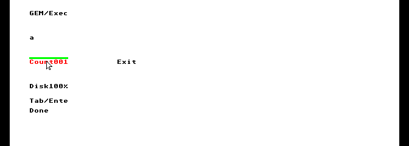

# Optional interactive GEM/VDI demo

[Guides](README.md) · [Supported interface](../reference/gem-vdi.md) ·
[Physical mouse measurements](../history/gem-mouse.md)

Build the optional graphics program alongside the standard OF816 demo:

```sh
python3 tools/build_demo.py --gem-vdi --output build/gem-mouse/m6-demo
```

This uses the pinned Action! compiler, Calypsi 5.18 and GEM source inputs. See
[build prerequisites](../contributing/building.md) and the
[port instructions](../../ports/gem4xe/README.md) for obtaining and verifying
those inputs. The output is `build/gem-mouse/m6-demo/exec816-demo.zip`.

The ZIP still boots `Exec-of816.xex` into OF816, with its five-second countdown
and standard shell/prime demo. An additional `gem-vdi/` directory contains the
separately selected graphics XEX, its matching SDFS disk and notices. Maps,
manifests, extracted source and test evidence remain outside the ZIP.

For graphics, cold-boot with the supplied AltirraOS ROM. Select Atari 800XL,
64 KiB base RAM plus fifteen CPU high banks, 65C816 at 8×, shadow ROM and PAL.
Enable full VBXE FX 1.26 at `$D600`, private 512 KiB VRAM, no shared RAM and no
VBXE IRQ. Mount **`gem-vdi/graphics.atr`** as drive 1 and load
**`gem-vdi/Exec-gem-vdi.xex`** directly. Use physical `generic56k` SIO with patch,
burst and random delay disabled and accurate sector timing enabled. The exact
emulator/ROM hashes and settings are in the [platform pin](../../toolchain/altirra-gem-vdi.json).

Enable **Mouse → ST Mouse (port 1)** in Altirra's input maps and disable other
maps that drive that port. Use **Capture Mouse** (F12 in the pinned SDL build) to
send host motion; Right Alt / Right Option releases capture. Opening a menu or
losing window focus also releases it. The driver uses one pixel per electrical
transition, without acceleration, and supports the left button only.

The application displays a text field, Count and Exit buttons while the Action!
root supervisor reads a cold 2 KiB file. Application and renderer use the two
existing 2,560-byte Task stacks. Root owns file work; the application owns input
and the renderer client. Disk completion leaves the scene open for interaction.

| Input | Action |
| --- | --- |
| Left click | Select the field or activate Count/Exit on matching release over the same control. |
| Tab | Cycle the text field, Count and Exit. |
| Printable keys / Backspace | Edit the focused 24-character field. |
| Return | Activate the focused button. Count advances its number and color. |
| Escape / BREAK | Exit from any control, settling any active disk request first. |

Mouse admission failure displays `KeysOnly`; the keyboard controls remain
available. An idle or absent mouse cannot be distinguished reliably, so an
unconfigured port does not prevent startup. Loss disarms a press; release and
press again before clicking.

Exit restores text, displays completion for five seconds and returns to the OS.
A missing, wrong, short or corrupt disk file follows cleanup and displays the
matching disk name in text. The root `system.atr` belongs to the standard demo;
graphics requires **the `gem-vdi/graphics.atr` shipped with its XEX**.
If a missing drive leaves the serial bus offline, the message also requests a
reset; the program preserves that bus ownership instead of returning to the OS.
Start from an inactive VBXE baseline; unknown previous ownership is unsupported.
A device that remains busy after bounded recovery requires reset and retains its resources.



[M5 development measurements](../history/gem-mouse.md#m5-coexistence-and-failure-closure)
keep the maximum observed sample gap below 276 µs during the selected GUI and
FASTEST125 SIO workloads. First captured motion reaches visible pixels within
seven PAL ticks; the selected small keyboard redraws take at most ten. The
acceptance ceiling remains 12 ticks. Phases must be at least 1 ms apart and
button levels held at least 10 ms; the existing controller's fastest qualifying
quantization is 16 scanlines (about 972 transitions/s). Fast host bursts can lose
distance even when a missing full quadrature cycle cannot be detected.

The distributed image has real mouse capture and no injector, timing gates or
substituted hardware status. Amiga mice, other ports, right/middle buttons,
wheel, physical hardware, NTSC, AES, desktop, GEMDOS, virtual workstations,
external fonts and multiple GUI clients remain outside this milestone. These
are focused results on the pinned emulator, not general hosted qualification.

To return to the usual demo, use its no-add-ons configuration, mount the root
`system.atr` and boot the root `Exec-of816.xex`.

Reproduce the focused graphics check for the exact packaged image:

```sh
python3 tools/test_gem_interactive.py --mode opt --production --replay \
  --case keyboard --case wrong-disk --case no-disk --output build/gem-mouse/m6-demo/gem-vdi
python3 tools/test_gem_mouse.py --mode opt --production --replay \
  --case controls --case close-held --output build/gem-mouse/m6-demo/gem-vdi
python3 tools/test_of816.py --output build/gem-mouse/m6-demo/of816
```

The checker verifies visible pixels and palette against an independent font
model, native keyboard state, physical IRQs and file contents, guards, stack
headroom, allocator ownership and OS/display restoration. The OF816 control checks
automatic and Forth-command shell routes, ordinary input, disk commands and exit.

The G5 computing-peer/font workload remains available as a separate development
regression through `tools/test_gem_concurrent.py`. The G4 corpus covers the
[supported drawing primitives](../reference/gem-vdi.md); I5 adds exact cursor
pixels, and I6 covers concurrency and failures. Their historical records remain
unchanged when the optional artifact is refreshed.
