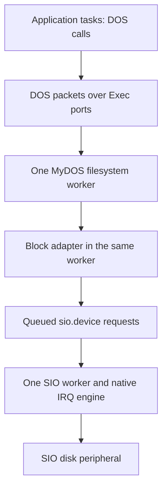

# Block I/O and DOS with MyDOS filesystems

> Historical record: applies to the revisions and profiles described below.
> See the [current documentation](../reference/dos.md) and [history index](README.md).

Status: read-only file/directory API, MyDOS parsing, explicit mounts, service
lifetime and integrated qualification implemented, 2026-09-20. All ten slices
of the [implementation plan](../plans/block-io-dos-implementation-plan.md) are complete.
The [implementation record](block-io-dos-implementation.md) documents the pinned
emulator evidence, eight-live-task timing, stack costs and file-service latency
limits. Physical hardware remains unqualified.
The 128/256-byte transport prerequisite has separate
[qualification](../qualification/sio-sectors.json).

The proposed [DOS console stream extension](../reference/streams.md) adds
RAW:/NIL: handles, Write and standard-stream selection above the existing DOS
interface. It does not enable filesystem mutation or route keyboard waits
through the filesystem worker.

Provide an AmigaDOS-style file API backed by a native, initially read-only
MyDOS filesystem handler. MyDOS support means reading existing disk structures,
including subdirectories and both supported sector sizes; it does not mean
loading MyDOS, calling its CIO interface or running Atari DOS applications.
Keep Exec responsible for tasks, memory, messages and device I/O. Put filesystem
policy in a separate `DOS` library and handler.

The first complete milestone is an application opening a named file in a MyDOS
subdirectory, reading and seeking through it, and closing it while other tasks
continue running. Repeat on 128- and 256-byte media, with more than one client.

## Scope and implementation boundary

Required for the read-only milestone:

- A sector-oriented block adapter over `sio.device`, with explicit geometry,
  short boot sectors, checked addressing and complete-sector error semantics.
- MyDOS 4.5x root directories, nested subdirectories, 8.3 names, ten-bit and
  sixteen-bit file links, and extended VTOC layouts.
- `Open`, `Read`, `Seek`, `Close`, `IoErr`, and read-only directory access using
  `Lock`, `UnLock`, `Examine` and `ExNext`.
- Explicit mount configuration and lifetime, separate cursors for independently
  opened files, task-local errors, and bounded processing of damaged media.
- A qualified 256-byte READ transport profile. A 128-byte first slice is useful
  progress, but is not completion of this note's MyDOS scope.

Defer filesystem writes, creation/deletion/rename, formatting, allocation-map
updates, repair, automatic media-change detection, a shell, executable loading,
current directories, assigns and a full Amiga Process implementation. Also defer
DOS 1, DOS 2.5 enhanced-density extensions, SpartaDOS, FAT, Amiga OFS/FFS, 512-byte
sectors and nonstandard boot-sector layouts. The shared DOS 2-style file layout
is needed inside MyDOS; it is not a claim to support every Atari DOS format.

## Layers and task ownership



Use one filesystem worker for all configured MyDOS mounts and the existing one
SIO worker for the whole bus. A mount gets records and a packet port, not its own
task. Separate mount ports give the handler an unambiguous volume identity
without changing the ordinary DOS packet arguments. Several handler ports can
share one allocated arrival signal, using the existing port contract; after a
wake the worker checks their queues fairly. This bounded mount-queue check is
task-side work, unrelated to IRQ signal delivery.

The initial handler completes one DOS operation at a time. Its sector reads use
`SendIO`/`WaitIO` with a private reply port. While it waits, applications and the
SIO worker run; additional filesystem packets remain queued. This deliberately
does not promise overlapping filesystem operations or a short latency for a
small request queued behind a long read/seek. Bound traversals and measure that
latency. Per-operation continuations and sector-granularity fairness can follow
if real workloads require them, without changing the public file API.

Only this worker mutates filesystem cursors, mount state and caches. No new
semaphore API is required. Do not hold `Forbid`, kernel policy serialization or
an IRQ mask while parsing paths, traversing chains, copying file data or waiting
for I/O. Public calls remain ordinary task-context calls, with IRQs enabled;
blocking DOS calls must also enter with scheduling permitted in this subset.

## Block adapter contract

Keep this a library internal to the handler initially, not another Exec device
or worker. A later public block device can expose `CMD_READ`/`CMD_WRITE` with
byte offsets. The raw SIO contract remains unchanged: `io_Offset` is zero and
`sio_Aux1`/`sio_Aux2` are wire parameters, never a filesystem API.

Each mount supplies an immutable block description:

| Property | Contract |
| --- | --- |
| Device and unit | `sio.device` and wire ID `$31`–`$38`, explicitly configured. |
| Timing profile | A qualified profile for the actual peripheral; independent of filesystem type. |
| Sector count | Unsigned 32-bit count, initially 368–65,535 for a mountable MyDOS volume. Never infer it from free-space counts. |
| Data sector bytes | 128 or 256, subject to transport qualification. |
| Boot layout | Sectors 1–3 transfer 128 bytes; later sectors use the configured size. |
| Access and generation | Read-only, plus a mount generation used by handles and cached data. |

The lower adapter can test smaller block devices; the minimum above is the
filesystem's requirement to contain its fixed root directory. Sector identifiers
are one-based. Zero is a file-chain terminator and must never be submitted as a
disk sector. Reject a sector beyond the configured count or `$FFFF` before
converting it to the two auxiliary bytes. Widen before adding or multiplying;
never allow a sector increment at `$FFFF` to wrap to zero.

Define internal operations with explicit results:

- `SectorBytes(volume, sector)` returns 128/256 after range validation.
- `ReadSector(volume, sector, destination, capacity)` reads exactly that sector
  and returns success/error plus the valid byte count, which is zero on failure.
- An optional block-byte reader maps a byte offset into sectors and copies only
  the requested bytes through the same checked sector operation. File positions
  do not use this mapping: MyDOS file chains remove trailers and may fragment.

For a 256-byte data-sector volume, physical byte offsets are:

```text
sector 1..3:  offset = (sector - 1) * 128
sector >=4:  offset = 384 + (sector - 4) * 256
capacity:    384 + (sector_count - 3) * 256
```

For 128-byte volumes the corresponding formulas use `(sector - 1) * 128`
and `sector_count * 128`. These describe the logical sector stream, without an
ATR header. ATR is an emulator/host container, not bytes presented to the guest
filesystem. A host fixture adapter must parse its container independently.

`ReadSector` issues wire READ `$52`, with the sector low byte in Aux1 and high
byte in Aux2. Success requires both `io_Error=0` and `io_Actual=expected_size`.
A partial/error response never becomes a valid cache entry, even if the driver
reports payload bytes received. Keep the driver's error separately for DOS
reporting. SIO framing and wire checksums remain entirely in the driver.

Use one reusable transfer IOSIOReq and a 256-byte upper-RAM scratch buffer in
the filesystem worker. Retain one owning open request per mounted unit; the
transfer request borrows that binding only while its owner stays open, following
the existing device contract. Do not copy Message queue links between requests.
The request/buffer cannot be reused or freed until its reply is collected. Read
full sectors into this scratch storage, validate filesystem trailers, then copy
file payload to the client's potentially bank-crossing buffer. This also avoids
exposing a failed sector's partial RX data as file contents.

### Retained read cache

The adapter now retains a configurable read cache across file closes and
ordinary command exits; MyDOS and SDFS share it. The captured `cache_blocks`
boot setting defaults to 512 blocks of 128 bytes (64 KiB payload). Zero disables
retention beyond the existing scratch sector. A full 256-byte hit requires both
halves; misses still use one ordinary complete-sector transfer. Four candidate
tags per set bound lookup work; round-robin replacement can evict colliding
sectors before nominal capacity is reached.

Both scratch and retained cache entries identify the volume, mount generation
and sector. Geometry is validated before attachment and remains immutable for
that lifetime; changing it requires detach/reattach. Scratch tags therefore
do not duplicate or recompare unit, profile, capacity, sector size or boot
layout. Each fetch still checks sector bounds, ownership and transfer completion,
and sectors 1–3 remain 128 bytes on both supported data-sector sizes.

Payload, tags and adapter state are upper-RAM allocations. The default adds
65,536 payload bytes, 6,144 tag bytes and 128 replacement bytes. The 58-byte
adapter is rounded to 64 bytes, 24 more than the former 40-byte allocation.
Captured boot settings reserve four additional upper bytes. Cache metadata and
added control storage total 6,300 bytes, below the 8 KiB target. Bank-zero
reservations change by **0 fixed bytes and 0 bytes per Task**.

Failed allocation frees partial storage and retains one-sector operation; the
shell reports that fallback once. Adapter teardown frees all cache allocations.
Detach and transport errors invalidate the affected volume; a latched offline
bus invalidates all retained blocks and rejects subsequent filesystem work.
Opening another unit may discard scratch contents but preserves retained data.
Read-only mounted media must remain unchanged; controlled replacement still
requires unmount/remount. No write-back or media-change detection is provided.
The existing worker operation checkpoints also cover cache hits and BREAK.
See the [implementation plan](../plans/sector-cache-implementation-plan.md) for boot
configuration and focused evidence.

### Geometry and the 256-byte transport prerequisite

Initial mount descriptors supply geometry explicitly, as with a configured
device. Do not guess density by attempting differently sized reads: a mismatched
wire length can damage transaction synchronization. Do not treat VTOC total/free
counts as a drive-capacity probe, or require DOS.SYS/bootable media to mount.
STATUS/PERCOM-based discovery is a later, separately qualified device feature.

The current [SIO interface](device-io-sio-design.md#first-siodevice-interface)
admits 256-byte READ (`$52`) requests on FASTEST125, qualified against the
pinned double-density emulator model in [slice 1](block-io-dos-implementation.md#slice-1-256-byte-transport).
The [GENERIC57600 extension](sio-57600.md) also admits 256-byte reads and is the
default shell mount profile. Other payloads on these two profiles and STOCK810
remain limited to 128 bytes; Happy1050
is no-data only. The filesystem must preserve these profile checks and the
short boot-sector rule when the same unit switches between sector 3 and sector 4.

Qualification must cover length 256 without eight-bit truncation, checksums,
last-byte/completion boundaries, bank-crossing buffers, error retirement and
125-kbaud RX/phase deadlines with eight tasks. Record the actual model, image
geometry, timing profile and unchanged-image replay. Parser-only 256-byte tests
or successful 128-byte timing do not qualify this transport.

## MyDOS disk interpretation

Use the authors' technical documentation and source as the format reference,
not filename extensions or a newly invented filesystem. The technical guide
describes boot sectors 1–3, VTOC at 360 growing toward lower sector numbers,
root directory sectors 361–368, and a maximum 65,535 sectors of 256 bytes.
[MyDOS 4.50 Technical User Guide, section VII](https://lira.epac.to/DOCS-TECH/Retro%20Archives/ATARI%20Archive/MyDOS%204.50%20-%20Technical%20Manual.pdf)

The details below were checked against the
[authors' MyDOS 4.51 source archive](https://atariwiki.org/wiki/attach/MyDOS/Mydos451.zip):
`MDOS2.ASM` (`INITYP`, formatting, `MKDIR`), `MDOS3.ASM` (`SFDIR`, `CHASE`,
`BSECDS`, `MAPIOC`) and `MDOS4.ASM` (`FNDBIT`). Archive SHA-256:
`ca9a6ef43d6e12c44c965faf31ec092001c15c2eefcff2c45a62faea1ffb5724`.
Implementation fixtures must record their producing MyDOS version and hashes;
do not generalize this evidence to every patched MyDOS derivative.

### Directories and names

Each directory occupies eight consecutive sectors, with eight 16-byte entries
in the first 128 bytes of each sector: **64 entries**, including on 256-byte
media. The unused second half is not another eight entries. Subdirectory start
sectors come from their parent entries; directories are not ordinary linked
file chains. They do not contain a Unix-style on-disk `..` record.

| Entry bytes | Meaning |
| --- | --- |
| 0 | Status flags. |
| 1–2 | Sector count, little-endian; not a byte length. |
| 3–4 | First sector, little-endian. |
| 5–12, 13–15 | Space-padded eight-character basename and three-character extension. |

Interpret zero status as end of entries, `$80` as deleted, `$01` as an unclosed
file, `$10` as a subdirectory and `$20` as write protection. Normal closed DOS 2
and MyDOS files commonly have `$42` and `$46` respectively; a directory can
have status `$10` alone. Therefore testing `$40` as a universal existence bit
would lose directories. Accept only the documented combinations in the chosen
format profile; skip deleted/unclosed files and reject unsupported live types.
DOS 2.5's special enhanced-density flags require their own decoder and are
outside this milestone.

For a subdirectory validate count eight, its complete contiguous extent and
non-overlap with fixed metadata and ancestor directory extents. Resolve paths
iteratively, retaining the ancestor extents in upper RAM, with a 16-directory
depth bound. Detect repeated/overlapping ancestors instead of recursing until
the worker exhausts its small native stack.

Expose Amiga-style absolute paths such as `D1:TOOLS/EDITOR.ACT`; `D1:` is the
mount root. Mount aliases select the configured SIO units. Limit the NUL-terminated
path to 255 bytes excluding its terminator. Use one colon and `/` separators;
defer relative paths, parent shorthand, wildcards and MyDOS CIO's `:`/`>`
subdirectory aliases. Do not silently truncate an overlong 8.3 component.

The proposed [resident-shell design](shell-design.md#paths-and-cd-behavior)
extends this qualified absolute-path baseline with DOS current-directory state,
relative resolution and leading parent/root forms. Those extensions are not
part of the completed storage qualification.

Preserve legal stored name bytes, including the original parser's `@`, `_` and
backtick characters. Prefer an exact byte match, then an ASCII case-insensitive
match for ordinary names. Reject an ambiguous folded match rather than selecting
one of two distinct stored entries arbitrarily. Enumeration returns stored case.
Unsupported/nonprintable names get an explicit name/format error. `Read` returns
unchanged bytes: ATASCII `$9B` is not translated to a host newline.

### File chains, size and seeking

For sector size `S`, the last three bytes are link-high, link-low and the number
of valid payload bytes. Maximum payload is 125 or 253. The next-sector encoding
is high-byte first, unlike the directory's little-endian first-sector field:

```text
entry flag $04 set: next = (link_high << 8) | link_low
entry flag $04 clear: next = ((link_high & 3) << 8) | link_low
                     require (link_high >> 2) == directory_entry_index
```

Choose this mode **per file**, not from sector size or the VTOC marker alone.
MyDOS can create a sixteen-bit-link file even on a small disk. Zero next-sector
means EOF; it does not make the last sector's payload empty. The directory entry
index is 0–63 within that file's parent directory, not its disk sector number.

Validate each sector before copying: number in range, outside fixed/known
directory metadata, valid byte count no greater than `S-3`, and correct file
number in ten-bit mode. Derive exact file length by summing validated payload
counts along the chain; multiplying the directory count by 125/253 is not an
exact length. Permit a final sector with zero payload for an empty file. Also
accept a canonical zero-count/zero-start empty entry. Nonzero count with zero
start, inconsistent EOF/count, out-of-range links and unsupported trailer formats
are corruption, not ordinary EOF.

Retain a traversal hop count and constant-space cycle detector per file cursor
across successive Reads. Every walk has a sector-count bound as well. This must
not reset on each small Read and thereby let a cyclic file produce bytes forever.
Backward seeks restart from the first sector with a fresh bounded traversal;
forward seeks can continue a validated cursor. Compute `OFFSET_END` by a bounded
walk when exact size is not yet known. Validate the directory sector count when
EOF is reached. Do not eagerly read an entire large file merely to open it.

Do not report these checks as a complete filesystem check: unrelated files may
cross-link, and corruption later in a chain may be discovered only after earlier
successful Reads. Whole-volume allocation audits and repair remain separate.

### VTOC and larger volumes

Read sector 360 when mounting and validate the selected format against supplied
geometry. For marker 2, the supported DOS 2-compatible layout uses one VTOC
sector. For MyDOS markers `m >= 3`, the bitmap occupies `m-2` logical 256-byte
pages, stored in descending sector order: one physical sector per page on
256-byte media, two on 128-byte media. Its first page includes a ten-byte header.
Reject an extent whose capacity cannot describe the configured volume or whose
reserved sectors overlap boot/root storage. Decode all arithmetic in 32 bits,
including bitmap positions for sectors near `$FFFF`.

The allocation bit for sector `n` is at logical bitmap byte `10 + n/8`, with
mask `$80 >> (n & 7)`; a set bit means free. VTOC bytes 1–2 describe the formatted
allocatable total and 3–4 the current free count, not the physical sector count.
No MyDOS bitmap update is needed to read files. Check header/range consistency
and reserve the complete VTOC extent in parser checks, but do not load the whole
bitmap permanently or require a full free-space audit before every Open.

Support links beyond sector 1023 and capacity up to the sixteen-bit sector
limit in the parser and block contract. Actual mountable geometries remain
limited to qualified peripheral profiles. An enhanced-density MyDOS volume is
not interchangeable with a DOS 2.5 enhanced-density volume just because both
have 128-byte sectors. Explicit `MYDOS` mount type and structural validation are
required; a marker or boot signature alone cannot identify every related format.

## DOS public API

Use a separate `DOS` namespace. Retain the familiar names, argument order and
result conventions from the classic autodocs for
[Open](https://developer.amigaos3.net/autodocs/dos.library/Open.html),
[Read](https://developer.amigaos3.net/autodocs/dos.library/Read.html),
[Seek](https://developer.amigaos3.net/autodocs/dos.library/Seek.html) and
[Close](https://developer.amigaos3.net/autodocs/dos.library/Close.html).
These are native source interfaces, not an Amiga binary ABI:

| Call | Native result and arguments | Initial behavior |
| --- | --- | --- |
| Open | FileHandle pointer (BYTE pointer name, LONGINT mode) | Existing file, independent cursor at zero; null on failure. |
| Read | LONGINT (FileHandle pointer file, BYTE pointer buffer, LONGINT length) | Count read, zero at EOF, or -1 on error. |
| Seek | LONGINT (FileHandle pointer file, LONGINT offset, LONGINT mode) | Return the **old** position; -1 on failure. |
| Close | LONGINT (FileHandle pointer file) | Nonzero success, zero failure; consumes the handle. |
| IoErr | LONGINT () | Calling task's secondary DOS result. |
| Lock | FileLock pointer (BYTE pointer name, LONGINT mode) | Shared reference to file/directory; null on failure. |
| UnLock | PROC (FileLock pointer lock) | Release exactly one acquired reference; null is harmless. |
| Examine | LONGINT (FileLock pointer lock, FileInfoBlock pointer info) | Object metadata and initialization of a directory enumeration. |
| ExNext | LONGINT (FileLock pointer lock, FileInfoBlock pointer info) | Next entry; zero plus ERROR_NO_MORE_ENTRIES at end. |

Keep `MODE_OLDFILE=1005`, `MODE_NEWFILE=1006`, `MODE_READWRITE=1004`, and
`OFFSET_BEGINNING=-1`, `OFFSET_CURRENT=0`, `OFFSET_END=1`. Boolean DOS results
use `DOSFALSE=0` and `DOSTRUE=-1`; callers test zero/nonzero. Initially only
MODE_OLDFILE succeeds. This mode's classic meaning is opening an existing file;
our read-only restriction belongs to the handler, not a redefinition of the
constant. Reject mutating modes with ERROR_DISK_WRITE_PROTECTED before issuing
any disk write. A future nonempty Write to a MyDOS handle must fail the same
way. The console-stream extension separately specifies successful zero-length
Write and writable console/NIL destinations. Unsupported modes are errors,
never alternate spellings for read-only.

FileHandle and FileLock are opaque native 24-bit pointers, not shifted BPTRs.
Lengths, results and file positions use signed 32-bit LONGINT. Reject negative
Read lengths, address wrap/unmapped output extents and invalid seek origins.
Read of length zero succeeds without touching the buffer. Seek allows positions
from zero through exact EOF, never negative positions or extension past EOF;
check signed overflow before committing the cursor. A failed Seek preserves
the original logical position.

On a Read error return -1, retain the starting logical position and invalidate
any derived cursor that needs rebuilding. Earlier sectors may already have
modified the output buffer; the caller must discard that call's buffer contents.
Only normal EOF returns a successful short count. This policy avoids presenting
a late checksum or chain error as successful EOF. Copies and extent checks must
support upper-RAM LINEAR buffers crossing banks.

Use shared locks (`SHARED_LOCK=-2`) initially; reject exclusive-lock requests
explicitly. Locks keep objects/mounts referenced; they are not kernel semaphores
and do not guarantee immovable physical media. Follow
[Lock](https://developer.amigaos3.net/autodocs/dos.library/Lock.html),
[Examine](https://developer.amigaos3.net/autodocs/dos.library/Examine.html) and
[ExNext](https://developer.amigaos3.net/autodocs/dos.library/ExNext.html) call
semantics. Give FileInfoBlock the familiar field names and order with native
integer layout. Report exact file bytes, occupied sectors, file/directory type
and stored name; use zero dates and empty comments for metadata MyDOS does not
store. Directory byte size is zero and its block count is eight; the root name
comes from the mount alias. Map the stored MyDOS protection flag to write/delete
protection while keeping the volume's read-only policy separate. Require a real
lock for Examine/ExNext; a null lock does not imply an unimplemented current
directory.
Computing exact size for Examine/ExNext may require a chain walk. Keep iteration
state caller-specific through the lock/info pair, never in one global cursor.

### Task-local state and lifetime

The first DOS call lazily creates a client context containing a private packet
reply port and reusable StandardPacket. Use a configuration-sized upper-RAM
side table associated directly with the current private execution context for
its context pointer and last error. The error cell must exist without a heap
allocation so allocation/signal failure can still be reported by IoErr. Bind
entries to the exact live Task identity and reset them on admission/reuse.
Access to the current entry must not search every task. Any necessary private
kernel accessor is short and nonblocking; DOS work runs on task stacks.

Do not add DOS fields to public Task, appropriate `tc_UserData`, or introduce
another Task API. The separate context substitutes only for the small part of
an Amiga Process needed here. More than one task must not share a global IoErr.
[IoErr](https://developer.amigaos3.net/autodocs/dos.library/IoErr.html) reports
the last secondary result; callers inspect it after a failure. Successful
Close preserves the preceding IoErr, so cleanup does not hide a Read error.

Provide `LONGINT DOS.ReleaseContext()` as a native lifetime extension, returning
nonzero on success or zero with IoErr on failure: succeed only
after all owned handles/locks are closed/released and no packet is outstanding,
then free the reply port, signal and context. It is harmless when no context
exists. Tasks must do this before removal; cancellation/removal of a client
with an in-flight DOS packet is unsupported. Integrate the same discipline into
normal root shutdown. Do not silently detach a packet whose buffer still names
a removed task's stack or freed heap.

One synchronous DOS call per task is sufficient initially. Handles/locks belong
to their opening task; other tasks open independent handles. Sharing, inherited
handles, reentrant calls from callbacks and automatic Process cleanup are later
contracts. Allocation or initialization failure unwinds without publishing a
partially usable client, mount or handle.

## DOS packets and completion

Keep the classic Message + DosPacket structure and familiar action numbers.
DosPacket retains `dp_Link`, `dp_Port`, `dp_Type`, `dp_Res1`, `dp_Res2` and
seven argument slots; StandardPacket contains the Message followed by it.
Link `ln_Name` to the packet and `dp_Link` back to the Message. This follows the
[DOS packet model](https://wiki.amigaos.net/wiki/AmigaDOS_Packets), with native
pointer representation and the reply simplification below.

Use 32-bit action/result/argument slots. Encode pointer arguments as zero-extended
24-bit addresses in those slots and reject a nonzero top byte; do not shift them
as BPTRs. Packet names are NUL-terminated strings rather than BSTRs. Confirm
record offsets, alignment and call widths through emitted raw/optimized probes
before publishing machine-readable ABI definitions; this note does not freeze
guessed byte offsets.

| Action | Number | Initial argument roles |
| --- | ---: | --- |
| ACTION_FINDINPUT | 1005 | FileHandle to initialize, zero root-relative lock, path within the selected mount. |
| ACTION_READ | 82 | Handler file identity, output buffer, byte count. |
| ACTION_SEEK | 1008 | Handler file identity, signed offset, origin. |
| ACTION_END | 1007 | Handler file identity. |
| ACTION_LOCATE_OBJECT | 8 | Zero root-relative lock, mount-relative path, shared-lock mode. |
| ACTION_FREE_LOCK | 15 | Lock identity. |
| ACTION_EXAMINE_OBJECT | 23 | Lock identity, FileInfoBlock. |
| ACTION_EXAMINE_NEXT | 24 | Directory lock identity, FileInfoBlock. |

Keep this packet subset internal to DOS and its handler initially. A public
asynchronous DOS packet API, cancellation protocol and general third-party
handler ABI need separate qualification. Ordinary applications use the library;
device clients can already use asynchronous Exec I/O below it.

Set both `mn_ReplyPort` and `dp_Port` to the client's private reply port before
publication. The handler writes results then calls Exec ReplyMsg exactly once.
Keep `dp_Port` unchanged; classic DOS's port-swapping reply convention adds no
value for this private subset. Receive with WaitPort/GetMsg and verify the
returned packet identity. A stale signal is not completion. Private client ports
carry only that one outstanding packet, so this cannot consume unrelated I/O
replies. The filesystem's SIO reply port is distinct from its DOS request ports.

After PutMsg the client retains the packet, strings, handles, locks, output
buffers and task context until collection. The worker retains the request while
waiting for device completion. A notification never transfers ownership by
itself. After replying, the worker must not dereference the packet: the client
may already have reused or freed it.

## Mounts, media and errors

Start with a static startup mount list: alias, unit, geometry, MYDOS format and
timing profile. Startup initializes the filesystem task and request/reply ports,
opens device bindings, reads/validates metadata, and only then publishes a mount
for path resolution. Distinct aliases must not mount the same unit twice.
Failure leaves no partially published volume. Publication/removal needs only
short task-side serialization; disk reads do not run under it.

Path resolution must acquire a transient mount reference under that same
serialization before using its handler port. Keep the reference through packet
collection, or transfer it to the resulting handle/lock. Removing an alias blocks
new acquisitions but cannot free a port while a client is between lookup and
PutMsg. Unmount and shutdown account for these transient references as well as
open objects. A bare FindPort result is not a lifetime guarantee.

A mount generation labels every handle, lock and cached sector. Explicit unmount
returns busy without changing publication while handles, locks or transient
packet references remain. Otherwise, atomically remove the alias from discovery,
then close device bindings and free buffers and ports. Reusing the alias creates
a new generation; old references must never silently address replacement media.
For orderly system shutdown, first stop new opens/locks, finish accepted work
and allow existing clients to close/unlock. Remove discovery and destroy the
worker only after all references and I/O replies are settled. Never discard a
queued packet as a substitute for replying.

Initially require media to remain unchanged while mounted, including mutation
through raw SIO clients. Remount after a controlled image/media replacement.
MyDOS does not give this design a reliable unique media identifier, and matching
boot/VTOC bytes are not proof that the disk is unchanged. A generation only
tracks changes Exec816 knows about. Do not claim transparent hot swapping or
reliable surprise-removal detection without a device-specific mechanism.

On a transport failure invalidate cached data; if the driver latches the bus
offline, mark all SIO-backed mounts unavailable and fail pending filesystem work
without further wire requests. Invalidate derived file cursors after chain or
sector validation failure. Still permit Close/UnLock to release software
references on unavailable media. Reopening/remounting must not clear the
driver's reset-required state, retry an unsafe transfer or fall back to ROM SIO.

Use classic DOS errors for missing objects, wrong object type, invalid numbers,
out-of-memory, read-only mutation, unsupported actions, failed seeks, exhausted
enumeration and invalid disk structures. Keep symbolic constants in generated
ABI inputs. Distinguish absent aliases (ERROR_DEVICE_NOT_MOUNTED), failed format
recognition (ERROR_NOT_A_DOS_DISK) and corruption in an admitted volume
(ERROR_DISK_NOT_VALIDATED). Return a driver's causal SIO/Exec error through
dp_Res2/IoErr when transport fails; do not remap every timeout to file-not-found.
Unsupported operations complete with an explicit error and one reply.

## Memory and execution budget

This documentation change reserves **zero bank-zero bytes**. The implementation
target is also zero additional fixed or per-context reservation: use one existing
task slot for the filesystem worker and put all other state in upper RAM.

With eight public contexts plus idle, root/shell + SIO worker + filesystem worker
consume three public slots, leaving five for applications or other services.
Waiting clients and both workers retain their slots, stacks and direct pages.
Each non-root public slot already reserves 1,568 bank-zero bytes, including DP
padding and guards; using one does not enlarge the existing eight-slot map.
The baseline runtime reservation including OS is 61,536 bytes; loading is 57,232.
See the [capacity budget](../architecture/task-capacity.md#complete-bank-zero-budget) and
[platform rule](../reference/platform.md#bank-zero-memory-budget).

Allocate mount records, ports, DOS contexts, packets, file cursors, traversal
state and the reusable 256-byte sector buffer in ordinary upper RAM. Client
output buffers may be MEMF_LINEAR. The shared read cache above is keyed by volume, mount generation, sector and
half-sector; its capacity is fixed for a boot session. No per-drive/per-file 256-byte bank-zero buffer
is permitted. Name parsing and directory traversal are iterative; large local
arrays must not consume task stacks or near-data storage.

The implementation must publish actual fixed/per-mount/per-client/per-handle
upper-RAM costs, allocation-failure rollback, compiler frame costs and measured
worker stack headroom. Keep code at the configured kernel starting bank with
all image/heap exclusions updated as it grows. If the worker cannot fit the
current stack allowance, resolve that explicitly before qualification; a design
target is not evidence that new code already fits.

## Deliberate differences and reasons

| Reference behavior | Exec816 decision | Reason |
| --- | --- | --- |
| Amiga DOS functions and handler packets | Preserve names, core results and packet actions; use a native DOS module. | Familiar application structure without an unimplemented Library/vector loader. |
| BCPL pointers/strings and 68000 layouts | Native 24-bit pointers, NUL strings, 32-bit quantities. | Matches the 65816 compiler ABI and existing Exec records. |
| Process embeds DOS state and a message port | Task-associated upper-RAM client context with explicit final release. | Avoid building a process/CLI subsystem or enlarging every Task to read files. |
| Separate handlers commonly service separate devices | One MyDOS worker serves configured mounts. | Conserve scarce bank-zero task storage; SIO has one physical bus. |
| Disk access through a block device | Internal sector adapter first; generic Exec I/O remains below it. | Geometry belongs above raw SIO, but an extra device/task is unnecessary now. |
| Full file mutation and namespace services | Read-only existing files, shared locks and absolute paths first. | Establish the full storage path before allocation and crash-consistency policy. |
| Classic DOS packet reply routing | Private packets use ordinary ReplyMsg, with stable dp_Port. | Reuses the qualified Exec ownership protocol; public handler compatibility is deferred. |
| MyDOS runtime/CIO and disk format together | Implement its disk format natively; use Amiga-style paths/API. | Interchange existing Atari media while keeping the Exec816 API direction. |
| Mutable/removable disks | Explicit mount lifetime and stable media initially. | The current driver offers no reliable general disk-change notification. |

These are the current intended interfaces, not new compatibility versions.
When implementation changes the ABI, update callers and generated definitions
together. Keep source/format compatibility claims separate from executable
platform qualification.

## Acceptance and follow-on work

The [implementation plan](../plans/block-io-dos-implementation-plan.md) covers these
acceptance boundaries:

1. **Native API and packets:** raw/optimized layout, far pointers including a
   zero low word, signed 32-bit results, task-local IoErr, exact replies, stale
   signals, allocation failures and cleanup without live-message use-after-free.
2. **Block adapter and transport:** first/last sector, sector 3/4 transition,
   128/256 sizes, invalid geometry/ranges, bank-crossing buffers, short/error
   completion, and actual qualified 256-byte peripheral reads at 125 kbaud.
3. **Independent MyDOS fixtures:** images produced by a pinned original MyDOS,
   including nonbootable media, empty files, partial final sectors, mixed link
   modes on one disk, nested/full 64-entry directories, protected/deleted/open
   entries, multi-sector VTOCs, links above 1023 and above 32767, and parser
   boundary fixtures near sector 65535. Compare file bytes and metadata with an
   independent oracle, not only images generated by the parser's own helper.
4. **Corrupt media:** cyclic/out-of-range chains, bad file numbers, oversized
   payload counts, inconsistent counts, truncated reads, metadata overlap,
   directory cycles, malformed flags/names and unsupported disk variants. Show
   bounded failure with no sector-zero request or unrelated memory access.
5. **End-to-end DOS:** open a nested file, read across sector/bank boundaries,
   seek in all modes, enumerate, close, and repeat with two clients. Demonstrate
   compute progress while the handler waits and independent file positions and
   errors. Cover unmount with live references, unavailable media and shutdown.
6. **Integrated qualification:** eight live tasks, raw/optimized builds, kernel
   banks 1 and 3, stack/domain guards, retained OS activity, 125-kbaud byte/phase
   timing and identical uninstrumented replay. Report request/queue latency and
   throughput as well as correctness; filesystem overhead and the existing SIO
   quiet interval may dominate small-sector throughput.

Run parser/adapter tests through emitted code as well as any host oracle. Keep
container parsing tests separate from guest SIO evidence, and physical-device
qualification separate from emulator results. Pin ROM, emulator, compiler,
peripheral configuration and every fixture used for a compatibility claim.

After this read-only milestone, specify MyDOS write support as its own design:
free-space allocation, eight-sector directory allocation, update ordering,
interrupted writes, uncertain SIO write outcomes and recovery. A successful raw
sector PUT is not a safe filesystem write implementation. General Process/CLI
services, public asynchronous DOS packets and larger task capacities follow
concrete application requirements.
