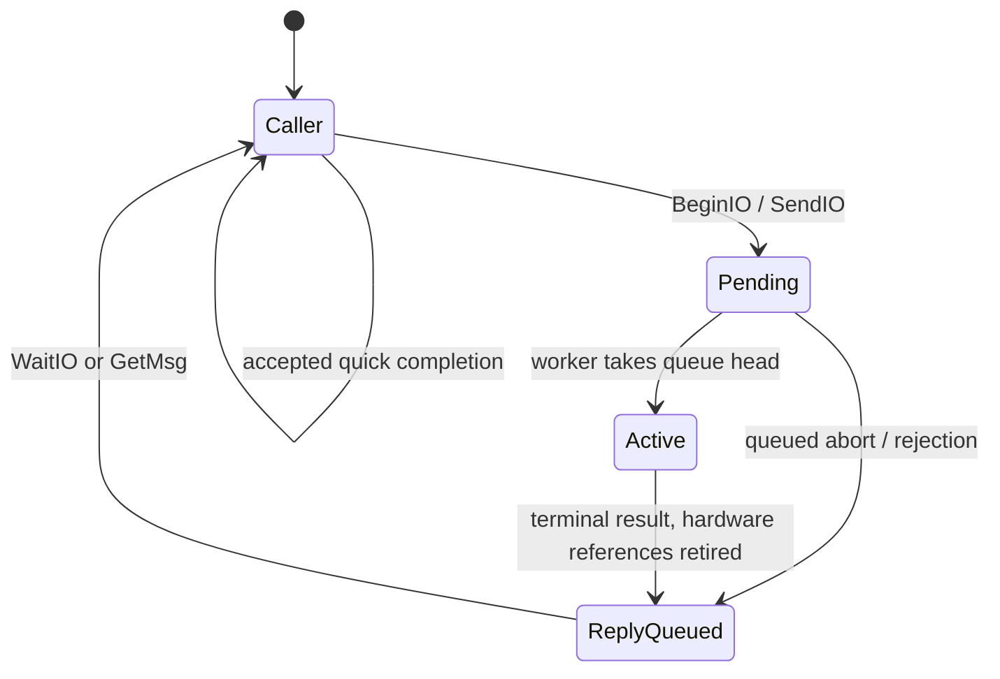

# Queued device I/O and SIO

> Historical record: applies to the revisions and profiles described below.
> See the [current documentation](../reference/device-io.md) and [history index](README.md).

Status: implemented on the pinned emulator, 2026-09-20. The
[implementation record](device-io-sio-implementation.md) and
[eight-slice plan](../plans/device-io-sio-implementation-plan.md) describe the executable
scope and commit boundaries. The ten generic calls and ordinary `sio.device`
registration are available. [Concurrent qualification](../qualification/sio-concurrency.json)
covers four/eight public tasks, raw/optimized code, stock and target-speed
transactions, and the restricted Happy no-data profile. The
[GENERIC57600 extension](sio-57600.md) adds the shell's nominal 57.6 kbaud profile.
DOS and physical hardware
remain separate milestones.

Keep the classic Exec IORequest and OpenDevice/SendIO/DoIO/WaitIO model. Use one
SIO worker for the physical bus and a prearmed native IRQ engine for each wire
transaction. A waiting client releases the CPU to other tasks. The bus processes
one transaction at a time; that does not serialize the whole operating system.

S1-S4 of the [driver boundary implementation plan](../plans/sio-driver-boundary-implementation-plan.md)
move SIO request and worker lifetime ownership into the driver, using public
Task, lease, residency, port and platform-producer facilities. The private SIO
control protocol and its scheduler hooks are removed. The
[final profile and play bundle](sio-driver-boundary-implementation.md#s4-final-profile-and-play-image)
complete the migration with focused development validation.
The selected [resident driver contract](../reference/resident-drivers.md) defines
caller-context entry points, shared-state ownership and the lifetime migration.

## Scope and existing evidence

Provide the generic device calls, a small resident-device dispatch mechanism,
and `sio.device`. Start with queued, finite command transactions against a pinned
disk peripheral. Filesystems, DOS packets, a general timer.device, dynamically
loaded drivers, streaming modems, cassette support and interrupt-callable public
I/O APIs are separate work. Do not introduce another Task API or compatibility
profile.

The [earlier concurrent measurements](messages-ports-implementation.md#concurrent-operation-and-serial-timing)
qualify a generated-byte TX pump alongside four-task port, registry and allocator
work. At the 125 kbaud target, the measured divisor produces about 126.675 kbaud
and a 78.942 µs byte interval. The longest observed refill was 72.176 µs, with no
late refills in those runs. However, one IRQ-masked interval reached 81.832 µs,
and completion-post-to-worker latency reached 18.545 ms. These are observations,
not a bound for every interrupt alignment.

Consequently, the worker must not supply each byte or mediate a timing-critical
transition between command, acknowledgement and data. The
[slice-1 probe](device-io-sio-implementation.md) now qualifies actual bank-crossing
buffers, RX and complete SIO transactions at two contexts on selected disk models.
The production driver now has separate ownership, recovery and eight-task
qualification records. Physical hardware remains unqualified.

## Public Exec contract

Use the classic [exec.library calls](https://developer.amigaos3.net/autodocs/exec.library/)
and [I/O structures](https://developer.amigaos3.net/autodocs/include_h/exec/io.h).
All calls below are exposed through `EXEC`, including the thin BeginIO helper
that classic systems place in
[amiga.lib](https://developer.amigaos3.net/autodocs/amiga.lib/BeginIO.html).
The native signatures are:

| Call | Native result and arguments | Contract |
| --- | --- | --- |
| CreateIORequest | IORequest pointer (MsgPort pointer replyPort, LONGCARD size) | Allocate and initialize a caller-sized request; null on failure. |
| DeleteIORequest | PROC (IORequest pointer request) | Free a created request; null is harmless. No implicit close or abort. |
| OpenDevice | INT (BYTE pointer name, LONGCARD unit, IORequest pointer request, LONGCARD flags) | Bind the request to a resident device/unit; zero on success. |
| CloseDevice | PROC (IORequest pointer request) | Release one successful open after all requests using it have been collected. |
| BeginIO | PROC (IORequest pointer request) | Dispatch with the caller's io_Flags unchanged. |
| SendIO | PROC (IORequest pointer request) | Set io_Flags to zero and dispatch; completion uses a reply. |
| DoIO | INT (IORequest pointer request) | Set io_Flags to IOF_QUICK, dispatch, then collect if queued. |
| CheckIO | IORequest pointer (IORequest pointer request) | Null while pending, otherwise the same pointer; never collect the reply. |
| WaitIO | INT (IORequest pointer request) | Wait for and collect this particular request; return its error. |
| AbortIO | PROC (IORequest pointer request) | Request cancellation; completion must still be collected. |

`INT` results sign-extend the signed eight-bit io_Error to sixteen bits. Store
io_Error as a BYTE containing its two's-complement representation; an ordinary
BYTE-to-INT cast alone would zero-extend it. CheckIO returns the full 24-bit
pointer, including a pointer whose low word is zero.

SendIO resets **all** flags, whereas BeginIO preserves them. DoIO sets exactly
IOF_QUICK; it does not preserve device flags. Device-specific options therefore
belong in the extended request for clients using SendIO/DoIO. These distinctions
follow [SendIO](https://developer.amigaos3.net/autodocs/exec.library/SendIO.html),
[BeginIO](https://developer.amigaos3.net/autodocs/amiga.lib/BeginIO.html) and
[DoIO](https://developer.amigaos3.net/autodocs/exec.library/DoIO.html).

Initially all public device calls require ordinary task context with IRQs
enabled on entry. Blocking continuations run on the caller's stack, outside
kernel-policy serialization. WaitIO and DoIO require a live PA_SIGNAL reply port
owned by that caller; they preserve nested Forbid across a blocking Wait.
Nonblocking submissions may use another task's agreed reply port, or PA_IGNORE
with explicit polling/collection. Asynchronous requests require a non-null
reply port. No public call enters compiled policy from IRQ, NMI or a ROM callback.

### Records, constants and allocation

Preserve classic field order with native 24-bit pointers, 16-bit command/record
length fields and 32-bit transfer quantities. The
[emitted ABI probes](../qualification/io-abi.json) confirm these layouts:

| Record | Fields and offsets | Size / alignment |
| --- | --- | --- |
| IORequest | io_Message 0, io_Device 16, io_Unit 19, io_Command 22, io_Flags 24, io_Error 25 | 26 / 2 bytes |
| IOStdReq | IORequest prefix 0, io_Actual 26, io_Length 30, io_Data 34, padding 37, io_Offset 38 | 42 / 2 bytes |

IOStdReq exposes the same leading fields directly, as in classic Exec. Device
and Unit pointers identify stable driver records. Their internal layouts are
opaque in this first contract; a Library base/vector ABI is not implied.
The Action! declarations therefore use BYTE POINTER for io_Device/io_Unit as
opaque 24-bit handles. Every field offset, array stride and call shape is
confirmed through emitted raw and optimized code in slice 2.

Keep IOF_QUICK=1 and the classic command numbers: INVALID=0, RESET=1, READ=2,
WRITE=3, UPDATE=4, CLEAR=5, STOP=6, START=7, FLUSH=8, NONSTD=9, all with the CMD_
prefix. A device implements only its documented subset and completes unsupported
commands with IOERR_NOCMD. Keep the
[standard errors](https://developer.amigaos3.net/autodocs/include_h/exec/errors.h):
OPENFAIL=-1, ABORTED=-2, NOCMD=-3, BADLENGTH=-4, BADADDRESS=-5, UNITBUSY=-6,
SELFTEST=-7, all with the IOERR_ prefix. Zero means success; positive error values
are device-specific. Define constants, layouts and imports in machine-readable
ABI inputs and generate Action!/assembly definitions during implementation.

CreateIORequest requires a non-null valid reply port and 16 <= size <= 65535.
The lower bound preserves the classic
[Message-sized allocation contract](https://developer.amigaos3.net/autodocs/exec.library/CreateIORequest.html);
OpenDevice and device operations separately require their complete record size.
Reject oversize requests rather than truncating mn_Length. Allocate ordinary
PUBLIC|CLEAR memory, initialize the Message, retain the requested mn_Length and
leave the request inactive. No hidden allocation prefix, per-request task or
signal bit is needed. IORequest consumes 32 heap bytes, IOStdReq 48.

DeleteIORequest frees using mn_Length, matching
[classic lifetime](https://developer.amigaos3.net/autodocs/exec.library/DeleteIORequest.html).
It neither frees io_Data nor deletes the reply port. Static/caller-prepared
requests are also supported and must not be passed to DeleteIORequest. Keep
mn_Length intact throughout the record's lifetime.

### Completion and ownership

Each request uses its embedded Message node for exactly one queue at a time:

Pending and active requests have NT_MESSAGE. A queued reply has NT_REPLYMSG.
Use NT_FREEMSG for initialized inactive requests and quick completions. A quick
completion is permitted only when IOF_QUICK was supplied: the driver finishes
inline, leaves that bit set and sends no reply. Before accepting deferred work,
it clears IOF_QUICK. Every non-quick submission, including an immediate command
error, receives exactly one reply. Actual SIO wire transactions always defer.

After publication, the submitting code must assume the request has already been
processed and collected by its recipient. Do not read its fields again on the
SendIO/BeginIO return path. Until collection, callers must retain the request,
reply port, device open and buffer; they may not resubmit, free or mutate them.
TX data stays immutable; RX data is not consumed until completion. Setting a
completion signal alone does not return ownership.

[WaitIO](https://developer.amigaos3.net/autodocs/exec.library/WaitIO.html) needs a
private guarded operation that checks the **specified request** and removes its
known node from the reply queue. It must not drain unrelated replies, scan all
ports/tasks or loop on WaitPort while an unrelated message remains at the head.
Check, remove and result capture occur under the existing IRQ-permitting policy
guard. If still pending, release the guard and Wait on the reply signal, then
recheck. Never clear that signal between the check and Wait. Shared/stale signal
bits are normal, and an immediate completion may leave the bit set.

WaitIO marks its collected request NT_FREEMSG. GetMsg remains unchanged: it
removes a message without changing its type. Applications may collect I/O with
GetMsg instead, then inspect io_Error and reuse the detached record. Choose one
collection path per submission; calling WaitIO after GetMsg is a double
collection. The node type alone does not prove membership or ownership, so no
claim is made to detect every duplicate submission or stale pointer.
[CheckIO](https://developer.amigaos3.net/autodocs/exec.library/CheckIO.html) only
observes completion and leaves collection to the caller.

[AbortIO](https://developer.amigaos3.net/autodocs/exec.library/AbortIO.html) is
void and does not wait. For a queued request, the driver removes the known node
and replies IOERR_ABORTED. For an active request, it requests a safe stop; normal
completion may win the race. The request remains owned by the device until its
one terminal reply is collected. Cancellation does not undo a peripheral write.

## Resident devices and task-side queues

OpenDevice names are NUL-terminated byte strings, as with FindTask and FindPort.
Action! callers must supply that representation rather than a counted string literal.
OpenDevice performs exact resident-name lookup and validates the unit, flags and
minimum request size before publishing a binding. Initialize failed-open state
so CloseDevice is harmless after a failed open. Each successful open has one
matching close. Extra requests may borrow that binding while its owning open
remains live; initialize their Message fields separately, and never copy active
queue links. Close requires all borrowed requests to be settled too. Retained
device/unit pointers are not independently counted opens.

Validate the Message and declared extent before accessing the I/O tail. A record
shorter than IORequest is invalid for device operations and faults without
touching absent fields; a complete IORequest with an undersized device extension
is rejected by OpenDevice or completed by BeginIO with IOERR_BADLENGTH. Keep
programming faults separate from device results.

An immutable generated dispatch description routes SIO and the immediate test
resident to typed Open/Bound/Close/BeginIO/AbortIO handlers. The checked gateway
returns a route; IOCORE calls the handler on the caller's stack and DP after
leaving kernel policy. Forbid covers validation, preparation and the bounded
callback, with IRQs enabled. Handlers may use public nonblocking Exec calls but
must not suspend with partially updated state. Console and the queued test
resident retain general policy dispatch through the same public I/O interface.
Open initializes software bindings; it performs no SIO transaction.
The SIO worker and its resources must be admitted before the device is published;
startup failure rolls them back without leaving an openable partial device.

This retains the application role of
[OpenDevice](https://developer.amigaos3.net/autodocs/exec.library/OpenDevice.html)
and [CloseDevice](https://developer.amigaos3.net/autodocs/exec.library/CloseDevice.html).
Disk autoloading, AddDevice/RemDevice, expunge and a general resident/Library
framework are deferred until there is a concrete loader requirement. Public
FindPort is not a substitute for OpenDevice, and applications must not bypass
BeginIO by sending arbitrary messages to the driver's private port.

The SIO worker owns one private FIFO request port for all units, one request
arrival signal, one bound hardware-completion signal and one resident-stop
notification bit. Startup/stop waiters use temporary caller-owned signals and
leases; see the [lifetime contract](../reference/resident-drivers.md#task-admission-and-lifetime).
There is one active
request on the entire bus. Queue length is bounded by caller-supplied storage;
clients use finite request pools for backpressure. There is no allocation or
request-table search on submission/completion.

Under driver-held Forbid, GetMsg and setting the active pointer form
one transaction. This leaves no detached, unaccounted request between queued
and active states. Initialize its preparing state and cancellation latch in
that same transaction. An abort during descriptor preparation must survive
preparation and be checked before arming; publishing must never clear an already
posted cancellation. The abort handler distinguishes the active pointer from a
still-pending queued request and unlinks the latter directly. Normal completion,
queued abort and submission all use the same guard. IRQs never inspect these
queues. A long lookup or list operation must not become a long SEI interval.

The worker waits on request-arrival OR hardware-completion. It reads durable
state after waking, handles a terminal result, replies once, then starts the next
request when the bus is available. One active descriptor and one terminal latch
are sufficient: the engine cannot start another transaction until the worker
retires that result. Signals may coalesce without losing completion records.
Streaming or multiple outstanding hardware operations would require a different,
explicitly bounded buffer/completion design.

## First sio.device interface

Use `OpenDevice("sio.device", unit, request, 0)`, where unit is the wire device
ID. Initially admit the configured disk IDs $31–$38; reject unsupported units
and nonzero open flags without narrowing their 32-bit arguments. A successful
open means that the driver is available, not that a peripheral has responded.
All units share the physical bus queue and worker.

Define `SIOCMD_TRANSACTION=CMD_NONSTD` for one complete framed transaction.
Do not reinterpret CMD_READ/CMD_WRITE or io_Offset as raw sector commands.
The qualified IOSIOReq has the IOStdReq prefix followed by:

| Field | Offset / type | Meaning |
| --- | --- | --- |
| sio_Command | 42 / BYTE | Wire command, distinct from io_Command. |
| sio_Aux1, sio_Aux2 | 43, 44 / BYTE | Wire auxiliary parameters. |
| sio_Direction | 45 / BYTE | NONE=0, READ=1, WRITE=2, relative to host memory. |
| sio_Profile | 46 / CARD | Validated platform/peripheral timing profile. |
| sio_TimeoutUS | 48 / LONGCARD | Active-transaction timeout; zero selects profile default. |

Size is 52 bytes, alignment two, consuming 56 heap bytes. io_Length
counts payload bytes, io_Data addresses the payload, io_Actual reports payload
bytes moved, and io_Offset must be zero. Framing/checksum bytes are excluded from
io_Actual. On error or cancellation it can report a partial transfer; it does
not certify valid RX data or that a peripheral committed a write. Applications
must inspect io_Error. NONE requires zero length; READ/WRITE require a nonzero
length and valid buffer. A profile bounds accepted lengths and command forms.

FASTEST125 and GENERIC57600 accept payloads up to 128 bytes and exactly 256 bytes for READ
command `$52`; intermediate lengths and larger writes remain rejected. The
[sector qualification](../qualification/sio-sectors.json) covers this extension.
The [57.6 kbaud record](sio-57600.md) covers GENERIC57600, including short boot
sectors, full data sectors and the unchanged IOSIOReq layout.
STOCK810 remains limited to 128-byte payloads, and Happy1050 to zero-byte NONE
transactions. Timeout zero selects
1,000,000 us, or 2,000,000 us for STOCK810; an explicit timeout must be at least
4,041 us and no greater than that profile default. Cold 810 seek/rotation plus
stock-speed transfer exceeded one second in concurrent testing. The two-second
budget accommodates that device latency without changing byte or phase timing.

The timeout starts when the active transaction asserts COMMAND, not while the
request is queued. Queued work can be cancelled directly. Validate nonzero
timeouts against the profile's supported range, less than half the private
32-bit clock's wrap interval; use wrap-safe comparisons. Microsecond units do
not promise microsecond resolution. The platform profile must specify actual
timer resolution and maximum enforcement lateness.

Reserve positive SIO errors for TIMEOUT=1, NAK=2, DEVICE=3, CHECKSUM=4,
OVERRUN=5, FRAMING=6, PROTOCOL=7, BUSUNAVAILABLE=8 and BADPROFILE=9, with the
SIOERR_ prefix. Preserve the first causal error during draining/recovery;
out-of-band diagnostics may record subsequent failures. Use the common negative
errors for invalid commands, lengths, addresses and accepted cancellation.
Do not silently retry writes or fall back to ROM SIO. Initial automatic retry
count is zero; any later retry policy must account for uncertain write effects.

Caller buffers may use ordinary or MEMF_LINEAR upper RAM. Validate the complete
24-bit address extent with widened arithmetic before arming; reject wrap,
unmapped ranges and profile oversize transfers. Advance the IRQ cursor across
banks correctly. A 32-bit length does not imply unlimited peripheral blocks.
No default bank-zero bounce buffer or MEMF_CHIP requirement is introduced.

## SIO transaction engine and timing

The hardware baseline is the
[Altirra Hardware Reference Manual](https://www.virtualdub.org/downloads/Altirra%20Hardware%20Reference%20Manual.pdf),
2026-01-02 edition, sections 5.6–5.7 and 9.1. Relevant constraints: COMMAND uses
PIA CB2; a command frame contains device, command, two auxiliaries and checksum.
SERIN holds one completed byte. Output-ready is not output-complete. Receive
data can immediately follow Complete/Error, including an Error result. The
host does not ACK a received data frame. A peripheral need not support cancelling
an operation already started. These constraints shape the following design.

| Transaction | Prearmed sequence after command transmission |
| --- | --- |
| NONE | Receive command ACK, then Complete/Error. |
| READ | Receive command ACK, then Complete/Error, then payload and checksum. |
| WRITE | Receive command ACK, observe write delay, transmit payload/checksum, receive data ACK, then Complete/Error. |

For each request the worker prepares an upper-RAM descriptor containing the
command frame, buffer cursor/limit, direction, checksum state, phase, deadlines,
result, cancellation state and generation. Validate and build it with IRQs
enabled while unpublished. A short native transaction publishes the descriptor
only after all fields are ready. Until disarmed, its storage and the buffer are
pinned by ownership, regardless of the submitting task's scheduling state.

The IRQ engine handles bounded byte movement, status capture, checksum update
and a finite set of phase transitions. It never allocates, walks lists, searches
tasks, calls ports or invokes compiled policy. Configure RX before releasing
COMMAND, keep it armed across result-to-data, and consume expected error-result
data before declaring the bus reusable. After the final TX write, observe its
acceptance into the shifter before relying on transmit-complete. Disable the
level-like complete source when it is no longer needed. Qualification must test
these boundaries, not just steady-state byte throughput.

At a terminal state the engine disables its active sources and retires all
references to caller storage, writes result/count, publishes a final commit
marker, then directly posts the bound worker signal. Descriptor handoff and
generation checks prevent a late IRQ from completing a reused request. The
worker copies results into the request before ReplyMsg and does not access that
request after publishing the reply. Clearing the active pointer and publishing
the reply are serialized together against AbortIO. It clears the terminal latch
before arming another descriptor.

### Phase alarms are a prerequisite, not a worker delay

Protocol delays and timeouts require a private native alarm mechanism alongside
serial events. Waiting for a worker or polling under SEI is unacceptable for
tight phase deadlines. A VBI tick can supervise long waits, but cannot supply
sub-millisecond COMMAND timing. No public timer.device or extra timer task is
required by this design.

The [focused probe](device-io-sio-implementation.md#timer-decision-and-profile-limits)
passes with independent POKEY timers 1 and 2 alongside linked serial clock
channels 3+4. Timer 1 supplies 224-base-cycle phase ticks only during short delays;
timer 2 supplies 7,168-base-cycle watchdog ticks while active. Rearming changes
the countdown and IRQ enable, without STIMER or a serial clock reset. Adopt this
candidate for slice 5, where production register/shadow ownership, interrupt
load and descriptor handoff still require qualification. The diagnostic snapshot
of write-only settings is not a production ownership mechanism.
The earlier [serial adapter test](serial-irq-adapter.md#measurement-and-limits)
already shows that adding hardware-timer interference can break byte timing.

Profiles must pin command/data baud, supported commands/lengths, minimum and
maximum host delays, ACK and byte timeouts, device-operation timeout, alarm
resolution, recovery policy and peripheral firmware/model. Begin with a stock
nominal-19.2-kbaud disk profile and separately qualify the 125-kbaud target with
a compatible peripheral. High speed is not a universal property of SIO devices.
The manual's page 219 text and Figure 18 disagree on the write-start delay
(10–18 versus 1.0–1.8 ms). The
[probe profile](../../toolchain/altirra-sio-device.json) explicitly uses Figure 18's
1.0–1.8 ms interval for its pinned disk models, with complete write/read-back
evidence. Other peripheral profiles must resolve and qualify their own limits.

If buffered RX/TX plus the alarm cannot meet the target under the pinned ROM
configuration, revisit interrupt entry, OS exclusion and the byte path before
building DOS. Batching task notifications alone cannot repair missed bytes.

### Abort, timeout and bus recovery

Abort of an active request sets a native cancellation latch through the same
protected handoff used by the engine. A silent peripheral must not prevent the
alarm path from observing cancellation. Whether a phase can stop immediately or
must finish/drain is a profile rule; the driver may complete normally if safe
cancellation is no longer possible. Keep the request and buffer until there is
no remaining hardware reference. Aborting is not equivalent to forcibly removing
the worker task.

Distinguish **memory quiescence** from **bus recovery**. After a timeout the IRQ
may stop touching client memory while a peripheral can still transmit. It may
then latch a terminal result, but the bus stays unavailable to new transactions
until a bounded profile recovery succeeds. Recovery uses private discard state,
never a returned caller buffer. Do not treat a quiet moment as proof that a
timed-out peripheral will not transmit later.

If recovery cannot establish a safe bus, latch it offline and complete pending
and later submissions with BUSUNAVAILABLE. Hardware may be locally quiesced and
unrelated OS state restored, but ROM SIO must remain excluded too. Reopening a
unit does not clear that condition. A qualified reset/recovery or platform reset
is required before reuse; shutdown must not hand an unsafe bus back to ROM as
though it had recovered. No unbounded recovery loop holds a request forever.

## IRQ, ROM and scheduling coexistence

Extend the [serial IRQ adapter](serial-irq-adapter.md) for receive, output-ready,
output-complete and the selected alarm source in **both native and emulation
entry paths**. The current adapter routes output-ready only. ROM VBI may enable
IRQs while in emulation mode; that callback must preserve its complete context
and retire the ROM activation before scheduling. Keep the existing full native
context, stack/domain checks and NMI-aware switching protocol.

Use the existing direct signal post and pending-wake queue. Bind the known worker
Task/context/mask before enabling a producer. An IRQ records the event and makes
the worker eligible; it does not force a context switch inside an OS activation
or a protected policy operation. Stop sources, retire callbacks and drain pending
delivery before releasing the binding or removing the worker. The experimental
EXECSIGNALIRQ diagnostic helpers are not the public driver API.

Before asserting COMMAND, acquire exclusive SIO ownership atomically against
OS entry. Enforce that exclusion at the ROM-service boundary throughout transfer
and recovery, not just with a one-time OS_BUSY check. ROM calls that may enter
SIO must be rejected/deferred before entering ROM. Never implement the worker
by calling SIOV: that would retain the serialized OS activation through I/O.

Define ownership and restoration for serial/alarm enables and vectors, POKEY
configuration, the owned PIA control bits and CRITIC. Maintain authoritative
shadows for write-only registers; their read aliases are not saved settings.
Merge owned bits on restore so unrelated interrupt changes survive. A live audio
or timer user must participate in this ownership contract or reject the claim.
The present serial claim helper's saved IRQ bits/VSEROR/CRITIC are insufficient.

CRITIC defers stage-two VBI while stage one and Exec's scheduling tick continue.
Bound each active transaction with the profile timeout and restore CRITIC at
retirement. The dedicated Exec workload does not insert an OS-service sleep
after a clean completion or guarantee a stage-two VBI between every two queued
requests. Retained OS display/input/timer services get opportunities when the
bus is inactive; uninterrupted legacy OS service is not a requirement while
the native driver owns POKEY. Preserve native scheduling, unowned IRQ handling
and state restoration at shutdown. Error recovery remains separate from clean
completion and never treats a quiet interval as proof that an uncertain bus is
safe. Native SIO removes dependence on ROM for this storage path; AltirraOS
still supplies boot and explicitly retained platform services.

## Task and memory budget; DOS boundary

One SIO bus uses **one worker**, irrespective of opens, units, ports or queued
requests. Admit it from the existing static context pool. No execution slot is
created by CreateIORequest or OpenDevice. A future root/shell + SIO worker + one
filesystem worker uses three of the required eight public task slots, leaving
five for applications/other services. Waiting workers and clients retain their
stack and DP reservations. Future 12–16-task support still needs qualification.

Put device/unit records, the private port, requests, active descriptor, alarm
state and buffers in upper RAM. Place driver code using the configured compile-time
kernel starting bank. Do not enlarge every Task or DP merely to add I/O. A
worker consumes an existing task slot, not a second hidden IRQ context.

This documentation change reserves **zero bytes**, fixed or per task. Current
complete bank-zero reservations, including guards, padding and unused capacity,
are unchanged:

| Public task capacity | Runtime including OS | Loading including OS |
| ---: | ---: | ---: |
| 4 | 57,968 bytes | 58,560 bytes |
| 8 | 61,536 bytes | 57,232 bytes |

See the [platform budget](../reference/platform.md#bank-zero-memory-budget) and
[current implementation accounting](messages-ports-implementation.md#regression-scope-and-remaining-work).
Implementation must separately report fixed callback/scratch changes and worker
stack/DP costs, even if total reservations stay unchanged. The existing 4,096-byte
upper native-helper reservation contains 3,368 bytes normally or 3,482 with the
diagnostic pump. Do not assume the complete driver fits its remaining space;
give new code/state explicit map extents and exclude them from heap ownership.

DOS should use a block adapter above these transactions. That adapter owns
geometry, byte-offset-to-sector translation, boot-sector size exceptions and
media policy. It can execute in the filesystem worker without another driver
task. A later block device may expose CMD_READ/CMD_WRITE with ordinary byte
offsets; raw sio.device auxiliary fields must not become a filesystem ABI.
Filesystem operations, caching, allocation of disk blocks and DOS packets remain
above this boundary. Queued I/O is usable before DOS exists.

## Deliberate differences and deferred capabilities

| Choice | Reason |
| --- | --- |
| Native pointers/layouts and sixteen-bit signed call results | Fit actionc's 65816 ABI; preserve field meanings and signed-byte errors, not 68000 binary compatibility. |
| BeginIO in EXEC | Keep the device entry point available without introducing amiga.lib linkage conventions. |
| Task-only, IRQ-enabled public calls | Coordinate driver callbacks through public Task/port operations while limiting masked time; native IRQ work has a separate bounded contract. |
| Resident static dispatch; opaque Device/Unit | Avoid inventing a Library/vector loader before it is needed; retain classic application call shapes. |
| 65535-byte request-record ceiling | mn_Length must represent the allocation used by DeleteIORequest; payload lengths remain 32-bit. |
| One bus worker with IRQ-level transaction progression | Conserve bank zero and tolerate measured worker scheduling delays. |
| Raw SIO extension and named timing profiles | Express Atari wire commands and target-specific timing without redefining generic Exec commands. |
| Driver-specific timeout/recovery; timer.device deferred | A finite SIO transaction needs hardware deadlines now, independently of a general timer service. |

Priorities remain stored but ignored by the scheduler. Semaphores, IRQ ports,
software-interrupt completion, dynamic driver loading and automatic task-exit
reclamation are not prerequisites for this first driver. Explicit producer and
request lifetime remains mandatory; there is no automatic recovery from a client
or worker being forcibly removed with live I/O.

## Acceptance gates

1. **Probe the missing hardware path first.** At one or two tasks, move actual
   upper-RAM TX/RX buffers, including bank crossings, and exercise the phase alarm
   and complete command/read/write transactions. Pin a peripheral, resolve its
   timing profile and record actual baud, byte service, COMMAND transitions,
   final-bit/turnaround behavior and silent-device timeout. Keep serial
   acceleration disabled. This gate settles the alarm choice before full SIO
   integration; generic APIs can independently be tested with a fake device.
2. **Qualify the generic contract through emitted code.** Cover proposed layouts,
   signed errors, full pointers, allocation failure/rollback, open/close and
   borrowed bindings, quick versus replied completion, immediate errors, FIFO,
   out-of-order replies, shared signals and unrelated messages ahead of WaitIO's
   target. Force completion between check and Wait and reuse before SendIO
   returns. Cover queued/active abort races, exactly-one reply, no early buffer
   reuse and detected invalid contexts. Use raw and optimized NIR.
3. **Qualify the driver and ownership exits.** Exercise native and emulation IRQ
   paths, all saved contexts, NMI during descriptor publication, simultaneous
   owned/unowned sources, stale IRQs, cancellation in every phase, no response,
   NAK, Error-plus-data, checksum/framing/overrun errors, delayed/extra bytes,
   recovery failure, close/shutdown and restart. Verify byte content/counts as
   well as hardware flags: a clear overrun flag alone cannot prove lossless RX.
4. **Qualify concurrent timing at four, then eight live tasks.** Include actual
   request/reply traffic, allocation/CLEAR, registry scans, Forbid sections, OS
   service intervals and unrelated IRQ load. Measure IRQ-masked spans, RX/TX
   deadlines, phase/alarm jitter, completion-to-worker, next-request start,
   client collection, queue progress and stack/DP guards separately. Specify
   profile limits before accepting runs. Record passive traces and identical
   uninstrumented replays with pinned compiler/ROM/emulator provenance.

A missing byte, missed protocol deadline or stalled background task fails the
relevant qualification even if the final checksum or reply looks correct.
Eight-task concurrent SIO, explicit bank-zero accounting and bounded OS
coexistence are required before claiming the SIO/DOS foundation is ready.
Emulator results remain distinct from later physical-hardware qualification.
