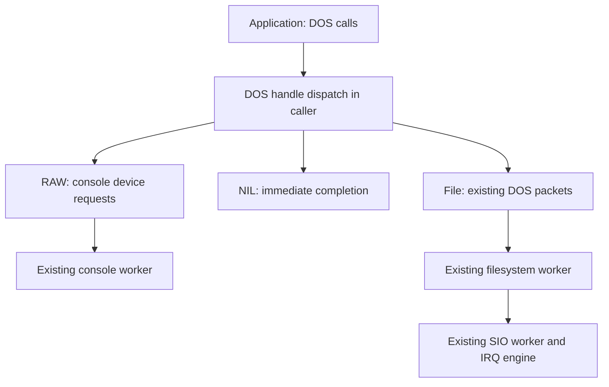

# DOS console streams

> Historical record: applies to the revisions and profiles described below.
> See the [current documentation](../reference/streams.md) and [history index](README.md).

Status: accepted design, updated 2026-09-22; implemented and qualified through all
seven [implementation slices](dos-console-streams-implementation.md). The
[native console](../reference/console.md) and [read-only MyDOS service](../reference/dos.md)
are implemented. This note adds file-like console access and task-local standard
input/output above those services. It does not change their qualification status.

The [cooked console extension](../reference/cooked-console.md) now adds bare CON:;
its separate [implementation record](console-interaction-implementation.md)
describes current qualification and remaining foreground/window work.

The [implementation plan](../plans/dos-console-streams-implementation-plan.md) divides
this milestone into seven executable slices with a commit after each slice.

The proposed [resident shell](shell-design.md) builds on these streams with
current-directory support, command parsing and redirection. Its application
editor does not change RAW: into a cooked CON: handler.

Keep DOS in the Exec816 repository as a component above Exec. Exec owns tasks,
signals, memory, messages and device requests; devices own keyboard/display and
serial transport; DOS owns stream names, handles and standard-stream selection.
Shell parsing and command execution belong above DOS. These streams work for
resident commands and do not depend on implementing the chosen o65 loader.

## First milestone and boundaries

Deliver `Open("RAW:", mode)`, `Open("NIL:", mode)`, `Read`, `Write`, `Close`,
`Input`, `Output`, `SelectInput`, `SelectOutput` and `IsInteractive`. Existing
file reads, seeks, directory operations and task-local `IoErr` remain available.
Applications can use `Write(Output(), ...)` without knowing its destination,
select a file as input, or discard output through NIL:.

**RAW:** provides translated byte input without automatic echo or line editing.
**CON:** adds the separate cooked line contract, using the same physical endpoint.
Standard error, inherited/shared handles, public asynchronous
DOS packets, timed input, buffered stdio, pipes and shell redirection syntax are
follow-ups. MyDOS remains read-only; console Write does not authorize filesystem
writes. Multiple windows retain their separate required design stages.

The first acceptance example opens a console stream, selects it as input/output,
and echoes bytes with ordinary DOS calls while another Task performs a real
MyDOS Read. A second client can write to the same console while the first waits
for keyboard input. NIL: must also work with console disabled and no disk mounts.

## Execution model and task cost

Implement RAW: and NIL: as small DOS backends in the **calling Task**. RAW:
submits ordinary requests to the existing `console.device` worker; NIL: completes
locally. File operations continue through packets to the filesystem worker.

A console Read must never occupy the filesystem worker. Conversely, a long
filesystem Read must not prevent another Task from calling console Read/Write.
No DOS work runs in IRQ/NMI, and the console worker never calls DOS synchronously
or waits for a request that only it can complete.

This design adds **zero Tasks**, including zero Tasks per stream, open or future
window. Shell/root + console + filesystem + SIO still uses four of eight public
slots, with private idle additional. A separate read client uses a fifth slot
as before. Blocking DOS calls suspend their caller; other runnable Tasks and
the device workers continue. A single Task cannot issue another synchronous
DOS call while its Read is blocked. Immediate asynchronous shell notifications
still require a separate application Task or a future asynchronous interface.

Using caller-side adapters instead of another packet-handler Task is an explicit
implementation deviation, justified by the native stack/DP and task-slot budget.
The public file API stays independent of that choice. This is not a public
Amiga handler-packet compatibility layer or a generic pluggable VFS framework.

## Public API

Keep opaque native 24-bit `FileHandle POINTER` values and signed 32-bit LONGINT
lengths/results. Reuse the existing DOS module, not a separate console API.
Calls are task-only. Blocking calls require IRQs and scheduling enabled, as
with the existing DOS/device contracts; none may run from an interrupt callback.
The reference call shapes and core results come from
[Read](https://developer.amigaos3.net/autodocs/dos.library/Read.html),
[Write](https://developer.amigaos3.net/autodocs/dos.library/Write.html) and
[Close](https://developer.amigaos3.net/autodocs/dos.library/Close.html).

| Call | Exec816 signature/result | Contract |
| --- | --- | --- |
| Open | FileHandle pointer (BYTE pointer name, LONGINT mode) | Owned handle, or null with IoErr. |
| Read | LONGINT (FileHandle pointer file, BYTE pointer buffer, LONGINT length) | Nonnegative count, or -1 with IoErr. A positive-length RAW read waits for bytes rather than returning false EOF. |
| Write | LONGINT (FileHandle pointer file, BYTE pointer buffer, LONGINT length) | Count committed to the destination, or -1 with IoErr. |
| Close | LONGINT (FileHandle pointer file) | Nonzero success, zero failure. An accepted close consumes the owned handle. |
| Input / Output | FileHandle pointer () | Borrowed current selection for the calling Task; null if unset. |
| SelectInput / SelectOutput | FileHandle pointer (FileHandle pointer file) | Replace the calling Task's selection and return the previous one. Null clears the selection. |
| IsInteractive | LONGINT (FileHandle pointer file) | DOSTRUE for RAW:, DOSFALSE for valid files/NIL:. Invalid handles return DOSFALSE with IoErr. |
| Seek | Existing signature | RAW:/NIL: return -1 with ERROR_SEEK_ERROR. File behavior is unchanged. |
| SetIoErr | LONGINT (LONGINT error) | Set the calling Task's secondary error and return the previous value; no context allocation. |
| IoErr / ReleaseContext | Existing signatures | Task-local secondary result and explicit context lifetime remain in force. |

DOS Boolean values remain `DOSTRUE=-1`, `DOSFALSE=0`. Getters do not create a
context, open a console, start a worker or change IoErr. Selectors accept only
null or a live FileHandle owned by the caller. Failure leaves the selection
unchanged and returns null with a nonzero error; success sets IoErr to zero, so
an unset previous selection is distinguishable from failure. IsInteractive
likewise clears IoErr on a valid handle, including a noninteractive one.

Selections do not imply read/write permissions or turn open modes into POSIX
access flags. For example, selecting a read-only MyDOS handle as Output is
allowed; attempting a nonempty Write still reports write protection.

The getter/selector model follows
[Input](https://developer.amigaos3.net/autodocs/dos.library/Input.html),
[Output](https://developer.amigaos3.net/autodocs/dos.library/Output.html),
[SelectInput](https://developer.amigaos3.net/autodocs/dos.library/SelectInput.html),
[SelectOutput](https://developer.amigaos3.net/autodocs/dos.library/SelectOutput.html)
and [IsInteractive](https://developer.amigaos3.net/autodocs/dos.library/IsInteractive.html).
An Exec Task initially has no selected streams; a resident shell sets its own.
No full Amiga Process record or process-startup inheritance is implied.

## Names and open modes

Classify names before filesystem startup and before MyDOS-specific component
validation. Use bounded, mapped, NUL-terminated names, at most 255 bytes excluding
the terminator. Compare the ASCII device prefix without case sensitivity.

| Name | Initial meaning |
| --- | --- |
| `RAW:` | Open a DOS handle referring to the existing default console instance, unit 0. |
| `NIL:` | Open an independent null stream: immediate EOF on Read, discard on Write. |
| `D1:...` and other configured mounts | Existing filesystem path and mount behavior. |
| `CON:` | Cooked input with echo/editing, retained partial reads and Ctrl-D EOF; see the cooked contract. |
| `CONSOLE:` | Reserved but unsupported: ERROR_ACTION_NOT_KNOWN. |
| `RAW:...` / `NIL:...` with a nonempty suffix | Unsupported syntax: ERROR_INVALID_COMPONENT_NAME. |
| Unknown prefix | ERROR_DEVICE_NOT_MOUNTED. |

Reserve RAW, NIL, CON and CONSOLE against mount-alias collisions; reject a
conflicting mount configuration before publishing it. `*`, window geometry,
titles and option strings are deferred and must not silently resolve to RAW:.
NIL: and namespace errors do not start filesystem/SIO services. Check configured
mount aliases before lazy filesystem startup when classifying other prefixes.
RAW: requires the already configured native console; it must not call ROM or
implicitly enable the service in a headless build.

Accept `MODE_OLDFILE=1005`, `MODE_NEWFILE=1006` and `MODE_READWRITE=1004` for RAW:
and NIL:. Each permits Read and Write; there is no file to truncate. Opening an
additional stream does not clear the screen, discard pending input or reset an
existing DOS console binding. Reject other modes with ERROR_BAD_NUMBER.
Keep MyDOS's rejection of mutating modes, and make the new Write entry reject
nonempty file writes with ERROR_DISK_WRITE_PROTECTED. Move the current global
Open-mode rejection behind destination classification.

Classic [Open](https://developer.amigaos3.net/autodocs/dos.library/Open.html)
describes creation/sharing modes rather than read-only/write-only permissions.
Its CON:/RAW: window-opening syntax is broader than this proposal. Binding the
one existing console, rather than creating a new window, is a documented target
restriction until the window manager and multi-instance lifetime exist.

## Byte transfers and errors

Validate the handle before dispatch. Reject negative lengths, null pointers for
positive lengths, 24-bit endpoint wrap and inadmissible buffer extents before
submitting I/O. RAW Read requires writable memory, Write readable memory, using
the device's admitted extent rules. Preserve bank-crossing LINEAR buffers and
32-bit counts; no 64 KiB payload limit is introduced. A zero-length operation
on a valid handle returns zero without inspecting its buffer, allocating an I/O
request, touching hardware or consuming input. This includes read-only files
for zero-length Write; positive-length file Write still fails explicitly.

RAW Read uses one nonempty `CMD_READ`, with the requested capacity. Return its
available prefix without waiting for Return or repeatedly reading to fill the
buffer. The current device copies at most 64 bytes per read; that implementation
quantum does not narrow the DOS length field. Empty input blocks. RAW has no
keyboard EOF convention: Ctrl-C/BREAK remains byte 3, and other controls are
ordinary bytes where the device keymap supplies them. There is no implicit echo,
editing, ATASCII conversion or process break signal. A successful nonempty device
read with zero Actual is an internal contract failure, not DOS EOF.

RAW Write submits one `CMD_WRITE` for the whole call. Distinct calls follow the
device's write FIFO; their source bytes do not interleave within a request,
though several Write calls making up one application message can interleave
with another writer. Completion means retained terminal state has consumed the
bytes and released the source buffer, not that every glyph is already visible.
Preserve terminal controls and explicit application-side ATASCII conversion.

Do not add an output spool or copy an entire write into DOS memory. On an I/O
error return -1 even if a prefix was committed; console output cannot be rolled
back and retrying the whole write can duplicate that prefix. Read errors may
leave the buffer modified; callers discard that call's contents. Successful
operations set IoErr to zero; successful Close preserves the preceding IoErr.

NIL Read returns zero immediately. NIL Write returns the requested nonnegative
length without reading or copying the payload. Positive-length NIL buffers must
still pass the common pointer/extent check: this is an explicit validation rule,
not a claim to reproduce every classic NIL: pointer special case. NIL is not
interactive and provides no seekable cursor.

| Condition | Secondary result |
| --- | --- |
| Missing console configuration/service | ERROR_DEVICE_NOT_MOUNTED (218). |
| Console held by a direct Exec client, endpoint opening/closing, reference saturation, or another pending RAW reader | ERROR_OBJECT_IN_USE (202). |
| Invalid, null or foreign-task handle | ERROR_BAD_STREAM_NAME (206). |
| Allocation/signal failure | ERROR_NO_FREE_STORE (103). |
| Invalid length, mode or buffer extent | ERROR_BAD_NUMBER (115). |
| Raw input overflow/loss | ERROR_BUFFER_OVERFLOW (303); return -1, never EOF or truncated successful input. |
| Other device completion failure | Preserve the causal Exec error, sign-extending generic negative io_Error values into LONGINT. |

Use the classic overflow constant from
[dos/dosasl.h](https://developer.amigaos3.net/autodocs/include_h/dos/dosasl.h).
Keep all added public constants/imports in [abi/dos.json](../../abi/dos.json) and
generate their shared definitions. Do not reuse unrelated filesystem-corruption
errors for console input loss. Following an overflow, the next Read uses the
device's documented reset/loss-clearing behavior; DOS adds no silent retry.

Lock/Examine/directory operations must not reinterpret a stream as a file-system
object. Lock of RAW:/NIL: fails with ERROR_OBJECT_WRONG_TYPE without starting the
filesystem. Passing a FileHandle as a FileLock retains the normal invalid-lock
error. No successful Flush, SetMode or WaitForChar stub is part of this scope.
In particular, [Flush](https://developer.amigaos3.net/autodocs/dos.library/Flush.html)
is not `CMD_CLEAR`, and
[WaitForChar](https://developer.amigaos3.net/autodocs/dos.library/WaitForChar.html)
must not be simulated by consuming a byte or returning false on every call.

## Handle ownership and standard streams

Each Open returns a new handle owned by its calling Task, linked into that
Task's existing DOS object accounting. Several handles can refer to the same
console endpoint, but they are not the same owned object. Another Task opens
its own RAW: handle; directly passing a FileHandle between Tasks remains
unsupported. A future process layer must define inheritance/duplication rather
than copying opaque pointers into a child's context.

Store Input and Output selections in the lazily allocated upper-RAM client
context. Neither getter nor selector transfers ownership or adds a hidden open
reference. The same owned handle may be selected for both directions and is
closed exactly once by its opener. Built-in commands borrow the selections and
must not close them; the surrounding shell owns their lifetime. Selection does
not rewrite the handle's reply-port owner or move input already buffered in the
device.

Redirection inside one Task is save/select/run/restore, followed by Close of the
temporarily opened handle. Restore on command failure as well as success. This
supports file input and NIL: output now; disk output awaits writable filesystem
support. Selecting another console destination does not create a window.

An accepted Close clears either selection that still points to that handle
before freeing it. This small native rule avoids dangling defaults; normally
the shell restores its saved selections first. Once closing begins, consume the
handle even on a backend close error, following the DOS Close model. Invalid
handle/reentrant-call rejection occurs before accepting a close and leaves live
objects untouched. Close does not cancel another Task's pending Read.

Keep one synchronous DOS operation per Task and reject reentrancy. Mark client
initialization, allocation, I/O and teardown consistently with the existing
`active`/`busy` removal guards. ReleaseContext succeeds only when all objects
are closed, selections are null and no request/reply is outstanding. It releases
the optional console request, the existing reply port/signal and context. It
does not implicitly close a leaked stream or detach a waiting buffer. Task
removal and slot reuse retain the existing DOS guards and reset all selections.

## One device open, multiple DOS handles

The physical unit still admits one owning `OpenDevice`. DOS keeps a shared
upper-RAM endpoint containing that owning request, a reference count and a
generation. Every successful RAW Open takes one endpoint reference. The first
opens the device; the last Close releases it after all borrowed requests are
collected. A direct Exec open and the DOS endpoint cannot own unit 0 together.

The owning request must not retain the first opener's private reply port. Embed
a manually initialized PA_IGNORE port and idle IOStdReq in the shared endpoint;
use that request **only for OpenDevice/CloseDevice**, never a transfer or WaitIO.
Initialize the Message and port list fields under the existing caller-prepared
request/port contracts. Their allocation belongs to the endpoint, with matching
manual cleanup rather than DeleteMsgPort/DeleteIORequest. This allows the first
opening Task to close its own handle and ReleaseContext while another Task still
holds the device through a different handle.

Each console-using client lazily allocates one reusable 42-byte transfer
IOStdReq. It borrows only io_Device/io_Unit from the retained endpoint and has
its own initialized Message fields. Its reply port is the client's existing
private DOS port, owned by that Task. The client busy gate makes a filesystem
packet and a console request mutually exclusive on that port. Collect the exact
I/O request with WaitIO before allowing another public call; the existing packet
collector must never receive a leftover device reply. No extra port, signal or
request per byte is needed. Requests are unbound/reset between uses so a client
may later reopen the console or use another destination safely.

Endpoint Read admission records the one active reader while a nonempty read
is in flight, through terminal reply collection. Reject a second concurrent
reader with ERROR_OBJECT_IN_USE rather than stealing bytes or introducing an
unbounded wait queue. When no read is outstanding, another owned RAW handle may
read the next bytes. This is arbitration, not independent per-handle input:
keyboard bytes belong to the console instance. Writes from other clients remain
admissible throughout a waiting Read. A normal completion racing cancellation
must still be collected exactly once; no public DOS cancellation API is added.

Publish the endpoint through a small generated upper-RAM registry with explicit
CLOSED, OPENING, READY and CLOSING states. Reserve the transition and generation
under a short IRQ-permitting Forbid section; allocate, open/close the device and
free storage with scheduling permitted. Concurrent Open during OPENING/CLOSING
returns ERROR_OBJECT_IN_USE. Do not hold Forbid while waiting, validating a long
buffer, copying or rendering. Allocation/open failure rolls back every request,
reference and partially initialized object before returning. Never wrap a
saturated reference count or generation into a valid new owner.

Live handles keep the endpoint allocated. Track accepted operations as well
and require zero active requests/replies before final device close. Last-close
and new-open races must see either a retained READY endpoint or CLOSING, never
freed state. Close of one handle while a different client waits cannot be the
last close. After the last close, clear discovery before releasing endpoint
storage; a later first open performs the device's normal clean-input reopen.

The console resident itself remains configured and alive after the endpoint
closes. Existing last-application retirement then stops console/DOS/SIO workers.
No additional resident count or shutdown Task is introduced. Unsafe SIO still
parks at `$FF93` before normal console/heap teardown; closing software handles
must not convert that state into a safe return to ROM.

## Integration with the current implementation

The existing [DOS calls](../../lib/dos/doscalls.act) assume every FileHandle has a
filesystem mount, and [object lookup](../../lib/fs/fsregistry.act) casts each owned
object to FSTYPES.Object. Those assumptions must change together:

- Give owned file/lock/stream records a small common prefix for list linkage,
  owning DosSlot, object kind and backend tag. Keep filesystem cursor/mount
  payloads separate from console endpoint and NIL state. Inline the prefix;
  do not add an extra heap wrapper around every existing file.
- Find the caller-owned identity before dereferencing its backend payload.
  Only filesystem objects use mount retain/generation checks. FileLock and
  FileHandle remain distinct kinds even when they share list machinery.
- Route built-in stream names before FSBOOT.Ensure and route handle operations
  by backend. Keep file packet semantics, mount references and private ReplyMsg
  routing unchanged. There are no fake disk mounts or sector buffers for RAW:.
- Centralize object link/unlink/count rules, including context cleanup. Do not
  leave separate filesystem and stream counts that can disagree at RemTask.
- Extend DOS generation/import bindings and package provenance in the current
  ABI. Rebuild all callers/tests; no compatibility version or parallel API is
  required during active development.

Suggested ownership is a small `DOSSTREAMS` implementation module with the
public entry points still generated in DOS. This is a routing change inside
DOS, not a new Exec gateway for Read/Write. Keep the existing direct DosSlot
association; do not add DOS fields to public Task or use tc_UserData. Task-side
lookup of caller-owned objects is permitted; IRQ delivery remains direct to the
known console worker and never scans streams, windows or Tasks.

## Memory and stack budget

This documentation change reserves **zero fixed or per-Task bank-zero bytes**.
The implementation target is also zero growth, including guards, alignment and
unused capacity. Eight-slot loading/runtime totals remain 57,232/61,536 bytes
including OS; see the [platform budget](../reference/platform.md#bank-zero-memory-budget).
There is no new stack, DP, screen, raw-key ring or translated input FIFO.

Use these upper-RAM planning amounts; freeze actual layouts in generated inputs
and verify emitted SIZEOF/offsets before claiming exact implementation costs:

| Resource | Planned cost and lifetime |
| --- | --- |
| Discovery/transition state | One explicitly mapped 16-byte registry in the configured kernel bank, outside existing reservations. |
| Client defaults and request pointer | Nine pointer bytes added to client payload; expected rounded context grows from 72 to 80 bytes using existing tail padding. No increase to the 16-byte per-slot DosSlot. |
| Reusable transfer request | 42 payload bytes rounded to 48, once per client that performs console I/O; released with its context. |
| Console/NIL handle | Budget 16–32 rounded bytes per open, including common prefix and applicable endpoint identity. No Task or private signal. |
| Shared console endpoint | Budget at most 128 rounded bytes, including the 42-byte owning request, 27-byte PA_IGNORE port and reference/reader/generation state. Freed at last close. |
| Existing client port and packet | Reused; no second reply port or per-open packet allocation. |

All live allocations use upper RAM and existing eight-byte allocation rounding;
report actual padding and shared heap-metadata costs during implementation.
Place the registry through the generated map, not an assumed unused alignment
gap. Prefer upper RAM for code, names and other static data too, and report any
added near-image bytes separately from reservation growth. No heap allocation
belongs in an IRQ or protected queue mutation.

Stack safety is an acceptance gate. The [qualified compiler](compiler-ae1f555-qualification.md)
reduces observed raw reader use to 242/1,024 bytes, leaving 526 bytes above
its 256-byte interrupt reserve (218 bytes used and 550 bytes spare optimized).
Do not wrap the existing blocking file path in another live dispatch frame or
put request records/line buffers on the stack. Preparation helpers should return
before the blocking call; splitting a routine does not itself reduce live call
depth. Measure emitted raw and optimized full call chains, keeping the current
compiler pin, guards, interrupt reserve and eight simultaneous Tasks. Required
compiler fixes belong in actionc with focused regressions, not DOS special cases.

## Cooked input and future windows

The [cooked contract](../reference/cooked-console.md) defines Return/LF termination,
255 edited characters, bounded echo, retained remainders, input-loss recovery
and physical Ctrl-D EOF. The session uses the caller's existing request while
holding the shared input lease. Other clients can still write, and filesystem
work continues while the caller waits for Return. Foreground break with no
pending Read remains a separate console-interaction slice.

CON: must not be a RAW alias with a cosmetic prompt. A future
[SetMode](https://developer.amigaos3.net/autodocs/dos.library/SetMode.html)
contract must define mode changes while reads, typeahead and cooked-line
remainders exist. Add timed readiness only with a real non-consuming wait
contract. These features require their own executable slices and task/stack
accounting; no extra handler Task is presumed by this note.

Future window bindings replace the default endpoint lookup with a selected
instance. Keep the endpoint/handle relationship now, but defer public window
name syntax until the [multiwindow contract](../plans/console-io-implementation-plan.md#required-multiwindow-follow-up)
defines creation, focus and lifetime. Output selection changes a stream handle;
it does not select keyboard focus. More handles referring to unit 0 do not count
as multiple independent consoles.

## Amiga compatibility and deliberate deviations

| Area | Retained or changed | Reason |
| --- | --- | --- |
| DOS function names/results | Retain Open/Read/Write/Close and standard-stream selectors; signed counts and task-local IoErr. | Familiar application structure and later redirection. |
| Handle representation | Opaque 24-bit native pointers instead of shifted BPTRs; records are private. | Native 65816 ABI and existing Exec816 DOS contract. |
| Console backend execution | Caller-side adapter over ordinary Exec I/O, without another DOS handler Task or public packet port. | Conserve slots and bank-zero stack/DP while keeping filesystem progress independent. |
| Process state | Task-local heap context; initially unset defaults, no implicit inheritance. | No full Process API or process launcher yet. |
| Console naming/windows | Bare RAW:/CON: bind the default; an eight-hex-digit suffix selects an opaque instance. | [Window lifetime/focus](../reference/console-windows.md) has W1–W3 development coverage; full release qualification is pending. |
| Concurrent input | One outstanding read per console; competing readers fail explicitly. | Matches the device's single-consumer contract without hidden task/queue growth. |
| Handle sharing | Distinct task-owned handles may share an endpoint; direct handle transfer is unsupported. | Preserve qualified request/reply ownership and removal guards. |
| Closing a selected handle | Clear that Task's matching defaults when its owned handle is consumed. | Avoid dangling defaults without hidden ownership/refcounts. |
| Validation and buffering | Checked extents even for NIL:, no buffered stdio, timed input or implicit text conversion. | Small, explicit native subset; no successful placeholders. |

## Acceptance and evidence

Implementation must produce a separate qualification record; this note is not
passing evidence. Use the recorded compiler and console/SIO emulator/ROM pins,
actual machine configuration and original MyDOS media. Required cases include:

1. **API and routing:** raw/optimized imports, 24-bit handles (including zero
   low words), 32-bit counts, all three stream open modes, unknown/oversized
   names, reserved-alias conflicts, no-mount NIL:, disabled-console failure and
   no accidental FS/SIO startup. Existing MyDOS writes remain rejected.
2. **Defaults and ownership:** unset getters, valid/invalid selectors, same
   handle in both slots, nested save/restore, failure cleanup, foreign/stale
   handles, mixed files/locks/streams in the owned list, explicit Close and
   ReleaseContext, Task removal/reuse. Getters must preserve IoErr and allocate
   nothing; tests must not claim to detect arbitrary stale-pointer address reuse.
3. **Real device I/O:** physical keys, short reads without Return, no echo,
   Ctrl-C as a byte, overflow/error recovery, zero-length calls, bank-crossing
   buffers and a Write larger than 64 KiB. Check exact retained output and
   source-buffer release after collection, not merely a notification signal.
4. **Concurrent ownership:** two independently owned RAW handles, second-read
   rejection, writes while another Task waits for input, FIFO writes, first
   opener exiting while another handle survives, open/final-close races,
   allocation rollback, and direct Exec ownership conflicts. Exercise stale
   signals and filesystem/device port reuse with exactly one collected reply.
5. **System lifetime:** console-only and combined configurations, no hidden
   resident Task, last-reference clean-input reopen, complete context/endpoint
   release, safe display/hardware restoration and independently verified unsafe
   SIO fail-stop. No request, port or payload can survive its owner untracked.
6. **Concurrency and timing:** eight simultaneously live public Tasks plus idle,
   physical typing, console writes, a single large MyDOS Read and independent
   memory/message/signal work. Run raw/optimized code and functional kernel banks
   1/3; retain 125 kbaud byte/phase/alarm limits, unchanged-image input replay,
   verified payloads, stack/domain guards and preset completion bounds. Measure
   stream-call overhead and echo latency separately from serial deadlines.

The [current console qualification](console-io-implementation.md#slice-8-eight-task-and-serial-timing-qualification)
records visible-echo delays up to about one second under scrolling. The compiler
migration supplies the updated stack baseline above. Check both latency and
stack use after introducing streams; any prerequisite stack reduction or console
responsiveness change needs its own focused evidence. Report zero bank-zero
reservation growth only after comparing the complete generated maps.
