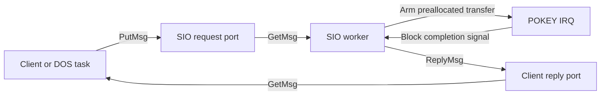

# Messages and ports: classic Exec design

> Historical record: applies to the revisions and profiles described below.
> See the [current documentation](../reference/ports.md) and [history index](README.md).

Status: implemented within the scope of the
[implementation record](messages-ports-implementation.md), updated 2026-09-19.
All six slices of the [implementation plan](../plans/messages-ports-implementation-plan.md)
are complete. This note defines the public contract and target-specific
deviations, using [memory allocation](memory-allocation-implementation.md),
[Lists](../reference/lists.md), [Tasks](../reference/tasks.md) and [signals](signals-implementation.md).
The [queued device I/O and SIO design](../reference/device-io.md) defines the next
layer; its device services are not yet implemented.

Follow classic Exec, including the V36 CreateMsgPort/DeleteMsgPort pair. Retain
pointer-based messages, FIFO queues, signal arrival actions, explicit replies
and caller-owned lifetimes. The reference is the classic
[exec.library autodocs](https://developer.amigaos3.net/autodocs/exec.library/),
not the newer AllocSysObject/FreeSysObject interface. Intentional differences
are listed near the end of this note.

## Scope

Provide nine calls in `EXEC`: PutMsg, GetMsg, ReplyMsg, WaitPort, CreateMsgPort,
DeleteMsgPort, AddPort, RemPort and FindPort. Support private and named public
ports, statically prepared and heap-allocated records, and PA_SIGNAL/PA_IGNORE
arrival actions. Messages transport references to shared memory; sending does
not allocate, copy a payload, wait for a reply or start another task.

Do not add synchronous SendMsg, counted signals, handles, mandatory ownership
tables, queue-capacity errors or a second notification mechanism. Queue length
is limited by the supplied message storage. Request-pool limits and backpressure
belong to the client/device protocol, before it calls PutMsg.

The first version is task-context only. Software-interrupt ports and public
IRQ message operations are deferred. Device registration, IORequest, SendIO,
DoIO, WaitIO, CheckIO, AbortIO, timer requests and DOS packets require subsequent
contracts; merely embedding a Message does not implement these services.

## Public records and constants

Preserve field names and order from the classic
[ports header](https://developer.amigaos3.net/autodocs/include_h/exec/ports.h),
using the existing full Node/List and native pointers:

```action
PUBLIC TYPE MsgPort=[
  EXECLISTS.Node mp_Node
  BYTE mp_Flags,mp_SigBit
  Task POINTER mp_SigTask
  EXECLISTS.List mp_MsgList
]
PUBLIC TYPE Message=[
  EXECLISTS.Node mn_Node
  MsgPort POINTER mn_ReplyPort
  CARD mn_Length
]
```

The native layouts below pass emitted raw/optimized field and array-stride
probes with the pinned compiler. They are not Amiga binary layouts.

| Record | Field offsets | Qualified size / alignment |
| --- | --- | --- |
| MsgPort | mp_Node 0, mp_Flags 11, mp_SigBit 12, mp_SigTask 13, mp_MsgList 16 | 27 bytes / 1 byte |
| Message | mn_Node 0, mn_ReplyPort 11, mn_Length 14 | 16 bytes / 2 bytes |

`mp_Node` links the port into the public registry; `mn_Node` links one message
into one queue. The embedded `mp_MsgList` is a full sentinel List. Its queue
and the public registry use different nodes, so a public port can receive
messages while remaining registered. Do not move an initialized port or a
linked message: their links contain their actual addresses.

`mn_Length` stays a 16-bit unsigned CARD, matching classic UWORD. Set it to the
total inline descriptor size, including the Message header: 16–65,535 bytes.
It is descriptive metadata, not a copy length or proof of allocation ownership.
A large transfer uses a descriptor containing a 24-bit buffer pointer and a
LONGCARD byte count. Its LINEAR payload can exceed one bank without widening
mn_Length or putting the payload inside the descriptor.

Generate the classic values from one machine-readable definition, including
the [node types](https://developer.amigaos3.net/autodocs/include_h/exec/nodes.h):

| Constant | Value | Meaning |
| --- | ---: | --- |
| NT_UNKNOWN | 0 | Initial message type before first use. |
| NT_MSGPORT | 4 | Port node. |
| NT_MESSAGE | 5 | Sent message; it may be queued or already being processed. |
| NT_FREEMSG | 6 | ReplyMsg with no reply port. Does not mean heap storage was freed. |
| NT_REPLYMSG | 7 | Replied message. It may still be queued at the reply port. |
| PF_ACTION | 3 | Mask selecting the low two arrival-action bits. |
| PA_SIGNAL | 0 | Post the port's signal to its associated Task after enqueueing. |
| PA_SOFTINT | 1 | Recognized but unsupported; requires a software-interrupt subsystem. |
| PA_IGNORE | 2 | Enqueue without notification. |

Action value 3 is unsupported. Require other mp_Flags bits to be zero in this
subset; reject unsupported actions/flags as misuse before modifying a queue.
Do not reinterpret PA_SOFTINT as a task signal. `mp_SigTask` is typed as a Task
pointer while soft interrupts are unsupported; it is not a general callback.

For PA_SIGNAL, mp_SigBit is a bit number 0–31, not a mask, and mp_SigTask must
remain live. The owner must have allocated that bit or hold its subsystem's
reserved-bit contract. Build masks with unsigned 32-bit arithmetic, including
bit 31. PA_IGNORE arrival handling neither dereferences mp_SigTask nor uses
mp_SigBit.

## Calls and queue semantics

These are proposed native declarations in the generated `EXEC` module:

```action
PUBLIC EXTERNAL PROC PutMsg(MsgPort POINTER port Message POINTER message)
PUBLIC EXTERNAL Message POINTER FUNC GetMsg(MsgPort POINTER port)
PUBLIC EXTERNAL PROC ReplyMsg(Message POINTER message)
PUBLIC EXTERNAL Message POINTER FUNC WaitPort(MsgPort POINTER port)
PUBLIC EXTERNAL MsgPort POINTER FUNC CreateMsgPort()
PUBLIC EXTERNAL PROC DeleteMsgPort(MsgPort POINTER port)
PUBLIC EXTERNAL PROC AddPort(MsgPort POINTER port)
PUBLIC EXTERNAL PROC RemPort(MsgPort POINTER port)
PUBLIC EXTERNAL MsgPort POINTER FUNC FindPort(BYTE POINTER name)
```

| Call | Contract |
| --- | --- |
| PutMsg | Set NT_MESSAGE, append the supplied message at the destination tail, then perform its arrival action. No return status. |
| GetMsg | Remove and return the head, or null immediately if empty. Preserve its type, reply port, length and application fields. |
| ReplyMsg | Set NT_REPLYMSG and append to mn_ReplyPort, performing that port's arrival action. If mn_ReplyPort is null, set NT_FREEMSG without enqueueing or notification. |
| WaitPort | Wait until the port is nonempty and return its first Message pointer **without removing it**. Only its PA_SIGNAL owner may call it. |
| CreateMsgPort | Allocate and initialize a private PA_SIGNAL port for the caller, or return null on memory/signal exhaustion. |
| DeleteMsgPort | Release a port created by CreateMsgPort and its signal. Null is a no-op; otherwise require quiescence, an empty queue and prior removal from the public registry. |
| AddPort | Set NT_MSGPORT, initialize an inactive port's message list and insert its node into the public registry in priority order. |
| RemPort | Unlink a known registered port. Do not free it, empty its queue or revoke existing pointers. |
| FindPort | Return the first exact, case-sensitive name match, or null. Caller holds Forbid across lookup and immediate use. |

PutMsg follows the classic
[non-copying send contract](https://developer.amigaos3.net/autodocs/exec.library/PutMsg.html).
Queue order is FIFO, including replied messages; message ln_Pri never reorders
it. On PA_SIGNAL, every enqueue posts the bit, even when the queue was already
nonempty. Signals coalesce; queue entries do not. Signalling a waiter makes it
eligible to run under the existing scheduler, without a priority/preemption
guarantee. The receiver may run and even reply before PutMsg returns.

Before sending, the sender owns an unlinked message and initializes its reply
port, length and body. Publication hands access to the receiving protocol:
the sender must not inspect, change, reuse or free the descriptor or borrowed
payload until it dequeues the matching reply, unless a separate protocol
explicitly permits shared access. Stack-local requests are valid only if their
frames outlive processing and reply removal; static/heap storage is usually
clearer for asynchronous requests. Replying can let the sender free the record
before ReplyMsg returns, so the receiver must retain no subsequent access.

[GetMsg](https://developer.amigaos3.net/autodocs/exec.library/GetMsg.html) neither
replies nor acknowledges completion. It does not clear a port signal. Removed
links retain the Lists library's stale values; neither those links nor ln_Type
are a membership test. A message may be on only one intrusive list at a time.
Dequeue it before putting it on a worker's private pending list; detach it from
that list before replying or forwarding it.

Use [ReplyMsg](https://developer.amigaos3.net/autodocs/exec.library/ReplyMsg.html)
for completion rather than PutMsg to mn_ReplyPort, since the type transition
differs. Fill results before replying and relinquish access as the reply is
published. The original sender reclaims access by removing that reply with
GetMsg; merely observing NT_REPLYMSG is insufficient. Do not automatically
reply again to a received reply. A null reply port needs an explicit one-way
ownership/completion agreement; NT_FREEMSG alone is no safe polling protocol.

All nonnull record/name pointers must designate valid, suitably aligned storage
for their stated lifetime. Only DeleteMsgPort accepts a null port argument;
GetMsg(null), PutMsg(null, message), ReplyMsg(null), WaitPort(null), AddPort(null),
RemPort(null) and FindPort(null) are misuse. A null mn_ReplyPort is valid.
There is no per-message error object or implicit allocator failure on enqueue.

## Waiting without losing work

[WaitPort](https://developer.amigaos3.net/autodocs/exec.library/WaitPort.html)
requires PA_SIGNAL and mp_SigTask equal to the caller. Keep one waiting consumer
per port. GetMsg itself can be used by another task under an explicit ownership
agreement, such as shutdown handoff; a WaitPort result does not reserve a message
against such a consumer and is not permission to process it while still linked.

Implement WaitPort as a caller-context loop around a short, private guarded
head check and the existing Wait. The internal check validates the port's wait
context and returns the head-or-null; it is not a new public PeekMsg API:

```text
repeat:
    message = guarded_head_check(port)
    if message != null: return message
    Wait(unsigned_32_bit_mask(port.mp_SigBit))
```

Check before waiting, including on the first invocation. If a producer posts
after an empty check but before Wait, the pending bit makes Wait return. If it
posts after Wait publishes the blocked state, existing direct signal delivery
wakes the caller. A stale/shared signal merely repeats the head check. Never
clear the signal with SetSignal between checking an empty queue and waiting;
that can erase the notification just received.

The loop and its port pointer live on the caller's stack/DP, with the port kept
alive by its owner. Do not block while retaining a kernel-stack activation,
SWITCHING guard or partially modified queue. A blocking WaitPort inherits
Wait's Forbid semantics: other tasks run while it sleeps, and its previous
nesting is restored on resumption. Forbid is not a lifetime lock across that wait.

A consumer normally calls WaitPort, then drains with GetMsg until null. For
several ports or a port plus a device-completion signal, drain all relevant
queues, call Wait with the combined mask, and repeat while also handling the
other event bits. Manually prepared ports may share an owner-allocated signal;
all queues sharing it must be inspected on a wake. No one-signal/one-message
assumption, queue scan by the scheduler, wait-all operation or timeout argument
is introduced. Timeout/cancellation is a later protocol using another signal
and explicit completion, not permission to free an outstanding message.

## Creation, discovery and deletion

[CreateMsgPort](https://developer.amigaos3.net/autodocs/exec.library/CreateMsgPort.html)
uses AllocSignal($FF) and an ordinary upper-RAM AllocMem with PUBLIC|CLEAR.
Initialize the port node to NT_MSGPORT, priority zero, name null, PA_SIGNAL,
the caller's Task pointer and allocated bit, and an empty NewList with message
list metadata initialized. Publish the pointer only after initialization.
If either resource is unavailable, release the other and return null without
publishing anything. This does not call AddPort.

With the expected 27-byte record, AllocMem consumes 32 bytes at the current
eight-byte granularity. CreateMsgPort uses one of its owner's available signal
bits. The current reservation of bits 0–15 leaves at most sixteen independent
application signals per task, shared with other uses. This is not a global port
limit or a task-capacity limit. Use manually prepared ports with an explicitly
shared signal when a task needs several queues per notification bit.

A static or caller-allocated port can use PA_SIGNAL or PA_IGNORE. Its owner
initializes all metadata and calls NewList before private use. PA_SIGNAL setup
allocates the bit in the receiving task, then publishes the completed port
through a startup handshake. There is no new InitPort API. Such ports require
manual signal/storage cleanup; DeleteMsgPort is only the CreateMsgPort pair.

[AddPort](https://developer.amigaos3.net/autodocs/exec.library/AddPort.html)
also initializes the message list, following Exec. Call it before producers
can reach the port, including when the port came from CreateMsgPort. Never
AddPort an active or queued port: resetting a live sentinel list loses its
messages. Prepare its name and signed-byte priority before publication. A null
name is permitted for an unsearchable registry entry; names are borrowed,
case-sensitive NUL-terminated byte strings whose storage must remain valid.

Use Enqueue for the registry: descending signed priority, FIFO among equal
priorities. This registry preference is independent of Task scheduling and
message FIFO order. Duplicate names are allowed, with FindPort returning the
first match; applications needing uniqueness must hold Forbid across FindPort
and AddPort. Do not change a registered name or priority without removal and
safe republication of an inactive port.

[FindPort](https://developer.amigaos3.net/autodocs/exec.library/FindPort.html)
returns a borrowed pointer. Protect a lookup-and-send rendezvous as follows:

```text
Forbid()
port = FindPort(name)
sent = (port != null)
if sent: PutMsg(port, message)
Permit()
```

Prepare the message and a live reply port before this sequence. Do not retain
the found port across Permit without a separate lifetime agreement. Internal
registry serialization alone cannot keep a returned pointer alive. Do not
block or call the OS between lookup and use. A receiver remains responsible
for accepted work even if it subsequently removes its name.

[RemPort](https://developer.amigaos3.net/autodocs/exec.library/RemPort.html)
only removes discovery; holders of previously published pointers can still
send while their lifetime agreement permits it. There is no implicit close,
reference count, cancellation broadcast or ownership transfer.

Before [DeleteMsgPort](https://developer.amigaos3.net/autodocs/exec.library/DeleteMsgPort.html):

1. Stop new discovery with RemPort if registered, and close admission through
   the application/device protocol. Retained-pointer producers must acknowledge
   that they have stopped; an empty queue does not establish this.
2. Finish, forward or explicitly reject accepted requests using their protocol.
   Drain queued messages and settle messages already dequeued but still active.
   Keep reply ports and payload buffers alive until all expected replies are
   removed. Cancellation requests do not complete these obligations.
3. Ensure no waiter, producer, handler or retained client reference can access
   the port. The creating task then releases its signal and heap storage.

DeleteMsgPort must detect a nonempty queue and wrong signal owner before
freeing resources. For CreateMsgPort ports, retain the original mp_SigTask and
mp_SigBit until deletion; an inactive port may change between SIGNAL and IGNORE
without losing that allocation. Freeing the bit does not promise to clear old
notifications; AllocSignal clears them on reallocation.

RemTask does not delete ports, reply messages or reclaim their allocations.
Before removing a port owner, follow the shutdown protocol. Do not scan all
ports on Task removal or claim that unregistered/private ports make this
precondition fully detectable. If a creator is forcibly removed midway through
resource acquisition, the existing explicit-allocation lifetime rules still
apply; automatic recovery needs separate task/resource lifecycle work.

## Serialization, interrupts and direct delivery

Use the [existing kernel protocol](kernel-critical-sections.md). Queue and
registry primitives run under E816_SWITCHING with IRQs permitted when the caller
entered with I=0. Other tasks cannot observe partial three-byte link updates.
IRQ/NMI handlers never touch these port lists in the first version. NMI records
ticks and follows the protected stack-transition protocol; SEI alone is not
their serialization mechanism.

A PutMsg or nonnull ReplyMsg transaction is:

1. Check the supported calling context/action and validate the known PA_SIGNAL
   target through its direct Task/context association before queue mutation.
2. Set the message type and complete all AddTail links under SWITCHING.
3. For PA_SIGNAL, post to that target using the existing atomic mask/wake
   mechanisms and make a matching waiter ready. For PA_IGNORE, do nothing else.
4. Make scheduling decisions only after the queue invariant is restored, with
   the existing final pending-wake recheck at native return.

Factor an internal post operation that can run inside the current policy
activation. Do not recursively call public Signal through COP, hold a new
IRQ mask across Action list code, or switch between linking and posting.
Only the existing signal transactions and native boundaries need IRQ masking.
An IRQ can post unrelated signals while port links are changing; it cannot
inspect those links or enter port policy.

The destination port and its signal Task are already known. PutMsg, GetMsg,
ReplyMsg and the WaitPort head check perform constant-size queue work, without
task, waiter, port-registry or message membership scans. The existing pending-wake
queue retains only tasks actually requiring deferred delivery. Registry AddPort
and FindPort naturally traverse registered names/priorities; RemPort unlinks its
known node in constant time. Their scans keep IRQs enabled but can delay task
scheduling, so registry size/name length belong in latency qualification.

| Calling context | Initial support |
| --- | --- |
| Native task, I=0 | All nine calls; ordinary Forbid rules apply. |
| Native task, I=1 | Non-waiting calls preserve I and cannot switch; WaitPort faults even if already nonempty, matching the current Wait policy. |
| Qualified device IRQ | No port calls. Use preallocated driver state and the existing bound completion-signal entry. |
| NMI, ROM callback, OS service, reentrant kernel activation | No public port calls. |

Create/Delete and WaitPort can be caller-context wrappers over guarded helpers
and existing allocation/signal services. Their local state and actual native
stack peaks must be declared and tested; no shared compiler continuation may
survive a task switch. Generate selector/layout definitions when implementing,
collision-check all service families, retain COP #$50 and OS COP #$00, and
update the single current Task ABI and callers together. Do not reserve guessed
selectors or add a compatibility profile in this design-only change.

As with Lists and the allocator, callers own pointer validity and membership.
Fault on detected unsupported contexts/actions, invalid live signal targets and
structural misuse; do not promise recovery from arbitrary pointers, duplicate
enqueues, stale reused addresses or forged records. A type byte cannot establish
exclusive ownership, and TypeOfMem does not prove a live allocation. There is
no mandatory per-port/per-message tracking prefix or registry of private ports.

## SIO and DOS direction

The subsequent [device I/O and SIO design](../reference/device-io.md) specifies
IORequest submission/collection, cancellation and a prearmed transaction engine
for the direction outlined here.

One SIO worker can own its request port, pending requests and active transfer.
A filesystem/DOS worker can own another port, and clients can own reply ports.
These ports consume upper-RAM records and signal bits, **not execution slots**.
There is no worker per port, request, unit or byte. Keep the eight-live-task
functional baseline and the eventual 12–16-task capacity target.

The intended later driver flow is:



The client keeps its request/reply port and buffer valid while waiting; other
tasks run. The worker can combine request-port and hardware-completion bits
in Wait. The IRQ services bytes from an already-owned buffer, records completion
before posting the worker's bound signal, and does not allocate or manipulate
message links. The worker records results, retires hardware references, replies
the request once, and advances its queue. If multiple completions can accumulate,
preallocated completion records/ring entries must retain each event; a signal
bit cannot count them. Ring ownership and overflow rules belong to the driver.

This preserves the existing block-completion delivery path without requiring
interrupt-callable port lists. It does not establish whether the worker can
arm the next block before a protocol deadline. The allocator's
[measurements](memory-allocation-implementation.md#four-task-serial-measurements)
show a worst observed completion-post-to-worker delay of 30.842 ms even while
byte refills pass. RX, turnaround and back-to-back blocks need an explicit
buffer/advance strategy and their own timing qualification; ports alone do not
reduce that delay. Future public IRQ PutMsg/ReplyMsg would need bounded native
link transactions synchronized with every task-side queue access, plus renewed
NMI, lifetime and serial measurements. That is deferred capability, not an
assertion that the CPU cannot support it.

## Storage budget

Put ports, messages, names, buffers and the public registry in upper RAM. Reserve
one full registry List in the configured kernel bank: 11 active bytes, proposed
16 reserved bytes including padding. Initialize it before admitting tasks and
include its exact extent in the generated map. Do not reuse the heap's region
list or reserve a capacity-sized port table. There is no per-task port field
or additional task/DP pool in this proposal.

Heap costs are 32 bytes per CreateMsgPort and round_up_8(descriptor size) per
AllocMem-backed message, plus separately allocated payloads. Static records use
their compiled size/alignment. Record placement can span banks when its entire
extent is valid contiguous RAM; emitted probes must exercise this. Ordinary
heap allocation already gives a convenient bank-contained descriptor. No
hidden copy into bank zero or widening of every list pointer is permitted.

This documentation change reserves **zero bytes**. The implementation target
is **zero additional fixed or per-task bank-zero reservation**. Report complete
before/after loading/runtime budgets, including guards, alignment, slack and
any growth of code/helper reservations. Calls must fit qualified stack/IRQ
headroom; expected small records do not establish stack bounds. See the
[platform budget](../reference/platform.md#bank-zero-memory-budget).

## Deviations and reasons

| Choice | Classification and reason |
| --- | --- |
| Native 24-bit pointers and 27/16-byte port/message layouts | Required by the current 65816 compiler ABI. Retain classic fields; qualify offsets and alignment rather than copying 68k sizes. |
| mp_SigTask typed as Task pointer | Initial supported arrival actions need no Interrupt-pointer union. Revisit with soft interrupts. |
| All public port calls initially task-only | Staging: current Lists/compiler policy excludes IRQ reentry. Classic PutMsg/ReplyMsg permit interrupts; extending that contract requires atomic queue mechanisms and serial qualification, not a long SEI region. Worker replies meet the initial driver architecture. |
| PA_SOFTINT and action 3 unsupported; other flag bits rejected | No software-interrupt/callback subsystem is specified. Preserve known constants and fail explicitly rather than silently changing actions. |
| WaitPort rejects I=1 even for a nonempty queue | Inherits the current Wait restriction; public Disable/Enable nesting is not implemented. Forbid-based waiting remains supported. |
| Upper-RAM records and registry; no added bank-zero arena | Platform placement policy needed to conserve native stack/direct-page capacity. |
| Detected misuse uses the existing controlled fault path | Matches current Exec816 services without changing classic void call signatures. It is not a guarantee to detect all bad pointers or membership errors. |

FIFO message order, priority-ordered public discovery, uncounted signals,
WaitPort's non-removing result, 16-bit mn_Length, null-reply NT_FREEMSG and
explicit lifetime are retained Exec behavior. CreatePort/DeletePort convenience
helpers from amiga.lib, software interrupts and device/DOS APIs are outside
this first milestone; no successful placeholder calls should advertise them.

## Acceptance before implementation is called complete

Run emitted raw and optimized code with the pinned compiler, ROM and emulator.
Keep public contracts separate from later implementation/qualification records.

- Verify all nine import shapes, record offsets/strides, 24-bit pointer returns,
  bit 31 and metadata preservation. Exercise different banks, equal low words,
  boundary-spanning records/names and guards; test heap and static storage.
- Compare multi-sender FIFO send/get/reply traces with an independent queue
  model. Include forwarding, receiver work after dequeue, null reply ports,
  PA_IGNORE, repeated reuse and a LINEAR buffer larger than 64 KiB.
- Force posts before the empty check, between check and Wait, during wait
  publication and after wake. Cover already-nonempty WaitPort, spurious signals,
  shared bits, several ports, bursts, nested Forbid and I=1 rejection/preservation.
  Check no lost work, duplicate links/replies or scheduler-wide waiter scans.
- Force real IRQ and NMI at partial queue/registry link writes, while IRQs post
  signals through the existing path. Assert no policy reentry, correct direct
  waking, full context restoration and intact stack/domain/OS guards. Keep
  intentionally stalled race probes separate from timing tests.
- Exercise creation failure rollback for both memory and signal exhaustion,
  reuse of the allocated signal, AddPort's inactive initialization, priority
  ties/duplicate names and lookup/use versus removal. Verify RemPort preserves
  queued work and retained-pointer semantics. Test orderly producer shutdown,
  outstanding replies and deletion misuse without claiming full stale-pointer
  detection or automatic cleanup after arbitrary Task removal.
- Run at least eight simultaneous tasks exchanging messages and replies with
  kernel banks 1 and 3. Verify queues, signal accounting, allocation totals,
  bank ownership and unchanged complete bank-zero budgets at shutdown.
- Repeat four-task 125 kbaud diagnostic TX tests with send/reply bursts,
  registry traffic, shared-signal drains and concurrent allocation/CLEAR,
  including long transfers and identical uninstrumented replays. Report byte
  refill latency, IRQ masking and completion-to-worker delay separately; require
  zero refill misses/gaps. Exercise growing queues, registry/name scans and
  deferred wakes. Preserve relevant Task, signal, memory, Lists and platform
  regressions. Existing allocation results do not qualify new port code.

Eight-task concurrent serial timing remains explicitly deferred, as in the
allocation milestone. It is still required before qualifying the full eight-task
SIO/DOS system. A passing message exchange or TX pump does not qualify RX,
turnaround, a production device driver or physical hardware.
