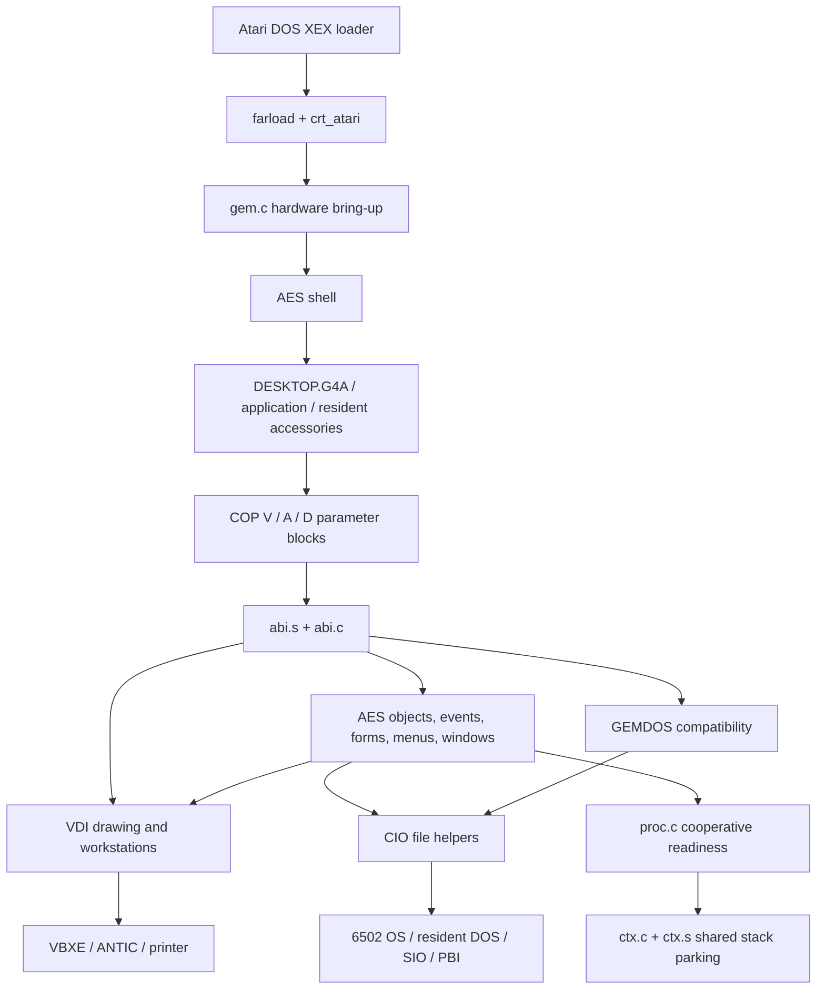

# GEM as a client of an Exec-like kernel

[Implementation plans](../README.md)

For the current comparison against GEM4XE 0.9.4 and implemented Exec816, read
[GEM4XE as the GUI layer for Exec816](exec816-integration-assessment.md).
The [XaAES study](xaaes-study.md) examines how to reach the confirmed target:
a multitasking GEM-compatible GUI over Exec816, with minimal changes to rebuilt
GEM applications. It recommends adapting GEM4XE with XaAES's client, event and
ownership semantics as references; direct XaAES or G4A binary compatibility
is separate work. This source study does not change the current native contracts.
The proposed [AES server design](aes-server-design.md) specifies the next layer:
GEM bindings, client messages and waits, GUI locks and retirement in the existing
presenter, with the implemented [timer.device](../../reference/timer.md), a
concrete shared-alarm lifecycle and AS0–AS4 two-client proof slices. AES timer
event semantics have passed AS2b development checks; integrated GUI latency
measurements remain pending. Ordinary Exec Wait
remains unchanged. The [implementation plan](aes-server-implementation-plan.md)
breaks AS0–AS4 into executable commits, with code ownership, a shared intake
budget, the two-client Task map and measured latency gates. AS0a now supplies the
generated wire, private C contexts and baseline measurements; AS0b adds optional
presenter admission with a shared intake budget. AS0c implements task-local
[application registration](../../reference/aes.md) and cooperative retirement;
AS1 adds copied FIFO messages and independent C message waits. AS2a implements
the shared timer transport and its cancellation/collection lifecycle; AS2b adds
GEM timer and combined-event waits with PAL/NTSC and raw/optimized C evidence.
AS3a implements recursive lock arbitration and queued acquisitions; native
painting/input gates remain AS3b. The implemented
[native interrupt ReplyMsg foundation](../../reference/ports.md#native-interrupt-reply)
supports timer.device without another worker; ordinary Action!/C message calls
remain Task-only.
The completed [minimal hosted VDI plan](minimal-vdi-implementation-plan.md)
builds on the larger Task stacks. Its [current contract](../../reference/gem-vdi.md)
defines the packet, display ownership and supported source boundary. The
[port directory](../../../ports/gem4xe/README.md) contains pinned inputs and
reproducible runners. Use the [artifact guide](../../guides/gem-vdi.md) to run
it, or the [implementation record](../../history/gem-vdi.md) for G0–G6 evidence.

The completed next milestone is [input ownership and event delivery](input-and-events-design.md):
native keyboard interaction during disk I/O, explicit console handoff and
renderer-owned cursor updates, followed by a separately pinned physical pointer.
The [implementation plan](input-and-events-implementation-plan.md) records I0–I7,
with [current input contracts](../../reference/input.md) and
[development evidence](../../history/gem-input.md). Physical pointer hardware and AES
remain separately gated work.

The [physical mouse design](physical-mouse-design.md) is implemented for the
configured ST mouse on port 1, using Altirra's existing model, shared SIO timing
and reusable capture feeding the existing cursor and controls.
The [implementation plan](physical-mouse-implementation-plan.md) is complete
through M0–M6 development checks, including the optional production artifact.
See its [execution record](../../history/gem-mouse.md); physical hardware and
broader hosted qualification remain separate work.

The [first desktop](desktop-design.md) implements one
presentation worker, a framed movable shell window, then overlapping windows
and exposure repair. Its [DT0–DT7 implementation plan](desktop-implementation-plan.md)
adds client/event lifetime, an ST sampling and visible-response checkpoint before
dragging, and a second independent application Task. DT0–DT7 have development
evidence and a local OF816 preview; pointer, outline, disk-load button and repair
timing limits remain open. See the [current desktop contracts](../../reference/desktop.md)
and [execution record](../../history/desktop.md).
The [Layers foundation](../../reference/layers.md) is implemented through its
[bounded library plan](../layers-implementation-plan.md).
The [mouse performance plan](mouse-performance-implementation-plan.md) is
implemented through MP4: about 4 kHz capture with preserved fine SIO timing,
one blitter list per pointer move, combined measurements and a refreshed OF816
preview. The [execution record](../../history/mouse-performance.md) separates
the measured savings from open pointer, outline and move-repair timing targets.
The current 2× pointer travel and memory reservations remain unchanged.

The [AES widget library plan](aes-widgets-implementation-plan.md) is implemented
through AW6 at the development tier: selected object/drawing/form code runs in
the existing presenter, with retained trees and bounded updates. The Control
Panel demonstrates buttons, toggles and radio groups beside the shell.
[Measurements and the tested local preview](../../history/aes-widgets.md)
record passing correctness checks and open feedback-latency targets. Task-bar
policy, editable fields, resource loading and full AES compatibility follow.

Further console optimization is paused, without changing the recorded limits.

The [desktop rendering design](desktop-rendering-design.md) combines
Amiga refresh semantics with GEM4XE pixel reuse: bounded damage, asynchronous
top-window copies, fewer background passes and optional VRAM snapshots. Its
[DR0–DR7 implementation plan](desktop-rendering-implementation-plan.md) keeps
the existing presenter and IRQ completion. DR0–DR7 are implemented at the
development tier, including the local OF816 preview. Pointer, outline and
move-repair timing limits remain open. See the
[measurements and remaining work](../../history/desktop-rendering.md#dr7-combined-measurements-and-local-preview).

The implemented foundation is the [bitmap console](bitmap-console-design.md):
an 80×30 CON: backend on the existing 640×240 display, sharing faster glyph and
copy operations with VDI. The [implementation plan](bitmap-console-implementation-plan.md)
defines B0–B9, from reproducible measurements and bounded blitter lists through
console integration, scrolling, coexistence and the optional artifact. It keeps
the existing console worker, one large stack pool and zero additional bank-zero
reservations. B0–B7 have focused development evidence, including
[scrolling and caret integration](../../development/bitmap-console-b7.json).
[B8 shell integration](../../development/bitmap-console-b8.json) adds functional
SDFS/pipeline and ST coexistence checks; responsiveness acceptance remains open.
The [optional bitmap preview](../../guides/bitmap-console.md) is packaged with
the standard OF816 demo; [B9 evidence](../../development/bitmap-console-b9.json)
records extracted-image execution and the current limitations. Subsequent
[output batching](../../history/console-output-batching.md) completes OB1–OB5;
the working shell is the desktop baseline, while broader performance acceptance
remains open.

**Preserved analysis:** these three documents were moved from GEM4XE's
`docs/kernel/` into Exec816 on 2026-10-01 so the upstream checkout can
be updated independently. Source paths, “current” and “this repository”
in the original analysis refer to GEM4XE at the baseline below. Source
links are pinned to that commit. The kernel and toolchain proposals
record the assessment made on 2026-09-15; they are not a description of
current Exec816 or the latest GEM4XE. Consult the current
[Exec816 reference](../../reference/README.md) and
[roadmap](../../roadmap.md) for implemented contracts and pending work.

Analysis date: 2026-09-15. Source baseline: gem4xe **0.2**, commit
`01c2e17b072e079443a11eff11d3ab3229db5ed5`.

These notes support the planned kernel; they do not describe an implemented
kernel or change GEM's present behavior. The processor implemented by this
repository is the **65C816/65816**. “Exec-like” is interpreted here as a small,
shared-address-space system providing tasks, scheduling, signals, message ports,
memory allocation and device requests. Amiga binary compatibility is not assumed.

## Confirmed direction

Exec is a **standalone system**, and this GEM port is an **optional GUI for it**.
Exec must boot, schedule tasks, manage memory and provide device/IPC services
without GEM running. Its kernel structures and public interfaces are designed
independently of AES, G4A and the present GEM memory map.

The dependency runs from GEM to Exec. GEM's current scheduling, allocation and
DOS assumptions are adaptation work in the GUI/compatibility layer. Hardware
findings and driver code from this repository remain useful evidence for Exec's
board support. Running the existing session in one task is a possible first GUI
milestone; it is not the kernel's execution model or the final GUI architecture.
Preserving existing G4A binaries is a separate compatibility choice.

Read these together:

- This page: present architecture, reusable components and integration gaps.
- [Platform contracts](platform-contracts.md): CPU, memory, interrupts, ABI and I/O.
- [Kernel integration plan](integration-plan.md): proposed boundaries, milestones
  and the tests that should establish them.

## Main conclusions

1. **Keep GEM above the kernel.** AES policy, VDI drawing and the desktop already
   form useful higher layers. The kernel should own execution, physical memory,
   interrupts and device arbitration. `src/sys` supplies hardware knowledge and
   possible reusable code, but currently depends on AES process identity; Exec's
   scheduler and allocator should be designed independently.
2. **The scarce resource is usable bank $00 RAM.** Far RAM does not provide native
   hardware stacks or direct pages. GEM also requires many objects to remain near.
   Design the memory map before choosing a task count or adding kernel structures.
3. **Current task switching is specialized for GEM.** It parks one shared engine
   stack in far RAM at cooperative yield points. It is valuable working evidence,
   but cannot be called from an arbitrary timer interrupt as a kernel scheduler.
4. **Concurrent applications require ownership changes throughout GEM.** Some
   resources are already per process; windows, current directories, shell state,
   allocator lifetimes and drawing scratch still assume one foreground program.
5. **DOS is presently a synchronous dependency.** A CIO call temporarily hands
   the CPU and interrupts to the Atari OS. An asynchronous request wrapper alone
   would not make that interval preemptible.
6. **Prove standalone Exec first, then bring up GEM.** A single kernel task
   containing the existing GEM session is one incremental integration option.
   GEM can keep cooperative desktop/accessory contexts during that adaptation;
   a later multi-client GEM service needs explicit suspended requests.

## What exists today

This is a machine-owning GEM environment launched by DOS. Applications are
separately linked native programs, loaded as `.G4A` files, and entered as far
subroutines. Returning from `main()` returns to GEM's shell. The desktop exits
when launching a program and is reloaded afterward; it is not a concurrently
resident ordinary application. Accessories are loaded before it and stay resident.
See [shell](https://github.com/slaapliedje/gem4xe/blob/01c2e17b072e079443a11eff11d3ab3229db5ed5/src/aes/shel.c), [loader](https://github.com/slaapliedje/gem4xe/blob/01c2e17b072e079443a11eff11d3ab3229db5ed5/src/sys/app.c) and
[application startup](https://github.com/slaapliedje/gem4xe/blob/01c2e17b072e079443a11eff11d3ab3229db5ed5/src/app/crt_gemapp.s).

### Component map

| Area | Current responsibility | Kernel relevance |
|---|---|---|
| [gem.c](https://github.com/slaapliedje/gem4xe/blob/01c2e17b072e079443a11eff11d3ab3229db5ed5/src/gem.c), [crt_atari.s](https://github.com/slaapliedje/gem4xe/blob/01c2e17b072e079443a11eff11d3ab3229db5ed5/src/crt_atari.s), [farload.s](https://github.com/slaapliedje/gem4xe/blob/01c2e17b072e079443a11eff11d3ab3229db5ed5/src/farload.s) | DOS loading, native entry, bring-up and return | Split bootstrap from starting GEM; replace machine takeover with a kernel handoff |
| [sys/rapidus.c](https://github.com/slaapliedje/gem4xe/blob/01c2e17b072e079443a11eff11d3ab3229db5ed5/src/sys/rapidus.c), [sys/irq.c](https://github.com/slaapliedje/gem4xe/blob/01c2e17b072e079443a11eff11d3ab3229db5ed5/src/sys/irq.c), [sys/irq.s](https://github.com/slaapliedje/gem4xe/blob/01c2e17b072e079443a11eff11d3ab3229db5ed5/src/sys/irq.s) | Cache/bus windows, vector installation, input IRQs | Board support and interrupt entry knowledge; kernel becomes the sole owner |
| [sys/ctx.c](https://github.com/slaapliedje/gem4xe/blob/01c2e17b072e079443a11eff11d3ab3229db5ed5/src/sys/ctx.c), [sys/ctx.s](https://github.com/slaapliedje/gem4xe/blob/01c2e17b072e079443a11eff11d3ab3229db5ed5/src/sys/ctx.s) | Save and restore a shared GEM engine stack | Preserve as the initial GEM-internal context mechanism |
| [aes/proc.c](https://github.com/slaapliedje/gem4xe/blob/01c2e17b072e079443a11eff11d3ab3229db5ed5/src/aes/proc.c), [aes/event.c](https://github.com/slaapliedje/gem4xe/blob/01c2e17b072e079443a11eff11d3ab3229db5ed5/src/aes/event.c) | Readiness, event waits, input ownership, GEM messages | Keep UI semantics; eventually connect waits and wakeups to kernel signals |
| [sys/app.c](https://github.com/slaapliedje/gem4xe/blob/01c2e17b072e079443a11eff11d3ab3229db5ed5/src/sys/app.c), [sys/farmem.c](https://github.com/slaapliedje/gem4xe/blob/01c2e17b072e079443a11eff11d3ab3229db5ed5/src/sys/farmem.c) | Near pool, far memory, relocation and application lifetime | Reuse format and bank handling; replace global lifetime assumptions |
| [sys/abi.s](https://github.com/slaapliedje/gem4xe/blob/01c2e17b072e079443a11eff11d3ab3229db5ed5/src/sys/abi.s), [sys/abi.c](https://github.com/slaapliedje/gem4xe/blob/01c2e17b072e079443a11eff11d3ab3229db5ed5/src/sys/abi.c) | COP entry, stack switch, parameter marshaling | Preserve public GEM calls; centralize trap dispatch and request ownership |
| [sys/gemdos.c](https://github.com/slaapliedje/gem4xe/blob/01c2e17b072e079443a11eff11d3ab3229db5ed5/src/sys/gemdos.c), [sys/dos.c](https://github.com/slaapliedje/gem4xe/blob/01c2e17b072e079443a11eff11d3ab3229db5ed5/src/sys/dos.c), [sys/cio.s](https://github.com/slaapliedje/gem4xe/blob/01c2e17b072e079443a11eff11d3ab3229db5ed5/src/sys/cio.s) | GEM file API translated to existing Atari services | Compatibility adapter and serialized legacy I/O backend |
| [vdi/vdidev.h](https://github.com/slaapliedje/gem4xe/blob/01c2e17b072e079443a11eff11d3ab3229db5ed5/src/vdi/vdidev.h), [vdi/vdi.c](https://github.com/slaapliedje/gem4xe/blob/01c2e17b072e079443a11eff11d3ab3229db5ed5/src/vdi/vdi.c) | Device interface and stateful renderer | Good graphics boundary; rendering need not enter the kernel |
| [aes](https://github.com/slaapliedje/gem4xe/blob/01c2e17b072e079443a11eff11d3ab3229db5ed5/src/aes/aes.h), [desk](https://github.com/slaapliedje/gem4xe/blob/01c2e17b072e079443a11eff11d3ab3229db5ed5/src/desk/desktop.c) | GEM UI behavior and desktop | Retain above the kernel; window/process policy needs later work |
| [app/gem.h](https://github.com/slaapliedje/gem4xe/blob/01c2e17b072e079443a11eff11d3ab3229db5ed5/src/app/gem.h), [app/gemlib.c](https://github.com/slaapliedje/gem4xe/blob/01c2e17b072e079443a11eff11d3ab3229db5ed5/src/app/gemlib.c), [tools/mkg4a.py](https://github.com/slaapliedje/gem4xe/blob/01c2e17b072e079443a11eff11d3ab3229db5ed5/tools/mkg4a.py) | SDK, bindings and relocatable executable format | Existing application compatibility target |
| [tools/a8test](https://github.com/slaapliedje/gem4xe/blob/01c2e17b072e079443a11eff11d3ab3229db5ed5/tools/a8test/bridge.py), [tests/emu](https://github.com/slaapliedje/gem4xe/blob/01c2e17b072e079443a11eff11d3ab3229db5ed5/tests/emu/m27_ctx.py) | Target observation and behavioral tests | Reuse for kernel register, timing and integration tests |

### Startup and lifetime order

The significant sequence in `gem.c:main()` and `shel.c:sh_main()` is:

1. DOS stages far code through XEX initialization records; the loader records
   `_fl_top`, the end of the loaded far image.
2. Native startup disables Atari interrupt sources before switching CPU mode.
3. GEM identifies DOS, configures Rapidus windows, installs native vectors,
   probes OS COP services, reads configuration, probes far memory and loads text.
4. It selects the display, initializes VDI/input, allocates process records and
   the root context's far stack-save buffer. `ctx_init()` runs at `main()` depth.
5. GEMDOS, AES and shell allocate persistent state. The desktop file is cached in
   far memory. Accessories load, initialize and reach their first event wait.
6. Near and far allocator floors are fixed. Each foreground program is loaded
   above those floors, run, cleaned up and released by rewinding both allocators.
7. On exit, GEM removes its interrupts, restores display and Rapidus state and
   returns to the DOS environment.

The order in steps 4–6 is an allocation policy. Moving one of those allocations
into an independently running service without changing its allocator can free
live memory when the foreground application exits.

## How much process isolation already exists?

“Process” below means an AES `PROC`, not a protected address space or a future
kernel task. [`proc.h`](https://github.com/slaapliedje/gem4xe/blob/01c2e17b072e079443a11eff11d3ab3229db5ed5/src/aes/proc.h) puts `CTX` first in `PROC` and defines
`rlr` by casting `ctx_cur`. Identity is therefore coupled to the current GEM
context record's address.

| State | Present ownership | Consequence |
|---|---|---|
| Application S, D and data | Each loaded application's near region | Useful basis for native task startup, subject to a new bank $00 map |
| GEM engine stack and compiler registers | Parked/restored per `CTX` | Suspended stack pointers remain valid only at the original addresses |
| COP block, engine stack pointer, signature and depth | Saved in `CTX` | Must also be carried by any replacement call continuation |
| Event queue, wait mask, timer deadline, button wait | Per `PROC` | Existing semantics can be adapted to kernel waits |
| Resource file and one nested resource | Per `PROC`, allocations still nested | Ownership records do not make the allocator independently freeable |
| File ownership bits, EOF bits, DTA | Per `PROC` | `gemdos_release()` closes the current process's files |
| VDI virtual workstation lifetime | `vwk_own[]` keyed by `ctx_cur` | Exit cleanup respects ownership; renderer state is still shared |
| Window geometry, stacking and messages | Global window manager; normal messages target `proc_app` | General multi-application windows are not implemented |
| Current drive and per-drive directories | Global GEMDOS state | One client's directory change affects others |
| Shell command, tail, environment and desktop buffer | Global session state | Process launch needs a separate kernel/process service |
| VDI input/output arrays, active workstation/device, render scratch | Global | Concurrent renderer entry requires serialization |
| CIO IOCBs, DCB, name buffer, mode-switch scratch | Global Atari/adapter state | One serialized legacy I/O owner |
| Near/far allocation cursors and floors | Global | Independent allocation/free lifetimes are not supported |

## Constraints that block general multitasking

### Cooperative dispatch and blocking calls

[`proc_yield()`](https://github.com/slaapliedje/gem4xe/blob/01c2e17b072e079443a11eff11d3ab3229db5ed5/src/aes/proc.c) scans ready processes round-robin. It yields
only when the current process has a wait recorded and `ct_idle()` says no mouse
gesture is underway. The input owner is always considered ready, allowing it to
poll for input. No task priority or timer preemption exists.

Normal dispatch is from `ev_poll()`. Accessory startup and `proc_drain()` also
call `ctx_switch()` directly; “only in ev_poll” comments describe the normal
wait path, not every call site. A program that never waits, an accessory that
never completes startup, or a blocking DOS call can stop all cooperative peers.
`ACC_ROUNDS` bounds the number of drain turns, not their wall-clock duration.

AES has synchronous operations such as `evnt_multi()` and `form_do()` that may
suspend deep inside the engine. A GEM service holding one lock across an entire
wait would prevent another client from supplying the event it needs. The future
service must either retain the current cooperative continuations or explicitly
record pending calls and complete them later.

### Allocator lifetime is part of today's API

Near `pool_alloc()` and far `far_alloc()` are bump allocators. Release rewinds a
cursor; the permanent floor only prevents rewinding below initialized residents.
`GEMDOS Mfree` returns success without freeing, and `Malloc` consumes the far
arena. This works for one foreground lifetime plus early-loaded accessories.
It cannot support tasks allocating and exiting in arbitrary order.

Keep short-lived scratch arenas if useful, but give each arena a specific owner.
Kernel task records, stacks, messages and device requests must be allocated
outside memory that `app_free()` can rewind. See
[app.h](https://github.com/slaapliedje/gem4xe/blob/01c2e17b072e079443a11eff11d3ab3229db5ed5/src/sys/app.h), [farmem.h](https://github.com/slaapliedje/gem4xe/blob/01c2e17b072e079443a11eff11d3ab3229db5ed5/src/sys/farmem.h) and
[gemdos.c](https://github.com/slaapliedje/gem4xe/blob/01c2e17b072e079443a11eff11d3ab3229db5ed5/src/sys/gemdos.c).

### UI locks and queues are not kernel primitives

`wind.c:wm_update()` increments/decrements `wm_ucount`; it does not acquire an
owner-aware semaphore. `ct_idle()` guards gestures, not this update counter.
Window ownership is absent from `WINDOW`; `WM_REDRAW`, gadget and ordinary menu
messages generally go to `proc_app`. Accessories are chiefly accommodated by
foreground input ownership and their own event queues.

`event.c:mq_put()` copies eight words, coalesces redraw/arrow messages, and silently
drops a message if the destination queue is full or absent. `appl_write` copies
eight words regardless of its length argument and does not report queue overflow.
That is a GEM compatibility behavior to examine; a kernel request/reply queue must
have explicit delivery and lifetime rules.

Current configured ceilings: four AES process records (foreground plus three
accessories), six accessory menu slots, eight window records including the
desktop, and four VDI workstation slots including the physical workstation.
The foreground queue holds 16 messages and accessory queues eight. These are
service limits, not suitable kernel-wide limits.

## Source audit follow-ups

These observations come from reading code, **not new target reproductions**.
They are useful test cases before generalizing the interfaces:

- **Loader validation and rollback:** `app_load()` checks magic, total input size
  and individual fixup offsets, but does not fully validate the entry against the
  allocation or the far image extent against `far_banks`. Length arithmetic also
  needs overflow checks. Invalid fixups return after allocation without a common
  rollback path. `app_load_file()` releases far memory on failure, but does not
  restore a near allocation left by that path.
- **Accessory load failure:** `sh_ldacc()` allocates a queue before taking the
  remaining steps; failure does not unwind the entire transaction. If context
  creation fails after loading the application, its allocations also remain.
- **Application identity:** `appl_init` returns `proc_pid(rlr)` but writes zero to
  `global[2]` and one to `global[1]`. Define consistent identity and advertised
  concurrency before supporting ordinary simultaneous GEM applications.
- **Time wrap and PAL assumptions:** `proc_ready()` compares an absolute deadline
  with `gl_ticks >= p_tdead`, while the event wait loops use unsigned elapsed-time
  subtraction. Those paths can disagree across wraparound. VDI reports 20 ms per
  frame. Test wraparound and NTSC timing before using these as kernel timers.
- **Validation is partial:** `near_of()` checks the upper address bits, not object
  ownership or allocation bounds. Parameter arrays are capped to engine sizes,
  but arbitrary pointers and malformed counts are not a protection boundary.
- **Fault handling:** BRK/ABORT set `irq_fault` and park the machine. There is no
  task-local termination, saved fault record or general recovery mechanism.

## Evidence and verification limits

This analysis read the current C, assembly, linker scripts, build/test harness
and relevant phase notes. Comments sometimes describe earlier revisions; use
the implementation and linker expressions when they disagree. Examples:

- The linker header's old LoRAM/Near split differs from the actual definitions.
- Its test-pool comment says 10 KB; the current `$4800–$67FF` extent is **8 KB**.
- Early phase notes describe old COP selectors; release 0.2 uses `$56/$41/$44`.
- The top-level README/CI text says some emulator patches are open;
  [tools/altirra/README.md](https://github.com/slaapliedje/gem4xe/blob/01c2e17b072e079443a11eff11d3ab3229db5ed5/tools/altirra/README.md) records their later merge.
  Pin a tested emulator revision instead of inferring capabilities from that prose.

Run during this analysis: `make test-host`, Python 3.14.7, exit status 0:
**139 tests reported, 21 skipped**. Existing unclosed-file `ResourceWarning`s
were printed. Calypsi and EmuTOS were absent at the Makefile's default paths,
`fixtures.toml` was absent, and no product map was available. Target builds,
compiler-simulator checks, emulator gates and fresh memory/stack measurements
were therefore not performed. The host result does not establish preemption
safety or hardware compatibility.

[Phase 40](https://github.com/slaapliedje/gem4xe/blob/01c2e17b072e079443a11eff11d3ab3229db5ed5/docs/phase40.md) records a real Rapidus reaching the desktop after the
vector-write strategy changed. [Phase 41](https://github.com/slaapliedje/gem4xe/blob/01c2e17b072e079443a11eff11d3ab3229db5ed5/docs/phase41.md) explicitly leaves the
Rapidus OS plus SDX native-driver combination untested. Antonia is mentioned in
`farmem.h`, but is not validated by this repository's emulator work. Treat
support for additional custom boards as a board-port task.

The repository records its licensing/provenance in [licence.md](https://github.com/slaapliedje/gem4xe/blob/01c2e17b072e079443a11eff11d3ab3229db5ed5/docs/licence.md)
and [COPYING](https://github.com/slaapliedje/gem4xe/blob/01c2e17b072e079443a11eff11d3ab3229db5ed5/COPYING). Preserve those records when extracting code;
choosing a kernel/service boundary does not itself establish a new license grant.

The [B0 development baseline](../../development/bitmap-console-b0.json) records
26 graphical workloads and the current text-console timings, with observer/replay
separation. It is not desktop or hardware qualification.
