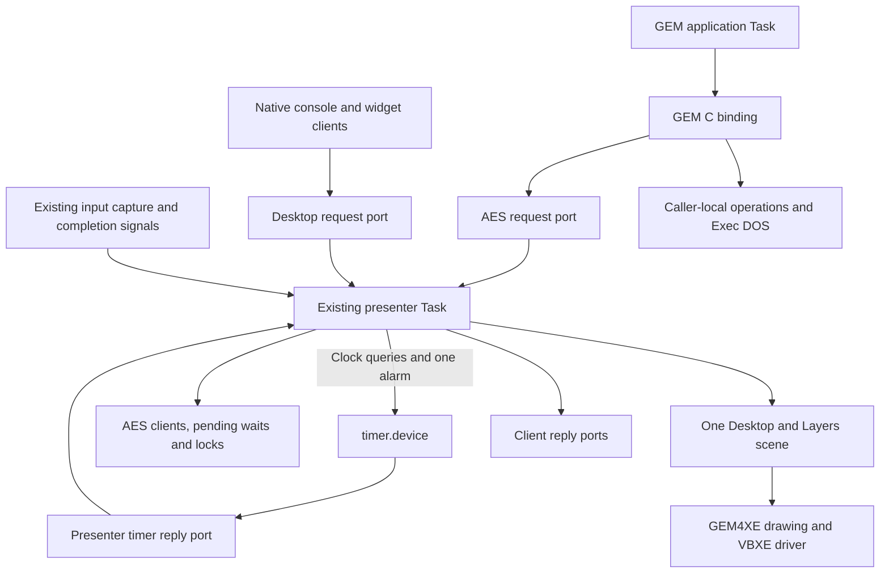

# AES server layer for Exec816

[GEM integration index](README.md) · [XaAES study](xaaes-study.md) ·
[Current desktop contract](../../reference/desktop.md)

The [implementation plan](aes-server-implementation-plan.md) assigns AS0–AS4
code changes, executable acceptance gates and the two-client Task budget.

Status: proposed AES service, updated 2026-10-06 against the implemented timer
foundation. No AES service is implemented by this note. Baseline: Exec816
`ab6eb2dec33412fd383b4970cbd23c05e9011e20`,
GEM4XE `e413c39d2f8e1bec8fe16596f610b923de4a0ae9`. The
[XaAES study](xaaes-study.md) records the pinned comparative sources and their
limitations. Keep donor analysis and adaptations in Exec816, outside GEM4XE.

The [current timer.device contract](../../reference/timer.md), ordinary
Action!/C device I/O and the
[native interrupt ReplyMsg binding](../../reference/ports.md#native-interrupt-reply)
are implemented. Timer TD0–TD3 have development evidence; AES AS2 now integrates
that device into GEM event waits. The
[execution record](../../history/interrupt-reply.md) documents the tested nominal
57.6 kbit/s loaded envelope and the open 125 kbit/s transport timing gate,
including misses without timer load. AES integration and timer TD4 GUI latency
measurements remain unimplemented. Start AS0/AS1 on that pinned development
envelope; high-speed acceptance and release qualification remain separate gates.

## Decision and scope

Add an AES service to the existing console/desktop presenter Task. Applications
call a GEM-compatible C binding; the binding sends ordinary Exec messages and
waits for replies. The service owns shared AES state, input routing and physical
presentation. A blocking AES operation suspends its caller, while the presenter
continues serving other clients.

The long-term target is a multitasking GEM desktop whose applications retain
their GEM calls, object trees and event loops when rebuilt for Exec816. The first
deliverable is the client, message, wait and lock foundation. Windows, application
redraw and independent VDI workstations follow on that foundation. The current
Control Panel remains a native retained-widget client during this first step.

This design preserves Exec's Task, message, signal and ownership model. It uses
XaAES as a behavioral reference, not as a FreeMiNT kernel module to transplant.
It does not adopt GEM4XE's scheduler, shared stack parking, trap handlers or
machine initialization. Binary compatibility with ST or G4A applications, full
AES coverage and asynchronous recovery from a corrupted application are outside
the initial scope.

## One owner, two source interfaces

Use a separate, versioned AES request protocol and port owned by the presenter.
Include its allocated signal in the presenter's wait mask. Native `DESKTOP`
packets keep their existing contract; neither interface creates a second scene,
focus owner, input consumer or display lease. The presenter calls internal scene
and drawing routines directly; it must never send a synchronous request to
itself through either public binding.

Keep the AES client table separate from native binding records, but allocate all
windows from the same scene capacity. Later, a window records its client kind,
owner and refresh policy. Native retained content and application-redrawn GEM
content can coexist in that scene without pretending their payloads are alike.

The initial service is published through startup's retained service handle, as
the native desktop is today. General application discovery can follow when the
C application loader exists. A future named port must obey
[lookup and withdrawal rules](../../reference/ports.md); `FindPort` alone does
not create a lifetime lease.

## Application binding and protocol

Preserve GEM4XE's public function names, argument types and AES parameter-block
conventions. Replace the binding transport and runtime startup. Keep parameter
blocks, output arrays and binding state private to each application. Initially,
one Task has one AES registration and one outstanding ordinary AES call. Sharing
one registration across several calling Tasks is unsupported.

Marshal the supported operation into a native request rather than exposing the
donor's global AES parameter block as shared service scratch. Use explicit
16-bit GEM words, checked native addresses and generated wire definitions.
The [C bridge](../../guides/calypsi-c.md) distinguishes C huge pointers from
native ABI pointers; copying a compiler's C struct layout is not a wire format.
Add machine-readable AES definitions and generated C/Action! declarations when
the first executable slice fixes the layout. No new AES COP signature is needed;
the binding uses public Exec operations through the existing gateway.

Each request carries an Exec Message header, protocol version/size, operation,
client identity, sequence, bounded inputs and completion status. Registration
also identifies the original binding storage, owning Task and private reply
port. Admission retains the Task and validates those relationships. Subsequent
requests must match that registration. This is a shared-memory ownership
contract, not a protection boundary against malicious memory writes.

Copy small scalar inputs and standard GEM messages into the descriptor. For the
initial subset, return outputs inline and let the binding copy them to the
application's AES arrays after collecting the reply. No application message
buffer needs to remain borrowed by another application. Future trees, strings
and drawing buffers require operation-specific copy/borrow rules.

Use monotonically increasing internal identities and sequences, rejecting
exhaustion before wrap. Map GEM application IDs through a table; never truncate
a native ID. Initial GEM IDs are positive signed 16-bit values, with zero
reserved for the service and `-1` for failed initialization. Do not reuse an ID
within one service lifetime: stale messages must not reach a new registration.
The limited live-client count does not imply a four-value public ID space.

An ordinary request passes through these states:

1. **Prepared:** only the caller may modify its unlinked storage.
2. **Queued:** `PutMsg` transfers access to the service; retain all referenced
   storage until the reply is removed from the reply port.
3. **Active or pending:** the service either completes it or records an event,
   lock or hardware condition that will complete it later.
4. **Replied:** detach every pending reference and finish outputs before
   `ReplyMsg`; never touch the descriptor after publishing the reply.
5. **Collected:** the binding removes the reply with `GetMsg`, checks identity
   and sequence, copies outputs, and may reuse the request.

Signals only announce possible work. Drain reply queues before waiting and
after waking; `WaitPort` observes a head without removing it. A reply can arrive
before submission returns. These rules follow the existing
[port](../../reference/ports.md) and [signal](../../reference/signals.md)
contracts, including stale/coalesced notifications.

Transport failures are distinct from GEM results. Map each supported operation
to its documented failure value and retain a binding diagnostic for malformed,
unsupported or exhausted requests. Reject unsupported `evnt_multi` bits as a
whole; silently stripping them could leave an application waiting forever.
Publish a precise supported-call table with the binding. Do not advertise a full
AES version/profile merely because these entry points link.

## First supported calls

| GEM call | Proposed first behavior |
| --- | --- |
| `appl_init` | Allocate one registration, return its GEM ID and initialize the supported `global[]` fields. Fail with `-1` on admission failure. A repeated call on a live binding returns the existing ID without allocating another client. |
| `appl_exit` | Retire this GUI registration and its resources before returning success; the Exec Task may continue and initialize again. |
| `appl_write` | Copy one standard 16-byte message to a live destination; return success when accepted, not when consumed. Reject other lengths, invalid destinations and a full queue with failure. |
| `evnt_mesag` | Return the oldest queued message or retain the request until one arrives. |
| `evnt_multi` | Initially support `MU_MESAG`, `MU_TIMER` and their combination. Return all selected conditions ready at the completion decision, with at most one message. |
| `evnt_timer` | Convert the unsigned millisecond duration once to an absolute device-clock deadline and complete when it expires. Preserve GEM4XE's one-tick minimum for standalone zero delay; zero-duration `MU_TIMER` in `evnt_multi` is immediately ready. |
| `wind_update` | Owner-aware nested `BEG_UPDATE`/`END_UPDATE` and `BEG_MCTRL`/`END_MCTRL`, including the `0x100` check-and-set form of acquisition. |

The first profile requires registration before `wind_update`; XaAES's special
pre-registration path is not included. Keyboard, buttons, rectangle events,
double-clicks, application discovery, windows, menus, resources, forms and shell
launching remain unsupported until their own slices. Test applications receive
peer IDs from the fixture/startup environment rather than an invented
`appl_find` implementation. AES messages do not carry an implicit pointer-sized
payload or grant access to the sender's memory.

## Pending events and timer wakeups

The service is the only writer of each client's queue, wait condition and
completion state. On accepting a wait, inspect queued messages and the current
deadline. If nothing matches, record the request before returning to the pump.
On any relevant arrival or timer wake, reevaluate it. Before replying, consume
only the returned message, remove the pending wait and retire its deadline.
Message and timer readiness may appear in the same `evnt_multi` result. They
must never produce two replies to one request.

Initial capacity is four AES clients and sixteen 16-byte messages per client.
Application messages remain FIFO; do not apply native pointer-motion coalescing
or the native event queue's LOSS/reset behavior. A full queue makes
`appl_write` fail without overwriting accepted work or parking its sender.
The binding profile must document this bounded-capacity failure. A successful
send guarantees queue acceptance, not survival of the destination's later exit.
Message queues occupy 1,024 upper-RAM payload bytes in total, plus metadata.

Use the implemented [timer.device](../../reference/timer.md) for asynchronous
deadline notification and monotonic clock reads. Ordinary `EXEC.Wait` remains
unchanged. The driver owns I/O completion and cancellation; AES owns event masks,
per-client deadlines and exactly-once application replies. Only the driver's
native continuation uses interrupt ReplyMsg. AES binding, device calls and
application replies run in Task context. Pointer sampling and blitter watchdog
activity are not a general timer source.

### Presenter-owned timer resources

Before publishing the AS2-capable AES service, the presenter creates a dedicated
`PA_SIGNAL` timer reply port and two `TIMER.TimerClockRequest` records. It opens
`timer.device`, `UNIT_VBLANK`, flags zero on the clock-query record. That record
remains the original open owner until shutdown. The alarm record borrows only
its device/unit fields and uses the same reply port; it does not acquire a
second open. Failure unwinds these resources before AES admission, while the
native desktop continues without the AES service.

| Resource | Use and ownership |
| --- | --- |
| Clock-query record | `TD_READCLOCK` through `DoIO`; this command completes immediately with QUICK, including errors. Never submit this record as the asynchronous alarm. |
| Alarm record | `TD_WAITUNTIL` through `SendIO` for the earliest pending client deadline. At most one submission remains uncollected; even an already-due target or immediate error produces a reply. |
| Timer reply port/signal | Owned by the presenter and included in its normal wait mask alongside native/AES requests, input and drawing completion. Drain replies before sleeping and after waking. |

The record layout and command constants already come from
[the timer ABI](../../../abi/timer-device.json); the Action! presenter uses
`USE TIMER` and ordinary `EXEC` I/O calls. C bindings for device I/O already exist,
but GEM applications need only their AES calls. Four client deadlines share one
device alarm, one of the device's eight open bindings and at most one of its
sixteen pending slots. There is no per-client timer request or signal.

### Clock and GEM duration semantics

On accepting a timed wait, read the coherent 64-bit clock and convert the full
unsigned 32-bit GEM millisecond value once with `TIMER.Deadline`. Store the
resulting high/low deadline in the client's server-owned record. Compare its
unsigned 32-bit halves directly; do not truncate it to the legacy 16-bit VBI
counter or recalculate durations when the earliest alarm changes.

The helper uses the reported 50/60 Hz rate and computes
`now + floor(ms/1000)*rate + ceil((ms mod 1000)*rate/1000) + 1`, with checked carry
and overflow. VBI resolution is 20 ms on PAL or about 16.7 ms on NTSC; the extra
tick prevents an early completion at an unknown position in the current frame.
This quantization is separate from interrupt service, presenter scheduling and
client-resumption delay. The clock counts VBI events, not elapsed wall time.

Zero-duration `MU_TIMER` in `evnt_multi` is immediately ready in AES without a
device submission. Standalone `evnt_timer(0)` uses `TIMER.Deadline(clock, 0)` to
store `now + 1`, then participates in the same earliest-absolute-alarm scheme.
It needs no separate relative request or extra rounding on rearm. Preserve this
distinction for an application's nonblocking message-queue drain.

### Alarm submission, replacement and collection

Track alarm ownership explicitly; a timer signal is only a hint. Before sending,
record the submitted absolute target and mark the record outstanding, since
completion may precede return from `SendIO`. Never modify that record's command,
binding or target while outstanding. Recompute the desired earliest target from
live client deadlines, not from a pointer retained in the device request.

| Alarm state | Presenter action |
| --- | --- |
| Reply available | Collect exactly once, check normal/aborted/error status and return the record to idle ownership before any reuse. Reevaluate all pending events. |
| Idle/collected | If a future client deadline exists, prepare and send the earliest target. Otherwise keep the device open without an alarm. |
| Outstanding, desired target unchanged | Leave it alone; unrelated input or redraw does not restart the delay. |
| Outstanding, target changed or no timed clients remain | If already terminal, collect it. Otherwise issue `AbortIO` once and mark it retiring. Keep the replacement target in server state. |
| Retiring | Continue the pump until the reply is collected, then recompute pending events and the earliest target before resubmitting. Normal completion may win the abort race; accept either that result or `IOERR_ABORTED`. |

Use `GetMsg` on the dedicated port as the normal collection path and verify the
reply is the outstanding alarm. `CheckIO` is observational and `AbortIO` is not
collection. `WaitIO` is allowed only after `CheckIO` confirms completion, and
must not follow a `GetMsg` collection of the same reply. Never issue a future
timer `DoIO`, an unguarded `WaitIO` or a busy-wait in the presenter. The current
driver normally makes cancellation terminal synchronously; collection and record
reuse are still separate steps.

Between rendering quanta, collect timer replies and evaluate pending AES events
using a fresh coherent clock sample for timed waits and the messages already
accepted into each FIFO. The selected ready bits at that decision determine the
single reply; at most one message is consumed. An old alarm reply may arrive after
a message already satisfied its client: collect it and reevaluate live state,
without replying to that client twice or treating an abort as `MU_TIMER`.
Deadlines that became due while replacing the shared alarm are completed by
this same evaluation; they do not wait for a new VBI. Before sleeping, ensure
the earliest remaining future deadline has an outstanding alarm, or that a
retiring alarm still guarantees a collection wake. Locally runnable work keeps
the normal fairness path active.

Check every clock-query, conversion and alarm-completion result. A failed clock
read, full device queue or arithmetic overflow must not silently leave a timed
call pending without a wake source. Return a binding diagnostic and zero GEM
result for an affected `evnt_timer`/`evnt_multi`; do not fabricate a timer event
or consume its queued message. A clock failure affects all pending timed calls;
an alarm failure affects every timed wait depending on that shared wake source.
Retire the alarm while continuing message-only and native desktop service.
Do not spin on clock errors or retry deadlines with new relative durations.

No timer, AES or per-client worker is added. Input and ordinary requests wake
the presenter independently of timer ticks; GUI response does not wait for the
shared alarm. AS2 and AS4 must measure that behavior in the real presenter, since
the existing driver probes alone do not prove AES latency or fairness.

## Update and mouse-control locks

The service owns locks as data: owner identity, checked nesting counts and
pending acquirers. It never calls a blocking lock primitive from its pump.
`BEG_UPDATE` acquires update ownership and an associated mouse-control hold
atomically. `BEG_MCTRL` acquires explicit mouse-control ownership. Track explicit
mouse holds separately from update-associated holds, so releasing one kind
cannot accidentally release the other.

Allow recursive acquisition by the owner, failing before counter overflow.
`END_*` succeeds only for the matching owner and a live corresponding hold;
underflow or a non-owner release fails without changing state. A check-and-set
acquisition either obtains the complete requested ownership or immediately
returns failure, with no partial hold. A normal contended acquisition remains
pending, consuming that client's ordinary call slot. Grant eligible waiters in
arrival order; permit the existing owner to recurse without waiting behind a
client that depends on its release. No client acquires half of an update lock
while waiting for the other half.

An update lock protects application-visible screen-update sequencing, stable
window visibility and the owner's drawing sequence. It does not stop Task
scheduling, disk I/O, message delivery or timer completion. While held, defer
conflicting focus/geometry changes and other clients' painting, including
native console/widget painting. Continue bounded input capture and route
mouse interaction according to the lock owner; do not let desktop drag or
button animations bypass the lock. Physical cursor movement remains a
presenter-controlled, serialized operation under the cursor's existing rules.

Grant ownership only after previously admitted conflicting drawing reaches a
safe completion boundary. Keep this distinct from a
[Layers draw token](../../reference/layers.md): application lock ownership may
span calls, but an internal token covers only actual bounded rendering. Do not
hold a token while waiting for application code or a future `WM_REDRAW` response.
Likewise, do not hold the GUI lock across arbitrary application work inside the
presenter. A client that keeps a lock can stall conflicting GUI updates; record
this diagnostically, without silently revoking the lock after a timeout.

## Presenter scheduling and latency

Extend the existing pump rather than nesting an AES event loop inside it.
Use an initial combined budget of four request admissions per turn across the
native and AES ports, rotating the starting port. A pending call leaves intake
immediately. Within the four-client bound, inspect pending events and eligible
lock grants each turn; a blocked client must not block independent requests.
Preserve the current bounded rendering continuations and hardware completion
path. When a budget is exhausted with runnable work remaining, continue through
the worker's normal fairness path rather than sleeping for a fresh notification.

Service completions, input and due timers between rendering quanta. Do not run
filesystem calls, application callbacks or synchronous client waits on the
presenter stack. The same applies to future form continuations: save state and
return to the pump. Global donor drawing scratch remains private to serialized
renderer execution, with no reentry while a continuation owns it.

There is no new per-frame queue or deliberate batching delay. Metadata and
message replies complete as soon as their state change is committed. Future
drawing calls must distinguish accepted state from fenced hardware completion;
readback, buffer retirement and benchmarks require the latter. Internal widget
drawing calls remain direct, and small button-feedback work must stay eligible
between long redraw quanta.

Measure the cost of the synchronous binding before choosing drawing batches.
Record submit-to-service, service-to-reply, caller-resumption and, for visible
operations, input-to-first-pixel and input-to-complete-feedback. Compare the same
optimized image configuration with and without AES service activity, idle and
under console/SIO load. Report distributions and worst observed delay, not just
throughput or VRAM bytes. Exec currently ignores Task priorities; assigning a
nominal high presenter priority is not a latency mechanism.

## Registration retirement and shutdown

Use a retained Task lease for every registration. A normal synchronous binding
has collected its previous call before issuing `appl_exit`, so it cannot leave
an outstanding foreground event wait behind. Initial service shutdown returns
BUSY while clients remain registered; it must not invent a successful GEM event
to wake an application or delete storage under a blocked caller.

For retirement, mark the registration closing, reject new sends to it and retire
its queued messages/deadlines. As windows and VDI resources are added, close them
and fence their drawing and borrowed buffers before releasing conflicting locks.
Then remove ownership entries, release all of its lock nesting and make waiters
eligible. Cleanup may continue over several presenter turns; other clients
continue to receive service.

Removing a registration can change the earliest shared deadline. Run the same
abort/collect/rearm state machine; the alarm contains no borrowed client pointer,
so its delayed collection cannot keep freed client storage reachable. A service
shutdown with no registrations still retires and collects its outstanding alarm.
Only then close the original clock-query open, detach the borrowed alarm binding,
delete both idle records and delete the empty timer reply port. Keep the pump and
reply signal alive until collection completes; disabling notifications or merely
clearing a signal bit cannot retire a request. Include these steps in startup
rollback after any successful open or alarm submission.

Before publishing the final client exit reply, detach all references to caller
storage and finish outputs. Follow the existing short publication/retirement protocol:
under `Forbid`, publish the final reply, release the server-owned Task lease and
retire the server record, then `Permit`. Do not dereference caller storage after
publishing the reply. Outside such a protected handoff a reply receiver may run
before `ReplyMsg` returns. After collecting the exit reply, the binding may
delete its empty reply port, free storage and later register again with a new
identity. Failed admission must unwind every allocation, signal and lease
without publishing a partial registration.

Normal C return and supported GEMDOS termination must route through this
cleanup before Process/image release. Initial fixtures use a resident C entry
with an explicit exit wrapper; the current Action! command loader does not
already provide C/G4A loading. A future cancellation/control request needs its
own independently available lane, exact-once completion and reply collection;
it is not necessary to invent asynchronous cancellation in the first synchronous
profile. Removing a registered Task or freeing its image remains a lifetime
violation. Crash recovery, forced kill and shutdown of uncooperative clients
require a separate general lifecycle design.

## Path from the foundation to a GEM desktop

The AES foundation alone will not make today's copied widget/console model
source-compatible with ordinary GEM window applications. Extend the same
service in this order:

| Follow-on | Required contract |
| --- | --- |
| Windows and handles | Map 16-bit GEM handles to owned native windows. Share stacking/focus with native clients. Add `wind_calc`, work/frame rectangles and selected `wind_*` fields; name current fixed-size/onscreen limits until extended. |
| Window messages and redraw | Deliver `WM_REDRAW`, `WM_TOPPED`, `WM_MOVED`, `WM_SIZED` and `WM_CLOSED` to the owner. GEM move/size/close gestures propose an action; the application accepts through `wind_*`. Preserve the native interface's own behavior explicitly. |
| Visible rectangles | Implement `WF_FIRSTXYWH`/`WF_NEXTXYWH` over stable scene visibility with checked coordinate conversion and defined enumeration invalidation. Do not expose native internal pointers. |
| Per-client VDI | Provide separate virtual-workstation attributes, clipping and inquiry state, selecting them around serialized rendering. The present private hosted VDI service cannot acquire a second display lease beside the desktop. |
| Full input events | Translate keyboard codes/modifiers and implement button, rectangle and click timing semantics in `evnt_multi`, including simultaneous ready events. Reuse existing capture. |
| Objects, resources and forms | Preserve application-owned trees and state writeback. Do caller-local resource I/O through the application's Exec DOS context. Implement modal forms as suspended calls; define menu/tree borrowing and editable fields. |
| Application desktop | Add native C program loading, the needed GEMDOS/file/shell bindings and a desktop application that remains resident while other applications run. |

For application-redrawn windows, keep pending exposure damage in the service
and request application painting with `WM_REDRAW`. Do not erase the work area
on every notification or reconstruct it from a copied widget tree. Clip drawing
to current visible regions and retain unresolved damage until repaint is
accounted for. Server-generated redraw and close/focus obligations need durable
state separate from the bounded `appl_write` FIFO, so a full application-message
queue cannot lose essential window work. Define coalescing and fairness in that
window slice rather than treating every message as interchangeable.

A VDI screen workstation is not a window handle. An ordinary GEM application
enumerates visible rectangles and sets its VDI clip; the server cannot infer a
retained window bitmap from that workstation alone. Resolve drawing fences,
work-area damage acknowledgement and window/clip ownership together when adding
the first redraw client.

GEM `USERDEF` drawing and other application callbacks must eventually execute
in the owning application's Task with an explicit rendezvous. Running arbitrary
application code on the sole presenter's stack would block all clients and
break ownership. Keep callbacks unsupported until that protocol exists.

## Memory and capacity

All new service/client records, queues, deadlines and protocol storage belong
in upper RAM. Four registrations are a bounded service capacity, not a promise
of four additional runnable applications in the existing eight-Task system.
Use the [Task capacity budget](../../architecture/task-capacity.md) to assign
system workers and the two proof clients before selecting their stack classes.

The AES design target is **zero additional fixed bank-zero reservation and zero
additional per-Task DP/stack reservation**. Reuse the presenter's existing
2,560-byte stack; do not add an AES or timer worker. The existing timer foundation
adds **0 fixed and 0 per-Task bank-zero bytes** and suballocates 10,240 bytes,
including code, state, alignment and unused capacity, within the existing upper
Task bank. Its IRQ/NMI and stack evidence is recorded independently; AES must
measure the combined presenter/driver call chain rather than reserve it again
or assume the earlier high-water result covers that chain.
Existing application Tasks still consume their selected
stack/guard class and 256-byte direct page. The two test clients must fit the
existing pools rather than silently expanding them.
Measure presenter and C-binding high-water usage under nested calls and
interrupt entry. If they do not fit, report and review the actual reservation
change, including guards, alignment and spare capacity, before enlarging it.

Initial fixed capacities: four AES registrations, one ordinary request per
client, sixteen queued messages per client, at most one pending event or lock
acquisition per client, and the existing shared four-window scene. Allocate one
AES service-port signal and one reply-port signal per registration. The presenter
also owns a timer reply port/signal and two 38-byte clock/alarm records: **76 bytes
of request payload**, plus port, allocator and alignment overhead. Four 64-bit
client deadlines add **32 payload bytes**, plus flags and alarm bookkeeping; no
per-client timer signal is needed. Record total upper-RAM bytes, signal use and
allocation-failure rollback from emitted layouts in the first implementation
slice; the 1,024-byte message payload subtotal is not a total RAM estimate.

## Executable slices and acceptance

| Slice | Acceptance before proceeding |
| --- | --- |
| AS0: binding and registration | Generated wire layouts; real C calls through Exec to the existing presenter; init/exit/reinit, stale IDs, wrong owners, admission exhaustion and complete rollback. No drawing changes. |
| AS1: messages and message waits | Two C clients exchange standard GEM messages through `appl_write`/`evnt_mesag`. Queue-before-wait, reply-before-submit-return, queue-full rejection and concurrent native desktop service pass. |
| AS2: timer events | Consume the implemented timer and native-reply contracts in the existing presenter. Real C `evnt_timer` and message/timer `evnt_multi` pass without input traffic. Cover both zero-delay forms, earlier/later/equal target replacement, last-deadline removal, completion-before-submit-return, abort/expiry races and stale signals. Verify simultaneous message/expiry, low-word carry, overflow and clock/device failure, the full 32-bit duration range, descheduling and retained runnable work. Check open/allocation failure rollback and shutdown with an outstanding alarm. |
| AS3: GUI locks and retirement | Recursive/contended/try acquisition, exact release, nesting overflow, implicit/explicit mouse holds and exit while owning locks pass. Another client's pending acquisition never blocks messages, timers or the owner's release. Conflicting native painting obeys ownership. |
| AS4: integrated proof / timer TD4 | Two rebuilt C clients preserve ordinary GEM call sequences and event loops beside the native desktop under the pinned 57.6k loaded configuration. Measure IPC cost, quantization versus timer lateness, input latency, stack use and repeated leak-free lifecycle. Include input during alarm retirement and long redraws. Passing this slice does not close the separate 125k transport gate. |

At AS4, a CPU-busy application that holds no GUI lock must not stop its peer's
messages/timers or native input service. A lock owner must demonstrably delay
conflicting painting without stopping disk progress or unrelated AES replies.
Record the limitation that a non-cooperating lock owner can delay GUI updates.
This is a two-client AES-foundation proof; a conventional two-window GEM redraw
application is the next compatibility gate, not an implied AS4 result.

Follow the [two-tier testing policy](../../contributing/testing.md). Use host
checks and focused emitted-code development tests, raw/optimized probes for
new wire layouts and C/Action! boundaries, and optimized concurrency/latency
tests. Reuse the recorded timer/interrupt development evidence as the dependency
baseline; do not rerun its full matrix for unchanged code. Add targeted NMI/IRQ,
stack, cancellation/collection and OS-coexistence cases where presenter
integration changes those paths, and rerun affected foundation cases if it
requires a kernel or driver change. Pin the ROM, emulator, compiler and timing
configuration in results. Broader qualification remains separate. Any demo
refresh uses `tools/build_demo.py`, retains OF816 and its five-second standard
autoboot, and smoke-tests the exact package.

All AES slices remain pending. The next executable work is AS0: fix the wire ABI,
admit and retire a real C client through the presenter, then add the AS1 two-client
message exchange. AS2 supplies the missing AES timer behavior on the existing
device; AS4 supplies its TD4 GUI measurements. No new timed-wait kernel operation
or interrupt entry is a prerequisite.

For this documentation-only change: bank-zero reservation delta is **0 bytes
fixed and 0 bytes per Task**; no executable compatibility or performance result
is claimed.
