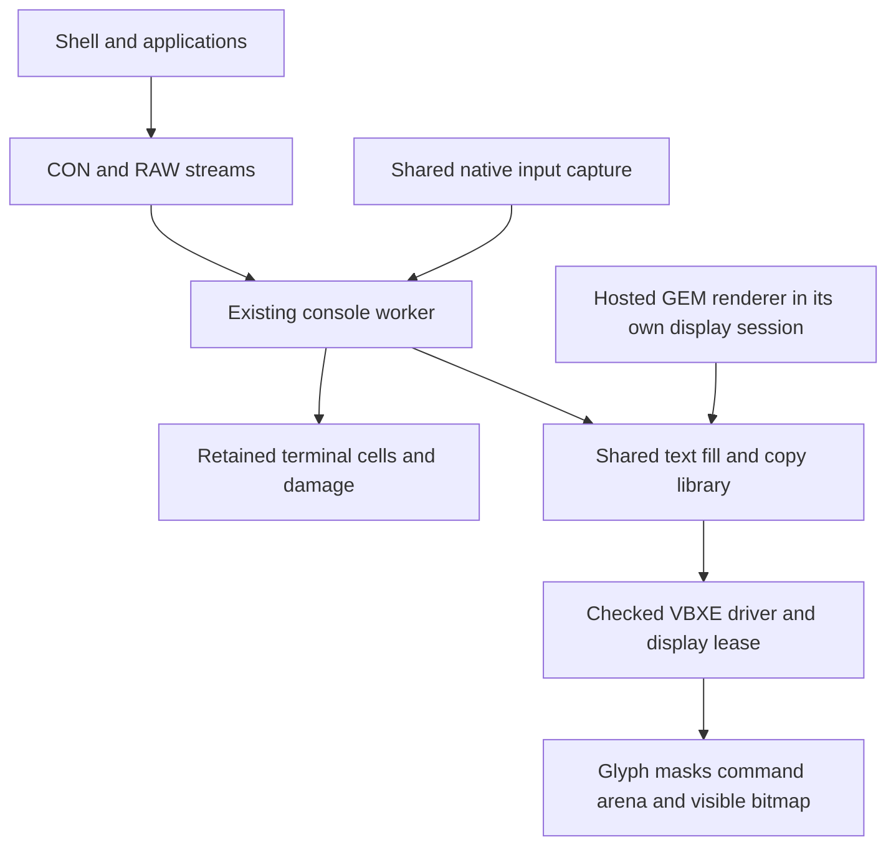

# Bitmap console design

[Implementation plan](bitmap-console-implementation-plan.md) · [GEM work](README.md) ·
[Console contract](../../reference/console.md) · [Roadmap](../../roadmap.md)

Status: functional development preview implemented, 3 October 2026;
responsiveness acceptance remains open. The baseline descriptions below record
the starting point before B0. Use the linked console contract for current behavior
and the implementation plan for executed slices and measurements.

Build an 80×30 character-cell console on the existing 640×240 VBXE bitmap.
Retain terminal contents in main RAM, keep expanded glyphs in VRAM, draw changed
runs with bounded blitter lists, and scroll by copying pixels. Reuse CON:, RAW:,
cooked editing, input routes and the shell. The drawing primitives must also
serve the hosted VDI and later desktop windows.

## Scope and baseline

The initial console uses the built-in 8×8 face with an eight-pixel line height,
one visible bitmap, fixed foreground/background colours and a steady underline
caret. Start with one full-screen instance, then preserve the existing four
instances and non-overlapping tiles on the larger display. Black text on white
is the initial colour pair; retain colours in presentation state. Per-cell
attributes, colour escape sequences, blinking, scrollback, resizing, overlapping
windows, AES, PMG pointers and mouse-cursor optimization are later work.

This is a bitmap presentation backend for the existing terminal model. Hardware
text of the kind used by S2: remains a possible separate display backend, but is
outside this milestone. There is one terminal implementation and one current
console API, with text and VBXE selected as display capabilities at build/startup.

The current [VDI backend](../../../ports/gem4xe/adapter/README.md) already has
18,432 bytes of even/odd glyph masks, a 4 KiB CPU staging page, clipped drawing,
cursor protection and bounded recovery. However, each blit passes through a
checked upload and synchronous fence. A VDI command may issue many such blits;
the service fences again before counting that command as completed. The client
also clears its entire 2,204-byte packet allocation for each preparation.

An existing local optimized benchmark, `build/gem-text-performance/results.json`,
records the following complete `GemCall` costs. Its executable SHA256 is
`3c55563171f6e7810a9cebdc425a00c4aed172d0e0ae36a088dc60b73aa5f097`.

| Workload | No pointer capture | Idle ST capture enabled |
| --- | ---: | ---: |
| 64 characters at even X, average of eight calls | 480 ms | 685 ms |
| Full 80×30 repaint, 60 calls | 18.62 s | 26.58 s |

These are development observations on the pinned optimized emulator path, with
20 ms timing granularity, no cursor drawing or disk traffic, and font startup
and clearing excluded. They are not pure blitter timings or hardware results.
The first implementation slice must reproduce and retain a portable baseline
with current inputs before using these numbers for a speedup claim.

## Ownership and execution

Keep the existing console worker as the sole display owner while bitmap CON:
is active. It runs terminal editing, input consumption and bounded presentation
turns. Call a shared drawing library directly from that worker through a checked
native/C adapter; do not send each console span through the GEM client/service
round trip. The hosted GEM renderer calls the same drawing library in its own
exclusive display session. Extract common operations rather than copy a second
VBXE driver or font renderer.

The bitmap worker must occupy one of the existing 2,560-byte pools, admitted
before small workers can consume both large pools. No new Task, stack or DP is
allocated. The text worker can continue using a smaller pool. The ordinary demo
therefore retains five persistent public Tasks and seven with a two-command
pipeline. The second large pool remains available; admission still fails cleanly
if no suitable pool is free.

The current C binding supports a narrow bootstrap boundary, not arbitrary
Action!/C callbacks. Add and test an explicit ordinary-call adapter with generated
packet layouts and checked full addresses. It must establish the C workspace,
preserve the Action! caller's affected lower DP bytes, D, DBR, stack alignment and
required registers, and permit native IRQ/NMI entry. Keep packet/state storage
in upper RAM. Measure the combined Action!, bridge, C and interrupt stack depth
on both raw and optimized builds; C has no Action! entry stack checks. A stack
failure requires reducing call depth or revising this design, not silently
increasing the bank-zero pool.

### Presentation callers

Today some Show/Hide/Focus work writes the display in its caller's Task. That is
incompatible with VBXE owner checks. Convert presentation changes into retained
control requests serviced by the console worker, for both backends. Preserve
the existing owner, overlap, focus-route and presentation-busy rules.

A caller publishes one bounded control transaction under the existing registry
protocol, releases scheduling exclusion, and waits for its exact completion.
Retain the caller, instance and request until the worker's last use. The worker
must service control requests even while new ordinary presentation borrows are
paused; it must not wait on a transaction that is waiting for that same worker.
Only the worker calls the hardware backend. No display work or wait occurs under
Forbid. Preserve synchronous Hide erasure and focus publication, while Show may
schedule retained-cell redraw as it does today.

Use public Exec messages, signals, leases and resident lifecycle operations.
Keep queue, cancellation, completion and recovery policy in the console/display
driver. Add no console-specific COP selector or private kernel shortcut. Existing
unrelated console protocols are not implicitly migrated by this design.

## Console model and geometry

Raise the core limits to 80 columns, 30 rows and 2,400 character bytes, using
widened checked arithmetic for dimensions and extents. The selected backend
limits admission and Show: text remains 40×24, bitmap supports 80×30. Add ordinary
read-only `CONSOLE.ScreenWidth()` and `ScreenHeight()` queries, returning zero
when the service is not ready. Keep opaque unit identities and four slots.

Allocate cells for each instance's actual geometry. Preserve current ASCII,
high-byte substitution, controls, wrapping, input loss, foreground BREAK,
`io_Actual` and cooked-line rules. The ROM text backend keeps its glyph mapping;
the bitmap backend uses the linked GEM font after the same terminal-byte
normalization. No terminal escape parser or implicit ATASCII conversion is added.

Replace a single broad dirty interval with one half-open dirty column span per
row. Merge changes on a row, and mark all rows after an invalidating operation.
Keep the oldest outstanding damage time until it is presented, so repeated
writes cannot hide starvation. Preserve a checked direct-model entry for tests.

WRITE completion continues to mean that bytes and their logical edits have been
accepted into retained state. It is not a display fence. The renderer cannot
borrow the original write buffer after its reply. Hidden output remains valid;
showing an instance redraws its model. Track model and presented generations
internally for tests and copy eligibility, without adding a public flush command
or changing DOS Write semantics in this milestone.

## Drawing and command submission

### Shared operations

The common library supplies clipped opaque text runs with explicit foreground
and background, fill rectangles, byte-aligned bitmap copies, presentation fences
and caret drawing. VDI keeps its current pen, baseline and inclusive-coordinate
semantics at its boundary. Internal geometry uses signed coordinates and
half-open rectangles; convert once with widened arithmetic.

Keep the logical VDI palette mapping. Hardware white is index 0 and black is
15. A nonzero-ink glyph can use one nibble-stencil command from the existing
mask atlas; hardware-zero ink needs a correct clearing/masked path. Fill each
opaque run's background once, preserve neighbouring nibbles, and omit empty ink
glyphs without omitting their background. Do not mistake the donor's overlay
flag for proof that a glyph's cell has been cleared.

Retain an exact clipped fallback while optimizing fully visible glyphs. Odd X,
clipped first/last nibbles and zero-colour ink must match an independent raster
oracle. Later optimize fallback transfers by uploading touched spans rather than
unconditionally reading/writing 4 KiB. Never discard unknown neighbouring pixels
merely to save a read. Repeated labels and whole-window caches remain later work.

### Bounded lists

Replace per-primitive submission with driver-validated contiguous command lists.
Validate the complete list before hardware mutation, copy records to driver-owned
VRAM, set chaining internally and fence before reusing any source or command
storage. Clients cannot supply arbitrary hardware-list pointers or modify a
submitted list. Keep complete extent checks, including signed copy steps.

Start with one 4 KiB command arena and a 4 KiB upper-RAM construction buffer.
The physical arena holds 195 records with one spare byte; initially admit at
most 64 records per submitted list, further limited by estimated work. Splitting
one long automatic chain into many records does not create scheduling points:
end the list, observe completion and reconsider input/control work between chunks.

Keep hardware execution synchronous at a bounded list boundary initially. Use
the existing wrap-safe timeout, STOP/quiescence and reset-required protocol.
VBXE IRQs stay off. Two executing/preparing arenas, IRQ-driven completion and
multiple outstanding client requests are deferred until measurements justify
their extra lifetime and interrupt machinery.

Batch within each VDI command first. Preserve the existing service's ordered
outputs, completed-prefix reporting and fence before command success. Flushing
an arena mid-command does not count that command as complete. CPU scratch reuse,
clipped drawing and cursor-save transactions are explicit dependency boundaries.
An error latches and prevents subsequent callbacks from touching hardware.

Reduce GEM packet initialization to submitted bytes and required header/reply
state, retaining zeroed reserved fields and stale-data rejection. This benefits
GEM callers; the console uses the common library without that packet overhead.

### VRAM mapping

Retain the reserved `$8000–$8FFF` MEMAC A aperture and the owner-only mapping
protocol. MEMAC B occupies `$4000–$7FFF` and would overlay live native stacks.
Do not enable it. No interrupt handler, SIO path or other Task may depend on the
mapping. The driver maps/uploads in bounded spans and unmaps on return.

Keep private 512 KiB VRAM under the existing FX 1.26 pin. Shared RAMBO ownership
and unknown prior graphics state remain unsupported. The bitmap profile must
explicitly select opaque HR scanout and verify palette output; do not infer
opacity from the current Show helper. Preserve the hosted VDI's established
presentation behaviour unless its contract and pixel tests are migrated together.

## Scrolling and the caret

Use an eight-pixel upward copy followed by a background fill for a one-line
scroll. At 80×30, the retained bitmap part is 320×232 = 74,240 bytes; the exposed
strip is 2,560 bytes. Unchanged rows need no glyph drawing. A narrow tile uses
the same 320-byte screen pitch and its own byte width, preserving neighbours.

Determine eligibility before the logical scroll: the view must be visible,
complete and synchronized with its pre-scroll cells, and its source pixels must
be clean. Remove the caret before copying. A small dirty run can be settled
within budget first; otherwise perform the logical edit and redraw its retained
result. Hidden, invalidated and uncertain sources always use model redraw.

Copy top to bottom when moving upward and bottom to top when moving downward;
horizontal overlap also needs the correct signed X direction. The first shared
copy contract accepts even source/destination X and even widths. Reject other
geometry before mutation; callers redraw it. Do not round a requested rectangle
outward or silently repack parity. Console cells and tile positions satisfy this
alignment naturally. General masked/parity-changing copies are later work.

Split large copies into ordered chunks, initially no more than sixteen full-width
pixel rows, with smaller chunks if measured occupancy requires them. Commit the
retained scroll exactly once. While a physical scroll continuation is pending,
defer further model writes to that instance, but continue input capture, read
delivery and other instances. Store the unit and presentation generation for
continuations; resolve them again on the next borrow. Do not retain unprotected
instance pointers across Yield/Wait. Hide, retirement or a generation change
drains an active list, cancels the continuation and invalidates the view.

After the final copy/fill fence, mark the view synchronized and draw the caret.
On a recoverable interruption of the optimization, retained cells provide the
full-redraw result. On hardware fault, follow display recovery instead of trying
more drawing. Completed writes remain completed; a display error cannot retract
their accepted bytes.

Use a steady one-pixel underline initially. Restore its underlying cell from
retained content before moving, clearing or scrolling, and draw it last for the
focused visible instance. It never enters retained cells or copy sources. An
unchanged caret produces no drawing. This avoids adding timed waits or another
Task merely to blink. The shared renderer must continue to protect an existing
software pointer when its GEM session uses these same drawing primitives.

## Worker budgets and responsiveness

B8 revision, 3 October 2026: ship the optional bitmap console as a functional
**development preview** while retaining the responsiveness targets below as
open acceptance work. The measured ordinary console scroll is about 165 ms,
already above the 20 ms limit. Faster command upload improves VDI text, but does
not establish fast console scheduling. Packaging this preview must not be
reported as satisfying the fast-console milestone. Keep this design and plan
current until those gates pass.

The next performance investigation must separate Task CPU time, time awaiting a
worker turn, and actual hardware BUSY intervals. Evaluate ordinary shared-library
cost first; if dispatch dominates, propose a reusable public scheduling change
with measured cost, IRQ/NMI safety and ownership semantics before implementing it.
Do not increase source/drawing budgets merely to hide latency between peers.
The [B8 record](../../development/bitmap-console-b8.json) states the executed
workloads and which boundaries remain unmeasured.

Keep 64 source bytes as the initial input-to-model quantum and at most one logical
scroll per instance turn. Bound drawing separately by command count, estimated
blitter cost and measured CPU work. Check control requests, keyboard/BREAK and
other runnable instances between useful chunks; do not yield merely because one
glyph finished. Conversely, do not drain an unbounded output stream before
servicing input. Dirty work and pending control completion must prevent an idle
Wait from losing a wake.

The initial ordinary-list target is at most 2 ms of blitter occupancy, with a
4 ms target for CPU work in one presentation quantum, excluding time preempted
by other Tasks. Both are measured goals, not substitutes for hardware timeouts.
The current round-robin scheduler and the shared ST/SIO interrupt cost remain
part of the end-to-end result. If those prevent acceptance after renderer work,
record the shortfall and propose a separate general scheduling change. Do not
add a graphics-only kernel dispatch path or weaken a SIO deadline.

| Workload on the optimized pinned PAL 65C816 ×8 profile | Initial acceptance target |
| --- | --- |
| Printable key or short cooked edit | Capture to first scanout containing the updated cell and caret ≤40 ms |
| Synchronized one-row scroll | Worker eligibility to completed copy/fill fence ≤20 ms; correct complete scanout within the following frame |
| Full 80×30 repaint | Invalidation to first complete correct scanout ≤500 ms |
| Unchanged console | No glyph uploads, framebuffer writes or repeated caret drawing |

Measure idle and loaded cases: ordinary prime computation, physical SDFS reads,
keyboard/BREAK capture, and separately an idle/active ST source without drawing
its mouse pointer. Exercise the normal seven-Task shell/pipeline configuration;
add a declared eight-Task stress case. Record maxima, distributions, Task counts
and stimulus bounds. An arbitrary CPU-saturating workload is not covered by a
next-frame guarantee.

Timestamp source acceptance, logical edit completion, driver submission,
hardware idle and visible scanout separately. A VRAM readback proves bytes, not
that the monitor has shown them. Use emulated cycle/scanline timing for sub-frame
costs; 50 Hz ticks alone cannot resolve a 2 ms target. Also count CPU work,
MEMAC bytes, BCBs and copied/redrawn area. Use passive observation and an
identical-image replay; identify any instrumented build separately. A single
visible buffer does not promise atomic whole-screen updates or tear-free output
under every raster phase.

## Memory budget

Target added reserved bank-zero bytes: **fixed 0; root/kernel 0; each public
Task 0; private idle 0**, including guards, alignment and unused capacity. Select
an existing large worker pool rather than enlarge it. The current eight-Task
budget remains 56,128 reserved bytes and 9,408 free after startup. Add no PMG
allocation, second CPU aperture or bank-zero command storage.

Provisional upper-RAM allowances, to be replaced by emitted allocation maps:

| Item | Allowance and accounting rule |
| --- | --- |
| Retained characters | `width × height` bytes per instance, up to 2,400; full-size default grows by 1,440 from 960 |
| Damage and presentation continuation | Up to 256 additional bytes per instance, including 120 bytes for thirty pairs of 16-bit dirty bounds and all slack |
| Serialized presentation control | Up to 256 shared upper bytes, including request, acknowledgement and retention state |
| CPU command construction | One 4,096-byte arena, separate from clipped-glyph staging |
| Row addresses | Up to 960 bytes for 240 four-byte VRAM offsets |
| Font, driver and C code/data | Reuse the hosted renderer's complete `$0C`/`$0D` reservations where linked; count 131,072 bytes relative to a text-only build |

Input FIFOs, OS snapshot, records and existing staging retain their own accounted
allocations. Do not label payload placed in spare C-bank capacity as another
whole-bank reservation, or omit those banks when comparing with the text demo.
Prove the remaining heap admits the sector cache and HELLO/CAT/WC pipeline.

Retain current screen, XDL, font, scratch and cursor VRAM reservations. Replace
the 256-byte BCB reservation with a 4,096-byte arena proposed at
`$38000–$38FFF`, leaving the old range unassigned. Relative to the current
108,032-byte VRAM map, this is **+3,840**, totalling **111,872 reserved** and
**412,416 unassigned**. The whole arena counts even when only 64 records are
admitted. The generated map must reject overlap and validate all extents; VRAM
addresses are never 65816 CPU pointers.

## Startup failure and distribution

Select the backend explicitly before console startup; live conversion of open
instances is outside scope. Establish the pinned graphics baseline, bind the
foreign drawing entry and admit the correctly sized worker before publishing
console readiness. The worker acquires the VBXE lease, prepares font/palette/XDL
and blank model, then admits keyboard capture and requests. Partial startup
unwinds in reverse order with scheduling and required interrupts enabled.

Stop closes admission, retires retained control operations, completes or aborts
owned I/O exactly once, stops input publication, fences/quiesces display work,
restores the OS and releases storage last. Existing live-endpoint/instance
rejection rules remain. A hardware failure must produce a terminal driver state
for outstanding I/O and waiters, not leave CON: hanging. Failure to quiesce keeps
ownership and DMA storage and uses the existing reset-required path.

Keep the normal OF816 five-second shell/prime autoboot. Package a separately
selected bitmap-console boot image with matching system disk, ROM and notices
through `tools/build_demo.py`. The initial full-screen console fixture is the
renderer acceptance scene; the optional shell/prime artifact reuses the existing
session logic with 80×24 and 80×6 tiles. Its title/layout must use queried
dimensions rather than hard-coded forty-column wrapping. Keep the standard
40×24 artifact as a regression control and ship only boot files, short guides,
licence notices and checksums in `exec816-demo.zip`.

## Sources and later desktop work

The user-supplied `VBXE_GEM_Desktop_Design_Note.docx`, dated 2 October 2026,
informed this design, especially sections 2, 4, 7–10. Its SHA256 is
`4a31d4dfe27957d0e56f5a6dbbf3790477e7970b2a6de85a51f5d1da0f0118d8`.
Its 640×200 layout, second aperture, PMG default and asynchronous two-arena
scheduler are not adopted for this milestone.

Hardware command, mapping and timing details were checked against the
[Altirra Hardware Reference, section 12.4](https://www.virtualdub.org/downloads/Altirra%20Hardware%20Reference%20Manual.pdf#page=389).
Current software authority remains the [platform](../../reference/platform.md),
[display](../../reference/display.md), [input](../../reference/input.md),
[console instances](../../reference/console-windows.md) and
[VDI contracts](../../reference/gem-vdi.md). Development checks do not qualify
physical VBXE hardware or untested emulator/core combinations.

Later windows can reuse the drawing library, retained console model, copy
eligibility and transient ordering. They still need visible-region clipping,
surface handles and eviction, multi-client state, focus/capture policy and
asynchronous application redraw. This milestone does not implement those
desktop services or allocate a Task per window.
