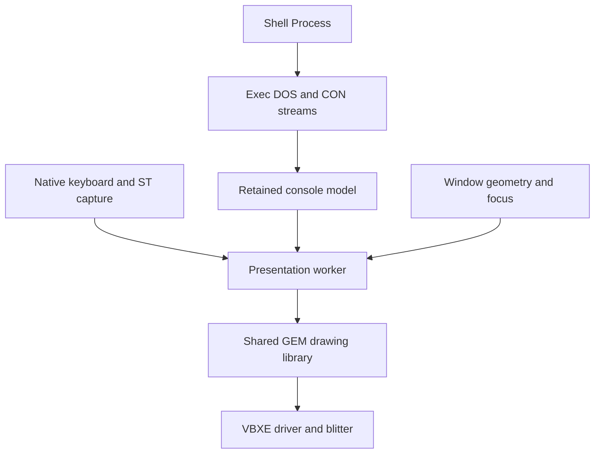

# First desktop on Exec816

[Implementation plans](../README.md) · [Graphics work](README.md) ·
[Roadmap](../../roadmap.md)

Proposed direction, 2026-10-04. Console development is paused at the working
bitmap shell. The next milestone is a desktop background, the existing ST mouse
pointer and one movable shell window. A second overlapping window follows to
prove exposure, focus and independent output before adding a file browser.
This note defines the proposed boundary; it does not describe implemented window
support or claim that earlier console performance targets have been met.

## Foundation and scope

Reuse the [console device](../../reference/console.md), circular retained cells,
DOS editing, output batching, font atlas and blitter scrolling. Keep the current
640×240 VBXE mode, built-in 8×8 font and
[ST mouse on port 1](../../reference/input.md). A proposed first shell client is
64×20 cells, leaving room for its frame and surrounding desktop. Window sizes
are fixed initially; dragging changes position, not console dimensions.

The [existing console instances](../../reference/console-windows.md) support
non-overlapping tiles. The [hosted VDI service](../../reference/gem-vdi.md) owns
an exclusive graphics session. Neither currently provides a desktop compositor.
Starting both hardware owners is therefore not the integration path.

Use GEM4XE's shared drawing code and adapt useful UI code where it fits. This
milestone proposes a small Exec-native window service rather than an immediate
AES compatibility implementation. The earlier
[integration assessment](exec816-integration-assessment.md) remains the basis for
later resource, widget and application work. Standalone GEM startup, its scheduler
and G4A loading are outside this milestone. Window resize, menus, icons, writable
file operations and arbitrary GUI application loading remain separate work.

## One presenter above Exec

Evolve the existing bitmap console worker into the single presentation owner.
Keep console I/O and rendering as separate modules within that worker, with
desktop policy handling frames, stacking, focus and damage. The kernel continues
to supply Tasks, messages, signals and lifetime primitives; it gains no window
policy or desktop-specific gateway.

The worker retains the display lease and is the only caller that touches VRAM,
MEMAC or presentation state. It also consumes pointer input and routes keyboard
events to the focused console. Application requests use ordinary Exec messages
at window or drawing-batch boundaries. Internal console presentation uses direct
module calls; it does not send a message per glyph or require another Task
handoff before showing a short edit.

This keeps Exec mechanisms below the GUI while choosing one serialized presenter
for the 65816 stack budget and existing non-reentrant drawing state. Each window
is an upper-RAM object, not a Task. An application can own several windows; its
execution Task is accounted for separately. The existing exclusive GEM demo stays
a separately selected workload until its client requests have an explicit route
through the presenter.

## Rendering and movement

Implement the [Layers plan](../layers-implementation-plan.md) first. Layers owns
geometry, stacking, cached visible rectangles and exposure damage through ordinary
calls inside the presenter. Window controls and input remain above it; drawing
and hardware submission remain below. Its update token keeps geometry stable
until the presenter has fenced the corresponding hardware work.

Retained console cells remain the source of truth. A window records its client
rectangle, frame, console identity, stacking position and accumulated damage.
Start with a fixed capacity of four window records, plus the desktop background;
the first executable scene uses one. Hidden or covered consoles still accept
output into their retained model.

Use a single framebuffer initially. Draw only damaged visible regions, with the
background and lower windows restored when an upper window moves or disappears.
For overlap, subtract higher opaque windows from each lower window's damage.
Bound region storage; overflow may request a bounded recomposition of the dirty
area, but must never permit drawing through an occluder. Clean or fully hidden
windows generate no drawing work.

A scroll may use the existing asynchronous copy/fill operation only when its
entire source and destination are visible, synchronized and free of transient
overlays. Otherwise update the retained model and redraw the visible damage.
Never copy a covered screen rectangle: it contains another window's pixels.
Offscreen window bitmaps are a later optimization if exposure redraw is measured
to be too slow; they require a separate VRAM allocation and lifetime contract.

Use an outline during title-bar dragging and commit the window position on button
release. This avoids repainting a whole terminal for every motion event. Retain
only the latest pending outline position, preserve button transitions and restore
the old outline before drawing the next. Initially align window positions to the
character grid to keep copying and text edges simple. At commit, copy only if
the source pixels are valid; otherwise repaint from retained state. Restore the
exposed old area in either case.

The current general rectangle-copy API is synchronous; only screen scrolling has
the combined asynchronous copy/fill operation. Movement must use bounded drawing
quanta and permit input service between them. A general asynchronous move is a
separate, reusable driver extension if measurements justify it, not an assumed
capability of the current scrolling call.

Reuse the existing software pointer implementation, extracting its presentation
interface from the hosted GEM backend as needed. Centralize pointer, caret and
drag-outline ordering: remove intersecting overlays before drawing, complete the
underlying work, then restore overlays. Never restore saved pixels from an older
presentation. Keep one blitter operation in flight, with its existing completion
IRQ and watchdog. Input capture and request intake continue while drawing and
dependent retained edits wait for that operation to retire.

## Focus and lifetime

Clicking a window raises and focuses it. Title-bar press captures a drag until
release; leaving the title bar does not lose that capture. Hiding or retiring
the captured window cancels the gesture. Focus publication preserves existing
keyboard route semantics: already captured keys and BREAK belong to the route
and command generation current at capture, not whichever window is focused later.

Window identity must be separate from its console unit and include a non-reused
generation. Register ownership and retain the relevant Task and console binding
before publication. Ordinary operations use that live registration; do not add
repeated writable-range scans to event processing. Admission, teardown, stale
identity handling and optional diagnostics still need explicit checks.

Closing a window is a request to its owning application, not forced Task removal.
The initial shell can exit through its existing command path; a close button
waits for a defined shell shutdown protocol. Window retirement waits for active
draws, replies and captured references before releasing storage. The display
driver's existing quiescence and reset-required fault rules still apply.

## Memory and implementation boundaries

The proposed presenter reuses the existing 2,560-byte worker pool and its DP.
Target additional reserved bank-zero memory: **0 bytes fixed and 0 bytes per
window**, including guards, alignment and unused capacity. This documentation
change itself reserves zero bytes. Each executable slice must verify the actual
map and stack headroom; a deeper call chain is not justification for silently
enlarging the pool. New window, region and request storage belongs in upper RAM
with explicit bounds. Any added application Task uses an existing pool and needs
separate capacity accounting alongside the shell, filesystem and SIO workers.

Keep the existing 4 KiB MEMAC aperture and command arena. Do not assume a second
aperture, general offscreen rendering or unlimited backing bitmaps. Build a
combined VRAM map before adding saved regions or surfaces; CPU RAM and private
VBXE VRAM are separate budgets. See the
[platform budget](../../reference/platform.md#bank-zero-memory-budget) and
[display contract](../../reference/display.md).

The implementation plan should produce these executable slices in order:

1. Separate console content from desktop placement while preserving the existing
   full-screen and tiled backends. Define window registration, presentation
   requests and upper-RAM limits without changing console stream semantics.
2. Show a desktop background and one framed shell window. Integrate pointer and
   keyboard focus into the same presentation worker; demonstrate shell input,
   scrolling, disk reads and clean shutdown.
3. Add title-bar capture, bounded outline movement and move commit. Verify exact
   pixels after repeated moves, including movement requested during a scroll.
4. Add a second overlapping window, stacking and exposure repair. A test panel
   can prove composition before spending a Task on a second shell. Exercise
   output into a covered console, focus changes and either window retiring first.
5. Package the optional desktop preview through `tools/build_demo.py`, retaining
   OF816, matching media and ROM, notices and the standard five-second autoboot.

Use development checks for these slices: focused emitted-code tests, raw and
optimized bridge coverage, exact pixels, stale requests, input routing, bounds,
stack/domain guards and selected IRQ/SIO coexistence cases. Compare short typing
against the existing shell demo and measure input-to-pointer, drag feedback,
move commit and exposure repair separately. Record CPU work, waits and final
scanout instead of treating blitter completion as visible completion. Set desktop
timing acceptance in the implementation plan; the old console goals remain
recorded and are not prerequisites for starting this work.

After window composition works, the next useful desktop application is a
read-only directory browser and launcher for supported Exec programs. It must
use Exec DOS and report its capabilities accurately. Filesystem writes, broader
GEM compatibility and dynamically loaded GUI clients follow their own plans.
