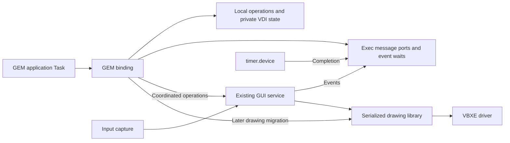

# Hybrid AES and VDI execution on Exec816

[GEM integration](README.md) · [AES server design](aes-server-design.md) ·
[Current AES contract](../../reference/aes.md) · [XaAES study](xaaes-study.md)

The [hybrid AES implementation plan](hybrid-aes-implementation-plan.md) assigns
HY1–HY4 executable slices to the existing message/timer profile and records the
separate prerequisites for caller-local GEM coverage and direct drawing.

Status: proposed, 2026-10-06. The current implementation still uses the
presenter-hosted AES endpoint. This note defines its next architectural
direction; it does not extend the supported GEM call set.

Run suitable GEM operations in the application Task, use Exec messages for
communication, and retain one GUI service for input routing and coordinated
window changes. This removes unnecessary presenter round trips while preserving
the GEM source interface. Keep round-robin scheduling and inactive priorities
until measurements of this model justify a scheduler change.

## Scope and execution model

Keep GEM function names, parameter blocks, object trees and event-loop behavior
for applications rebuilt for Exec816. Binary compatibility, a new library
loader, full AES coverage and forced recovery of crashed clients are outside
this change. Continue the pinned GEM4XE extraction in Exec816; leave the donor
checkout untouched. VBXE remains the only graphics target.

Use ordinary library calls for caller-context work. Existing linked/resident
code is sufficient initially; a dynamically loaded shared library is not a
prerequisite. `aes_call(AESPB *)` becomes a dispatcher that selects direct work
or a service request by opcode. Public Exec primitives still use `COP #$50`.
No new GEM trap, kernel GUI handler or timed-wait service is required.

The [Amiga library model][amiga-libraries] and
[Intuition event ports][amiga-events] provide the execution model: shared code
for immediate work, messages for asynchronous interactions. GEM semantics still
decide whether a particular call must wait for completion. An asynchronous
internal request must not cause a synchronous GEM call to return too early.

| Work | Execution and ownership |
| --- | --- |
| Object lookup, coordinate calculations, resource parsing | Caller, using caller-owned data. Resource-file I/O uses its Exec DOS context. |
| VDI attributes and inquiries | Caller-owned workstation state, as each operation is implemented. No hardware entry for a state-only setter. |
| Application messages and event waits | Calling binding plus Exec ports, signals and timer.device. |
| Registration, retirement, window geometry, stacking and focus | GUI service; one authority shared with native clients. |
| Shared-state queries | Direct only with a synchronized snapshot or explicit read ownership; otherwise remain service calls. |
| Object drawing and VDI primitives | Presenter initially; caller-context drawing only after the ownership and stack checks below pass. |
| Input routing, native window controls and exposure repair | Existing GUI service, with bounded work and ordinary event delivery. |

The native retained Control Panel is not automatically converted into a GEM
application. GEM windows and `WM_REDRAW` remain separate follow-on coverage;
application-redrawn content must not be treated as a copied retained widget tree.

## Caller state and bindings

Keep one AES registration and one active GEM call per application Task. Parameter
arrays, outputs, resource ownership, event-wait state and VDI attributes belong
to that registration. Shared code must not use another client's parameter block
or an unprotected global current-client pointer.

Audit donor and adapter scratch before enabling each direct entry. A normal
call instruction does not make shared compiler/runtime workspace reentrant.
Preserve the caller's stack, direct page, registers and bank context through
the existing native/C bridge, including nested library calls. Application
callbacks must execute in their owning Task; callback opcodes stay unsupported
until their nesting and lifetime contracts are defined.

## Application messages

Give each registered application a private receiving port and a bounded pool
of sixteen internal message records. Preserve the current sixteen-byte GEM
payload, FIFO publication order, full-queue failure and nonreused application
IDs. `appl_write` should:

1. Validate the destination, retain its endpoint against retirement and claim
   a free record under brief Task-side synchronization.
2. Copy the payload and publish through ordinary `PutMsg` to that endpoint.
3. Release the publication hold and return acceptance without a presenter or
   recipient acknowledgement.

[Exec messages](../../reference/ports.md) carry references. The record belongs
to the destination's pool, so the sender may reuse its original buffer after
return. The receiver copies the payload out and returns the detached record
to the pool. These internal one-way messages use this explicit recycling
protocol; they do not borrow a sender's stack or require a reply port. A sender
must not touch the record after publication. Service RPC and device requests
retain their normal reply-and-collection protocols.

Closing admission prevents new endpoint holds. Retirement waits for publishers
already holding the endpoint, drains queued records, and only then frees the
port and pool. Lookup and publication must remain safe across another Task's
exit; retaining a Task alone does not retain its port or buffers.

## Event waits and timers

Move `evnt_mesag` and the supported `evnt_multi` matching into the calling
binding. Check retained events first. If none match, use ordinary `Wait` on the
relevant port/device signals and recheck after waking. Do not add a polling loop
or a presenter request just to discover that an event is already available.
Only selected event sources belong in the wait mask; leave unselected queued
events intact. Preserve check-before-wait behavior and never clear an arrival
signal between checking its queue and sleeping.

For a timed wait, use a client-owned timer binding with a private reply port,
one clock-query record and one borrowed alarm record. Open lazily on first use;
an open failure leaves message-only waits available. Four AES clients require
at most four timer opens and four pending alarms, within the current device's
eight-open/sixteen-pending limits; account for other users and handle exhaustion.
This replaces the presenter's shared AES alarm as timed waits migrate.

Keep the [current GEM timer semantics](../../reference/aes.md): absolute VBI
deadlines, PAL/NTSC conversion, no early expiry, one-tick standalone zero delay,
and immediately ready zero-duration `MU_TIMER` without an alarm. Reject
unsupported event masks before consuming events. At a readiness decision,
return every selected condition that is ready, consuming at most one message.
Clock/device failure preserves queued messages.

When another event wins, cancel and collect any outstanding alarm before reuse
or return. Expiry racing cancellation must still retire exactly one device
completion. Freeze the chosen result while retiring that alarm; subsequent
events remain for the next call. Timer IRQ code continues to publish only
device completions; it never traverses GUI records or runs AES code.

## Shared ownership and blocking

Use short `Forbid` sections only for bounded Task-owned metadata transitions,
such as endpoint holds or recording a resource owner and its waiters. Release
exclusion before allocation, drawing, service calls or waiting. IRQ/NMI-shared
ports and device state continue using their existing native protocols;
`Forbid` alone does not protect them.

Longer resource ownership must allow unrelated Tasks to run. Use an owner-aware
library lock with queued sleepers and public Exec signals where needed. It
must publish a waiter before allowing the owner to release, recheck ownership
after waking, and never spin awaiting another Task. A reusable semaphore may
be introduced separately if justified; this design requires no GUI-specific
kernel operation or priority inheritance.

Keep `wind_update` in the GUI service initially. Its recursive update/mouse
ownership and pending-acquisition gates already cover native console painting,
widgets and scene changes. It is a logical application lock, distinct from a
short drawing transaction. Direct acquisition is a later change that must
preserve that entire contract, including contended waits and owner exit.
New direct drawing admission must obey these logical ownership gates too.

Never wait for a GUI reply while holding renderer or scene ownership that the
GUI needs to produce that reply. End physical drawing ownership before event
waits or callbacks. A logical GEM update lock can span calls as specified by
the API, without retaining the physical renderer throughout.

## Direct drawing requires a separate migration

The [current desktop](../../reference/desktop.md) owns all physical drawing;
[Layers](../../reference/layers.md) assumes one serialized scene owner, and the
[display lease](../../reference/gem-vdi.md#display-lease-and-transitions) belongs
to one Task. Calling those routines from a second Task is currently invalid.

The target keeps the GUI service responsible for display lifetime and window
policy, while allowing a registered application to acquire one bounded drawing
transaction. Admission must stabilize its window identity and visible clip,
select its private VDI state, and give it exclusive access to renderer scratch,
the staging page, MEMAC mappings, command lists and cursor save/restore. Native
painting and cursor work use the same arbitration. No second physical display
lease is created, and a GEM update lock alone grants no hardware access.

This requires an explicit driver/lease delegation contract. Reusing the
presenter's lease pointer cannot bypass its owner checks. IRQ completion routing
and transaction retirement must allow the drawing caller to finish without
waiting for GUI work blocked by that same transaction. IRQ/NMI never uses the
mapped aperture or renderer scratch.

Start direct drawing with synchronous, fenced primitives. Release ownership
only after DMA and borrowed buffers are safe; retain storage on an unquiesced
hardware fault. Long operations need bounded internal quanta and input-service
opportunities without exposing stale clipping or incomplete state. If an
operation cannot meet those rules, it stays presenter-executed for that stage.
Do not add a VBI delay or batch button feedback behind unrelated output.

This change reduces transport delay; it does not reduce the primitive's CPU
cost or eliminate contention for the single VBXE engine.

## Lifetime and memory

Retain registration storage, code and Task leases through all direct calls,
publishers, queued service replies, drawing transactions and timer completions.
Orderly exit withdraws admission, retires those users, closes timer resources,
releases GUI ownership and only then frees ports and context. Service shutdown
waits for all registrations. Forced removal and recovery from arbitrary memory
corruption remain unsupported.

Add no Task per application window, dialog or wait. Contexts, message pools and
timer records live in upper RAM. Budget their full allocated capacity, including
Exec headers and alignment; moving the existing payload FIFO into Exec records
does not make its storage free.

This documentation change adds **0 reserved bank-zero bytes**: fixed/kernel,
root, per-public-Task and private-idle deltas are all zero. Initial binding and
event slices target the same zero delta. Direct rendering is not yet proven to
fit every application's stack. Measure emitted call depth, interrupt headroom,
guards and nested C/native entries before admission; any stack/DP enlargement
requires a separate reservation budget including unused pool capacity. More
upper RAM cannot replace native bank-zero stacks.

## Migration and validation

Proceed in small executable slices, with one current implementation of each
operation. Rebuild bindings and service together when private layouts change;
remove superseded transport paths as their replacements land.

1. Establish caller contexts and synchronized endpoint lifetime; migrate copied
   application messages and message-only waits.
2. Move timer and combined-event waits to callers; remove the shared AES alarm
   after the last migrated use. Keep service registration and GUI locks.
3. Add suitable local object/resource operations and private workstation state
   as their GEM coverage is implemented.
4. Prove driver delegation, scene arbitration and stack capacity with two
   callers plus native painting before enabling direct VDI drawing.

Follow the [development testing tier](../../contributing/testing.md): focused
emitted-code tests for FIFO/full queues, competing senders and retirement,
arrival between queue check and Wait, simultaneous message/timer readiness,
cancellation/expiry, unsupported masks and cleanup. Exercise preemption with
distinct client state, native/C context restoration, guards, overlapping-window
pixels, cursor coherence and bounded completion. Use small raw/optimized probes
for compiler-facing bridge/layout changes; broader behavioral runs use optimized
code. Run targeted IRQ/NMI and SIO coexistence cases where ownership changes.

Reuse the [AES latency workloads](../../development/aes-server-latency.json)
and frozen acceptance limits. Separate CPU execution, runnable-to-running
delay, resource contention and hardware completion. Measure call-entry-to-return
for direct operations and retain reply-to-client measurements for service calls.
Record input-to-pixels latency alongside background/disk progress. Removing an
RPC is not itself a latency acceptance result. Keep priorities inactive while measuring;
revisit scheduling only if significant runnable-task delay remains.

[amiga-libraries]: https://www.theflatnet.de/pub/cbm/amiga/AmigaDevDocs/lib_1.html
[amiga-events]: https://www.theflatnet.de/pub/cbm/amiga/AmigaDevDocs/lib_9.html
