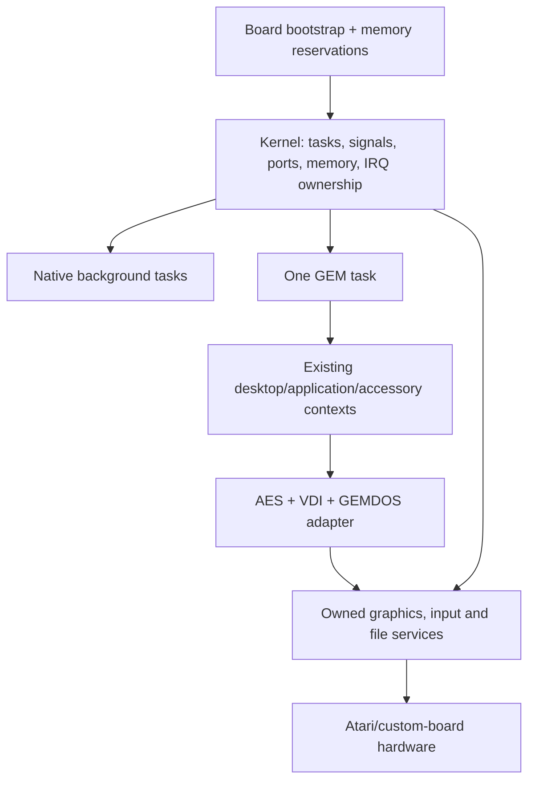

# Integration plan: standalone Exec, then GEM

**Status:** preserved proposal from 2026-09-15; see the
[scope and source baseline](README.md). Kernel and compiler milestones
below have not been reconciled with the current
[Exec816 roadmap](../../roadmap.md).

This is a proposed sequence based on the [repository analysis](README.md) and
[platform contracts](platform-contracts.md). It is not a commitment to a final
API, exact task count or a particular custom-board map.

The [confirmed direction](README.md#confirmed-direction) is a standalone Exec
with GEM as an optional GUI. The kernel's first acceptance test is independent
of GEM. A later GUI port consumes Exec's services through an adapter; compatibility
with the current G4A ABI is a separate choice, not a kernel requirement.

## 1. Define the intended Exec model

The useful precedent is tasks scheduled by priority/activity, task-directed
signals, message ports and devices. Keep graphics, filesystems and desktop
policy above the scheduler. The AmigaOS documentation provides the conceptual
reference; its current examples mix classic and newer APIs, so this proposal
does not copy their C layouts or an Amiga ABI.
[Exec Tasks](https://wiki.amigaos.net/wiki/Exec_Tasks).

Message ports should queue references to owned messages, with a reply returning
ownership. A sender must keep a request and its buffers alive until completion.
Unlike the current GEM UI queue, a device request must not silently disappear
when a queue is full. These semantics follow the useful part of Exec's port model.
[Exec Messages and Ports](https://wiki.amigaos.net/wiki/Exec_Messages_and_Ports).

Signals should represent pending conditions, not count events. Queue contents
and counters carry multiplicity; waking on a signal means checking those sources.
Make checking pending signals and entering the wait state atomic with respect
to signal delivery.
[Exec Signals](https://wiki.amigaos.net/wiki/Exec_Signals).

### Proposed minimal responsibilities

| Kernel facility | Initial contract to specify |
|---|---|
| Task creation/exit | Native entry, stack/DP requirements, priority, owned allocations, completion notification |
| Scheduler | Runnable/waiting states, priority ordering, round-robin among equals, idle task, deferred rescheduling |
| Signals | Per-task pending/wait masks; proposed 32-bit masks, with multiword updates synchronized on this CPU |
| Message ports | FIFO references, sender/reply identity, ownership transfer, explicit failure and shutdown behavior |
| Memory | Reserved physical regions, allocation classes, alignment/bank constraints, independent free and accounting |
| Exclusion | Short interrupt-safe sections and a distinct task semaphore; nesting and wait restrictions defined |
| Timer service | Monotonic time, deadlines, cancellation, wrap-safe comparison and bounded ISR work |
| Device requests | Submit, completion/reply, wait/poll, cancellation and buffer lifetime; no forced free while outstanding |
| Diagnostics | Task identity, registers, PC bank, S/D/DB, allocation owner and fault reason |
| Service discovery | Version/capabilities plus stable entry points, without exposing kernel internal struct layout |

Do not make an AES `PROC` the kernel task structure. A kernel task can have no
GUI, one GEM client can own several windows, and initially an entire cooperative
GEM session can live inside one kernel task. File handles and current directories
belong to a higher process/file-service context rather than the scheduler itself.

## 2. First GUI integration option: one GEM session inside one kernel task

After standalone task, IPC and memory services work, this option preserves UI
behavior and the G4A launch/return convention during GUI bring-up. GEM remains
internally cooperative at this stage. All code entering its renderer and AES
runs within that one task; unrelated native tasks communicate through defined
requests, not direct concurrent GEM calls. The kernel must also work with this
entire GUI task absent. Starting or normally stopping the GUI leaves Exec and
unrelated tasks running; fault recovery remains limited by shared memory.

Safe suspension of the whole GEM task requires its physical memory to remain
mapped and untouched. Give the kernel its own D, stack space and scratch state;
do not let an ISR or another task reuse GEM's compiler workspace. Kernel task
identity must be separate from `ctx_cur`, which can still change as GEM schedules
an accessory. The kernel's IRQ/COP dispatcher remains authoritative throughout.

The current memory map cannot simply have a kernel linked on top. Establish
available always-mapped bank-$00 space first. A native boot can reclaim legacy
reservations once their dependencies are removed; a DOS-hosted prototype needs
an explicitly smaller coexistence budget. Keep GEM's arenas separate from all
kernel allocations so a foreground application exit cannot release kernel state.

### Choose the bootstrap boundary explicitly

| Approach | What it buys | Limitation |
|---|---|---|
| DOS loads the kernel, with a serialized legacy backend retained | Existing CIO/SIO/PBI storage can bring up GEM sooner | Legacy calls still take over interrupts/mappings and can stop scheduling for their duration |
| Native kernel boot with native storage drivers | Kernel controls interrupts, timing and memory continuously | Requires boot/media and filesystem work before the full desktop can load files |

The standalone target uses Exec-owned services. A DOS loader or legacy backend
can be an optional development aid, without making resident DOS a requirement
of Exec's API or architecture. Loading Exec through DOS and depending on DOS
during normal execution are separate decisions. Do not promise preemptive I/O
latency while firmware intervals still take over scheduling. The production
loader, first native storage backend and board remain design decisions.

## 3. Why “put a lock around GEM” is incomplete

Consider two clients: A waits in `evnt_mesag`, and B must send its message. A
service that holds an exclusive engine lock until A's call returns prevents B's
call from running. The same issue occurs with event-driven dialogs and timers.

Initially, let the existing GEM cooperative continuations handle this within
the single GEM task. For a later multi-client service, choose deliberately between:

1. **Explicit pending calls:** copy arguments into a per-client request, register
   event conditions, release active engine ownership, and reply when ready.
   UI operations with their own waits need a state machine or continuation too.
2. **Retained engine continuations:** keep a per-client saved engine stack and the
   audited per-call state, restoring it only when that client is selected. This
   extends the existing mechanism but retains its stack-copy and global-state
   constraints.

Short drawing calls can stay serialized and synchronous. Do not hold a scheduler
disable or IRQ mask through an event wait, a dialog gesture, a full-screen draw
or disk I/O. A graphics semaphore is different from stopping all tasks, and a
gesture's mouse ownership is different from either.

Before multiple ordinary GEM programs run together, add:

- Window owner IDs and routing of redraw/gadget/menu events to that owner.
- Owner-aware update locking, including recursion and owner-exit behavior.
- Per-client current directories, launch parameters and process cleanup.
- Stable identities for file/workstation/resource ownership, independent of a
  movable or recycled `CTX *`.
- Independent allocation lifetimes, with persistent menus/resources pinned while
  the service references them.
- Per-request scratch where a call can suspend; an audit of static renderer,
  form, selector, callback and string-bounce state.
- Event completion that releases engine ownership without invalidating the
  blocked caller's parameter block or stack.

The desktop's unload/run/reload shell is a separate policy change. Kernel
preemption does not automatically turn it into a resident multi-application shell.

## 4. Memory and execution rules to establish first

### Task state

An initial task record should identify its stack extent and high-water mark,
saved machine frame, direct-page workspace, entry/exit state, priority,
ready/wait linkage, signal masks, owned memory and outstanding requests. Keep
the interrupt-reachable portion in always-mapped memory; large metadata can be
far if interrupt code can access it without changing an unstable mapping.

Prefer physically distinct bank-$00 stacks for the first few native tasks if
the chosen map permits them. If stack parking is necessary, require restoration
to identical addresses and specify whether other tasks may hold pointers into a
parked stack. Exec-style messages must not refer to stack bytes that another
context can overwrite. Heap-owned requests simplify this rule.

Treat E=0 as an initial native-task invariant. The mode-switching DOS backend
must enter a separately defined non-preemptible interval before manipulating
shared OS state. This must cover request preparation and mapping transitions,
not just the final `JSR CIOV`.

### Ownership and cleanup

Each allocation records its owner and memory class. Each message/request has
one current owner and a defined reply path. Task exit first stops new requests,
then completes or cancels outstanding work, closes service resources and finally
releases memory. Do not asynchronously free a task's stack while a service is
using its pointers. Initially prefer cooperative task shutdown; a BRK in shared
memory may require stopping the system rather than pretending recovery is safe.

Keep GEM scratch arenas behind their existing call sites if convenient, but
never satisfy independently lived kernel allocations from those arenas. Tests
must interleave allocations by two owners and free them in both orders.

### Interrupt and wait discipline

Specify separate operations for protecting an IRQ-shared list, suppressing a
reschedule briefly, and waiting for a task-owned semaphore. Define nesting and
which operations are legal from IRQ/NMI. A `Forbid`-like API should not appear
until its interaction with waits is deliberate and tested.

For idle, use a race-free check-and-sleep protocol. An interrupt arriving between
“nothing ready” and `WAI` must not leave runnable work asleep. NMI can interrupt
an IRQ-masked section; NMI handlers must either avoid those shared structures or
follow a protocol designed for that nesting.

## 5. Staged work and acceptance evidence

| Stage | Concrete work | Evidence required before moving on |
|---|---|---|
| 0. Reproducible baselines | Pin the kernel toolchain, emulator and board inputs; separately preserve the GEM build/map and relevant GUI fixtures | Native kernel tests can run without GEM; the GUI baseline is available before changing the port |
| 1. Board/bootstrap boundary | Add a handoff with reserved RAM extents, CPU mode, vectors, mappings, display capability and optional legacy I/O | Native entry and exit work without GEM; vector readback and diagnostic output work on the chosen real board |
| 2. Memory + cooperative native tasks | Owner-aware allocation, two task stacks/DPs, explicit yield and exit | Deep locals survive switches; code in different banks runs; freeing either owner leaves the other intact |
| 3. Signals, ports and timers | Atomic wait/wakeup, reliable request/reply, idle, monotonic deadlines | Signal-before-wait and signal-during-wait both complete; repeated events are counted by queues; wrap/cancel cases pass |
| 4. Preemption of native tasks | Full native trap frame, IRQ-safe scheduler and deferred rescheduling | A task that never yields cannot stop a peer; all legal M/X states and hidden register bytes survive; bounded stack use |
| 5. Standalone device/file services | Implement the selected native drivers and file service over Exec requests; keep any legacy backend optional | Non-GUI clients perform concurrent I/O with correct ownership, completion and cleanup; latency is measured |
| 6. GEM adapter and first GUI task | Replace its independent hardware takeover/probe/exit with Exec services and private arenas; translate GEMDOS calls; optionally retain cooperative accessories/G4A startup | Desktop and application behavior match the chosen compatibility scope while native tasks progress; Exec works before GUI start and after normal GUI shutdown |
| 7. Multiple GEM clients | Pending calls/continuations, real window/update ownership, independent process lifetimes | Two GUI clients survive waits, drawing, directory changes and either exit order; existing pixel/event behavior remains valid |

Stages 4 and 6 depend on the actual bank-$00 budget. Do not assume old small
application stacks can absorb the new interrupt prologue; measure and adjust the
G4A launch policy if retained. Standalone Exec is useful before GUI integration;
adding one cooperative GEM session is a later intermediate system before stage 7.

### Existing tests to carry forward

The current host baseline and its limitations are recorded in [README](README.md).
Once target dependencies are configured, the most relevant existing targets are:

| Change area | Existing targets / sources |
|---|---|
| Native vectors, keyboard and timer | `make test-m10`; [m10_irq.py](https://github.com/slaapliedje/gem4xe/blob/01c2e17b072e079443a11eff11d3ab3229db5ed5/tests/emu/m10_irq.py) |
| G4A/COP entry, register preservation, relocation | `make test-m11`; [m11_abi.py](https://github.com/slaapliedje/gem4xe/blob/01c2e17b072e079443a11eff11d3ab3229db5ed5/tests/emu/m11_abi.py), [test_bind.py](https://github.com/slaapliedje/gem4xe/blob/01c2e17b072e079443a11eff11d3ab3229db5ed5/tests/host/test_bind.py) |
| Far memory and bank limits | `make test-m5 test-m6 test-m29 test-m31`; [test_farmem.py](https://github.com/slaapliedje/gem4xe/blob/01c2e17b072e079443a11eff11d3ab3229db5ed5/tests/host/test_farmem.py), [test_g4a.py](https://github.com/slaapliedje/gem4xe/blob/01c2e17b072e079443a11eff11d3ab3229db5ed5/tests/host/test_g4a.py) |
| Shared-stack contexts and accessories | `make test-m27 test-m28`; [m27_ctx.py](https://github.com/slaapliedje/gem4xe/blob/01c2e17b072e079443a11eff11d3ab3229db5ed5/tests/emu/m27_ctx.py), [m28_acc.py](https://github.com/slaapliedje/gem4xe/blob/01c2e17b072e079443a11eff11d3ab3229db5ed5/tests/emu/m28_acc.py) |
| DOS mode switches, files and directories | `make test-m12 test-m14 test-m14x test-m15`; configured U1MB/CF variants as applicable |
| Shell, desktop and launch lifecycle | `make test-m16 test-m17 test-m18 test-boot` |
| Rendering and display selection | `make test-m3 test-m25 test-m26` |
| Printer path | `make test-m30`; [test_print.py](https://github.com/slaapliedje/gem4xe/blob/01c2e17b072e079443a11eff11d3ab3229db5ed5/tests/host/test_print.py) |
| Near memory and compiler assumptions | `make memcheck check-cc` |

The models in [tools/vdiref.py](https://github.com/slaapliedje/gem4xe/blob/01c2e17b072e079443a11eff11d3ab3229db5ed5/tools/vdiref.py),
[tools/aesref.py](https://github.com/slaapliedje/gem4xe/blob/01c2e17b072e079443a11eff11d3ab3229db5ed5/tools/aesref.py) and
[tools/deskref.py](https://github.com/slaapliedje/gem4xe/blob/01c2e17b072e079443a11eff11d3ab3229db5ed5/tools/deskref.py) are valuable behavior oracles for the
ported subset. A pixel match alone cannot prove correct ownership, wakeups,
preemption or register preservation. Preserve those comparisons and add the
specific kernel observations below rather than treating screenshots as enough.

### New kernel tests with high value

- Interrupt at native M/X combinations; preserve A high byte, D, DB, S, PBR and
  CPU flags, including interruption of a block move and nested NMI/IRQ entry.
- Deep stack/local-pointer tests plus interrupt headroom, guard corruption and
  overflow diagnostics. Verify any parked stack returns to the same addresses.
- Deliver a signal just before waiting, during the wait transition and during
  idle entry. Queue multiple messages behind one signal and drain all of them.
- Interleave two owners' near/far allocations, include a bank-edge object and a
  cross-bank span, and exit owners in both orders. Test exhaustion and rollback.
- Malformed G4A headers, inconsistent bank counts, out-of-range entry/fixups and
  failure after partial load must leave every owned region unchanged or reclaimed.
- Suspend client A in an AES event call; client B sends the event. Repeat while
  a dialog is active to expose locks accidentally held across waits.
- Perform legacy DOS I/O with the banked window active; verify stable kernel
  stack/data, retained native vectors and explicit loss/latency behavior.
- Abort or shut down with a pending I/O request; no buffer is freed before the
  backend has stopped using it. Define the response to an unresponsive backend.
- Run a CPU-bound native task beside GEM while measuring worst input and timer
  latency, not only average frame rate. Repeat on real hardware.
- Boot and exercise task creation, allocation, message exchange and device I/O
  with no GEM image present. Start and normally stop the GUI while those clients
  continue, checking for leaked resources and changes to kernel vector ownership.

## 6. Decisions to keep open, with initial defaults

These are design inputs for implementation, not blockers to the present analysis.

| Decision | Working default | Revisit when |
|---|---|---|
| Implementation language | Favor extending actionc for native Action! plus assembly, subject to executable 65816 qualification (assessment below) | The backend executes the kernel's calling, memory and preemption tests |
| First board | The actual Rapidus machine, with its map verified | Target hardware and firmware versions are selected |
| Other custom 65816 boards | Separate board descriptors and bring-up tests | Their linear RAM, native vectors and I/O mappings are known |
| Isolation | Trusted programs in one address space | A concrete protection mechanism is available |
| GEM compatibility | Reuse UI behavior; consider format 3/4 G4A support as an initial adapter option | The cost of compatibility versus rebuilding GUI applications is assessed |
| Native task stacks | Distinct, always-mapped bank-$00 regions | The measured budget requires a different strategy |
| Boot/storage | Standalone Exec services; optional DOS loading/backend only as a development aid | Production loader and first native storage driver are selected |
| Kernel ABI | Versioned service interface, new selector allocated explicitly | Toolchain and task/startup conventions are settled |
| First scheduler policy | Fixed priorities, round-robin among equals | Workload measurements show a different need |
| First demonstrator | Two native tasks exchanging messages and using a device, with no GEM dependency | Native bootstrap, memory map and service contracts are established |
| First GUI demonstrator | Start and normally stop GEM while native background tasks continue | Standalone Exec passes its own acceptance tests |

The first demonstrator should prove ownership, wait/wakeup and context integrity
independently of the GUI. Any development backend that still suspends scheduling
must be identified. GEM then becomes a demanding consumer of those established
services, providing UI integration tests without defining the kernel's internals.

## 7. Toolchain assessment: extend the existing Action! cross-compiler

The proposed Action! route extends the existing cross-compiler, which already
has executable 68k support. It does not start with the original cartridge's
storage model or require a new compiler frontend. This changes the assessment:
**native Action! plus a small assembly core is a credible preferred direction**
for Exec, with backend qualification before substantial kernel development.
This is a recommendation, not a recorded final language selection.

Source inspection on 2026-09-15 used actionc commit
`c73818d91a2b458aa0d65fcb30d2e3ca844699ec`. No actionc tests or generated programs
were run during this inspection.

### What is already present

- Native invocation-local parameters, automatic locals, entry-time initialization
  and recursive/reentrant activation contracts. The completed core work explicitly
  names an Exec-inspired 65816 system as a use case.
  [Native ABI plan](https://github.com/mkur/actionc/blob/c73818d91a2b458aa0d65fcb30d2e3ca844699ec/docs/NATIVE_ROUTINE_ABI_AND_AUTOMATIC_STORAGE_IMPLEMENTATION_PLAN.md).
- Independent native/small 65816 target layouts and a MIR65816 consumer of verified
  NIR. The native layout uses three-byte data/code pointers; its call plans use
  JSL/RTL and 16-bit accumulator/index widths at routine boundaries. Frame and
  task-save requirements are represented explicitly.
  [Target definitions](https://github.com/mkur/actionc/blob/c73818d91a2b458aa0d65fcb30d2e3ca844699ec/src/target.rs),
  [MIR65816 definitions](https://github.com/mkur/actionc/blob/c73818d91a2b458aa0d65fcb30d2e3ca844699ec/src/mir65816/mod.rs).
- An executable MC68000 backend with native frames, relocatable artifacts and
  independent VM validation. Its checkpoint explicitly distinguishes that coverage
  from the 65816 backend's current layout/lowering coverage.
  [MIR68K checkpoint](https://github.com/mkur/actionc/blob/c73818d91a2b458aa0d65fcb30d2e3ca844699ec/docs/MIR68K_CHECKPOINT.md).

### What still needs to be proved

MIR65816 currently stops before register allocation and emission. Reuse the shared
language/IR contracts and the 68k validation approach, then implement actual 65816
instruction selection, allocation/spills, encoding, bank-aware placement, runtime
helpers and startup/assembly adapters. Lowering tests establish planned behavior;
they do not prove native machine-code execution or interrupt safety.

Keep these first acceptance cases small:

1. Direct and indirect calls, address-taken locals, recursion and balanced stacks.
2. Near/far memory access and pointer arithmetic at bank boundaries.
3. Correct M/X, D and DB behavior across calls, runtime helpers and interrupts.
4. Two independently preempted tasks executing the same compiled routine, with
   separate locals and compiler scratch preserved; include nested interrupts.
5. A compiled list/port operation and a volatile device access, observed from an
   independent emulator rather than only compiler IR tests.

The current frame strategy uses bank-zero hardware-stack-relative addressing
with eight-bit displacements. Review the frame/argument limits when adding spills;
this addressing restriction is not a 256-byte limit on the native hardware stack.

GEM can remain compiled by Calypsi. Give Exec an explicit binary service interface
and write adapters: Action!'s planned three-byte native pointers and GEM's
four-byte address fields must be marshaled deliberately. Sharing a compiler is
therefore a convenience, not an architectural requirement. Calypsi and this GEM
port remain useful comparison and hardware references while actionc's new backend
is qualified.
