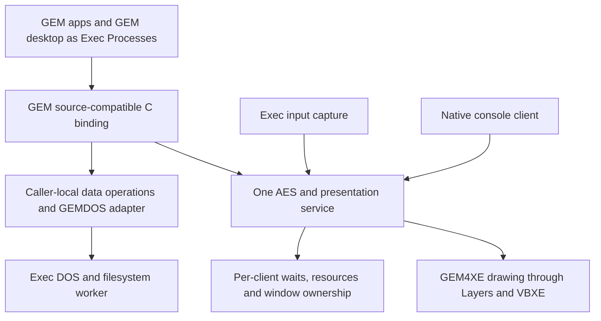

# XaAES study for the Exec816 GEM desktop

[GEM integration](README.md) · [Implementation plans](../README.md) ·
[Source evidence](../../development/xaaes-study.json)

**Assessment, 2026-10-05:** use XaAES as a reference for multitasking AES
semantics while adapting GEM4XE over Exec816. A direct XaAES port would bring
substantial FreeMiNT and 68000 dependencies. Its most useful lessons are client
ownership, pending event waits, dialog continuations, redraw delivery and
resource retirement. These address the gaps between our current native desktop
and a GUI that runs rebuilt GEM applications with minimal source changes.

This is a source study and a proposed direction, not an implementation or a
performance qualification. The existing desktop, widgets and VDI contracts
remain unchanged. The user-confirmed target is a multitasking GEM-compatible
GUI above Exec, using VBXE only. Upper RAM may grow; input-to-visible-response
latency and bank-zero use remain constraints.

## Sources and scope

| Source | Inspected revision |
| --- | --- |
| FreeMiNT and XaAES | `cd0b07fd0f3654d79bcaad38b8d995f0d2e08179`, fetched from upstream master; commit dated 2026-10-03 |
| GEM4XE | `e413c39d2f8e1bec8fe16596f610b923de4a0ae9`, existing local extraction baseline |
| Exec816 | `7268d114604fca6ee2927b063b6603e156bcbcf2`, clean starting tree |

The XaAES source declares version 1.7.0 Beta; use the commit pin, not that
version string, to reproduce this study. The fetched tree lives in ignored
`build/research/xaaes/freemint/`, outside GEM4XE. The evidence record hashes the
inspected inputs and records the inventory method. Neither donor was edited.
This is selected call-path inspection, not a complete correctness audit.
[Version declarations][xa-version]

Compatibility should be a tested list of calls and behaviors, not a claim to
implement every XaAES extension. Its dispatcher itself has unimplemented entries,
including `appl_read`, `appl_tplay` and `appl_trecord`. Preserve supported GEM4XE
behavior where needed, advertise only implemented capabilities, and leave MiNT
process/signal extensions outside the first target. [Dispatch table][xa-table]

The 58 top-level C files in `xaaes/src.km` contain 82,727 physical lines,
including comments and blank lines. This excludes headers, subdirectories and
assembly. It measures source scope only: it is not linked size, required RAM,
porting effort or evidence that a reduced subset would be too large.

## What XaAES actually does

### Execution in the calling process

Current XaAES builds as a FreeMiNT kernel module. `init_km` receives and checks
the kernel entry interface; initialization registers `XA_handler` with trap 2
and creates AES/helper kernel threads. `XA_handler` looks up the current
process's AES client and directly invokes the requested AES routine. Selected
calls acquire the screen lock around that invocation.
[Module build][xa-build], [initialization][xa-init],
[trap dispatch][xa-handler], [helper threads][xa-threads]

It is therefore not a design in which every AES operation goes through one
ordinary server's request queue. Some work executes under the caller's process
identity; input and deferred operations also use internal client events and
helper threads. `cBlock` can execute internal redraws and client events before
sleeping or returning the requested application event. Ordinary GEM messages
and these internal callbacks are different queues.
[Blocking and internal events][xa-block]

The kernel context matters. FreeMiNT's inspected interrupt path checks the
supervisor bit and `in_kernel` before preempting. Porting its semaphore code to
arbitrarily preemptible Exec Tasks would not preserve those assumptions. Exec's
IRQ/NMI and Task-stack rules must remain authoritative; long drawing calls must
not become long `Forbid` sections to imitate FreeMiNT's execution environment.
[Preemption entry][mint-preempt], [Exec Task contract](../../reference/tasks.md)

The 2003 kernel-integration note explains the earlier move away from a user
process using pipes and `Pmsg`: interactive latency and synchronization cost
were explicit concerns. That is historical design rationale, not a measurement
of today's XaAES or our message transport. The transferable lesson is to
measure crossings and wakeups; it does not require moving GUI policy into the
Exec kernel. [Historical rationale][xa-kernel-note]

### Client state and event waits

`init_client` attaches an AES record to the FreeMiNT process. `xa_client` holds
the waiting parameter block and event mask, timeout, button and keyboard state,
message queues, resources, menus, dialog state and exit state. A window has an
explicit owner. The GUI identity is backed by a real OS process; a window does
not imply another process or stack.
[Client admission][xa-client-init], [client record][xa-client],
[window record][xa-window]

`XA_evnt_multi` records the requested conditions and parameter block, installs
a timer when needed, and blocks that client. `check_queued_events` gathers
satisfied conditions into the return mask. Timer and event registrations are
cancelled on completion. Multiple satisfied conditions can be returned; the
protocol is not simply one native input event translated to one AES call.
[Event matching][xa-events], [wait registration][xa-wait]

**Proposed Exec adaptation:** keep this state in upper RAM, keyed to a retained
Task and a separate AES identity. The C binding remains synchronous to its
caller. The service keeps a pending request and completes its reply when the
conditions are satisfied. Checking existing events, registering the wait and
entering the Exec wait must not lose an arrival. Use public message/signal
semantics and one service owner, rather than copying XaAES's `sleep`/`wake`
implementation. Define timer units and wrap handling explicitly.

### Dialogs can wait without stopping the GUI

`XA_form_do` keeps the caller's parameter block and installs form state. Where
appropriate it uses an object-tree widget in a window, then blocks the caller.
Form completion writes the result back and marks the pending call complete.
It also retains a classic path when the application has locked the screen;
automatic windowed dialogs are not a universal property of every call.
[Form setup][xa-form], [form completion][xa-form-exit]

**Proposed Exec adaptation:** extend our existing gesture machinery into a
resumable form operation. Preserve the application's `form_do` call and result,
including object-state and editable-text changes. No dedicated Task per dialog
and no blocking input loop in the presenter. Preserve explicit screen-modal
behavior where the compatibility contract requires it; a blocked caller and a
globally modal interface are separate concerns.

### Update and mouse locks have owners

XaAES's resource locks record a process owner, nesting count and sleepers.
`wind_update` implements screen and mouse operations, including the check-and-set
flag. Screen locking also coordinates mouse locking in the inspected code.
Process exit releases locks held by that process.
[Lock implementation][xa-locks], [wind_update][xa-update],
[exit lock release][xa-exit-locks]

GEM4XE's current `wm_update` only counts screen-update nesting; the source
explicitly says nothing consults that count. That cannot protect two
independently scheduled Exec clients. [GEM4XE update handling][gem-update]

**Proposed Exec adaptation:** implement ownership and nesting in the GUI
service, queue conflicting acquisitions, and let the service process permitted
work while a caller waits. Specify screen/mouse lock ordering and nested try-lock
rollback with tests; do not copy semaphore internals verbatim. Internal bounded
paint tokens and application-held update locks are distinct lifetimes.

An application that computes while holding `BEG_UPDATE` can delay other screen
updates. Preemption alone cannot remove this compatibility restriction. Do not
silently expire its lock and allow competing drawing. Measure the normal case
without a lock separately, diagnose long-held locks, and handle orderly client
exit. Arbitrary fault recovery requires stronger lifecycle support than Exec
currently promises.

### Redraws belong to application owners

XaAES sends `WM_REDRAW` to the owning application and exposes visible rectangles
through `WF_FIRSTXYWH`/`WF_NEXTXYWH`. Moving, sizing, closing and topping generate
application messages; they are not interchangeable with our native desktop's
immediate geometry commands. Frame drawing and application work-area drawing
have distinct responsibilities.
[Window messages][xa-window-messages], [visible rectangles][xa-rectangles]

It keeps separate critical, redraw, ordinary and internal-redraw queues.
Redraw duplicate handling removes identical/contained rectangles for the same
window; the inspected code does not simply union every pair of rectangles.
There is also handling for clients that miss redraws. These queues use dynamic
allocation; our implementation needs its own bounded capacity and exhaustion
policy, rather than inheriting an allocation failure that silently loses work.
[Message queues][xa-messages], [event delivery order][xa-events]

**Proposed Exec adaptation:** retain one authoritative window model shared by
AES clients and the native console. Add GEM redraw delivery and visible-region
enumeration over Layers. Preserve pending damage when notification capacity is
exhausted, and give shutdown/control events bounded progress without starving
ordinary application messages. A stalled client must not prevent service to
unrelated clients, subject to explicit update/mouse locks.

There is a practical API mismatch: classic screen VDI drawing names a
workstation, not a desktop window. A wrapper cannot infer a backing surface by
treating the workstation handle as a window handle. Start with compatible
screen coordinates, clipping and update ownership. Design buffering/caches as
internal optimizations with correct invalidation; do not require apps to replace
their redraw loop with our native `REPLACE` protocol.

### Live object trees and callbacks

`XA_objc_draw` receives the application's object-tree address. Resources and
widget metadata are associated with clients, but a GEM object tree is not our
copied, offset-based `WidgetTree` packet. Applications can modify object states,
strings and editable fields, then draw or interact with that tree again.
[Object drawing][xa-object], [resources][xa-resource],
[current Exec widgets](../../reference/widgets.md)

**Proposed Exec adaptation:** define borrowing and writeback for each operation.
A synchronous draw can borrow the tree until completion; a dialog borrows it
while its caller waits and writes changed fields before returning. Registered
menus and other retained addresses need a longer lifetime contract. Copies are
allowed internally only if they preserve when application edits become visible.
Use full-width addresses and checked conversions between GEM and Exec records.

User-defined objects are a separate difficulty. The current XaAES draw path
uses a 68000 inline-assembly callout (`PROGDEF_BY_SIGNAL` is zero), and restores
clipping after application callback execution. The tree also contains assembly
callback support. Calling arbitrary application code on our sole presenter's
stack would violate the current design and expose it to blocking or reentry.
[User-defined drawing][xa-callout], [assembly support][xa-user-asm]

Keep callbacks explicitly unsupported in the first slice. Before admitting an
application that requires them, design a callback rendezvous executing on its
own Task, including nested VDI requests, clipping, request identity, code/image
lifetime and cancellation. This is a prototype gate, not a solved consequence
of sharing an address space. The application API need not change, but the
binding and service need an explicit protocol.

### Retirement is part of the GUI

XaAES ties its client to process lifecycle callbacks. Cleanup cancels timers
and internal events, removes windows and menus, releases resources and locks,
and prevents further events from targeting a retiring client. `appl_exit` and
process termination are distinct: an application can leave AES and remain an
OS process. [Lifecycle callbacks][xa-lifecycle], [client cleanup][xa-cleanup]

Exec already retains Tasks and waits for exact request retirement, but its
current desktop rejects removing a registered Task; it does not automatically
recover from an arbitrary client crash. Its Process API does not promise forced
termination or memory isolation. [Desktop lifetime](../../reference/desktop.md),
[Process limits](../../reference/process.md)

**Proposed Exec adaptation:** first route normal C return, `appl_exit` and the
supported GEMDOS termination path through orderly GUI retirement before image
or Task storage is released. Drain/fence outstanding drawing and borrowed data
before releasing them. If later exit notification requires kernel support,
design a general public lifecycle operation usable by other services. Do not
add an AES-specific Task extension or claim safe reclamation after corruption.

## What to reuse and what to replace

| Area | Recommended source or mechanism |
| --- | --- |
| GEM headers and application bindings | Preserve GEM4XE's source API; replace its trap/startup transport with Exec C bindings. |
| VDI algorithms, fonts, object/resource code | Continue the pinned GEM4XE extraction, widening supported behavior as applications require. |
| Client identity, waits and form continuations | Use XaAES behavior as a reference; implement with ordinary Exec messages, signals and upper-RAM records. |
| Window ownership and GEM messages | Adapt into the existing single window service, with one stacking/focus authority. |
| Clipping, damage, cursor and VBXE submission | Reuse Exec Layers, presenter and driver; extend their current limits deliberately. |
| GEMDOS and resource-file I/O | Translate to the application's Exec DOS context; extend the C bridge. Avoid blocking the GUI worker on filesystem I/O. |
| Process creation and application exit | Exec Process/loader contracts with a new native C application admission path. |
| FreeMiNT module interface, traps and scheduler assumptions | Replace; these are not portable infrastructure for Exec. |
| XaAES 68000 callouts and input drivers | Replace with registered Exec execution paths and existing input capture. |
| Themes, task manager, printing dialogs and broad AES extensions | Defer unless a selected application requires them. |

XaAES consumes a VDI implementation: its `xa_vdi.c` wraps VDI calls and caches
attributes, and startup opens workstations through gemlib. It does not supply
our missing VBXE raster engine. Its client initialization initially shares the
AES VDI-settings pointer; this should not be mistaken for a complete design for
our applications' independent virtual workstations.
[VDI wrappers][xa-vdi], [workstation setup][xa-workstations],
[client initialization][xa-client-init]

Our current [hosted VDI](../../reference/gem-vdi.md) is one private session with
one workstation and global scratch. Multiple application workstations need
explicit state selection for attributes, clipping and inquiry results, plus
hardware serialization. Neither a second client binding nor XaAES's window
ownership supplies that automatically.

## Recommended execution design

The proposal is a hybrid: client-side GEM bindings and caller-local work,
with one service owning shared AES state and physical presentation. This differs
from XaAES's kernel-module execution. It follows Exec's existing public message
and resource model and avoids duplicating the renderer's deep stack per app.

Keep pure caller-owned operations local where their semantics permit it.
Internal widget primitives execute directly inside the presentation service;
they must not send individual messages back through their own public binding.
Batch ordered application drawing only where output values, borrowing and
visibility rules permit. Copy or retain each buffer for its actual lifetime,
and provide explicit completion for readback, retirement and benchmarks.
Do not impose a VBI wait on every call or accumulate button feedback behind a
large throughput batch. First measure a synchronous implementation; optimize
transport using those measurements.

The single-owner service is not a claim that it will always be faster than
caller-context library execution. It is the lower-risk starting point with our
non-reentrant renderer and bank-zero stack budget. If request overhead dominates,
measure batching and caller-local work before proposing shared library entry.
Exec currently ignores Task priorities, so assigning a high GUI priority would
not solve latency in the present scheduler. [Task scheduling](../../reference/tasks.md)

## Gaps that the study makes explicit

1. **Geometry:** native windows are currently fixed-size and fully onscreen;
   GEM sizing, work-area calculations, scroll gadgets and partially offscreen
   geometry require deliberate extensions to Desktop and Layers.
2. **Identity:** native IDs are 32-bit and never reused within a binding, while
   GEM handles/messages use 16-bit fields. Use checked lookup tables and define
   exhaustion and queued-message retirement; never truncate a native ID.
3. **State:** copied widget packets and their current four object types cannot
   substitute for general AES object trees, editable fields, menus and resources.
4. **Graphics:** independent virtual workstations, additional drawing modes,
   fonts and raster operations remain necessary even with multitasking AES.
5. **Loading and files:** the existing native loader admits the Action! command
   ABI, not arbitrary C/G4A programs. The current C DOS bridge exposes only
   `Output` and `Write`; Exec DOS itself now supports writable filesystems.
6. **Lifecycle:** graceful GUI exit can be built on current ownership rules;
   asynchronous process-death cleanup is additional work, not an existing guarantee.
7. **Capacity:** the demo has eight public Task slots and four desktop windows.
   Budget the system workers and application stacks before promising a client
   count. More upper RAM does not add native stacks or direct pages.

Sources: [Desktop](../../reference/desktop.md), [Layers](../../reference/layers.md),
[widgets](../../reference/widgets.md), [C bridge](../../guides/calypsi-c.md),
[program loading](../../reference/program-loading.md), [DOS](../../reference/dos.md),
[Task capacity](../../architecture/task-capacity.md).

## Proposed executable sequence

These are follow-on proposals; this study authorizes no runtime compatibility
claim and does not mark an implementation milestone complete.

| Slice | Observable acceptance |
| --- | --- |
| Client and wait contract | Two independently scheduled clients use `appl_init`, message/timer waits and exit. No lost wakeups, duplicate completions or cross-client events. |
| Locks and graceful retirement | Nested update/mouse locks, contention and check-and-set work between clients. Normal return with outstanding logical GUI ownership follows defined cleanup. |
| Compatible windows and drawing | Two apps keep their GEM redraw loops. Occlusion, owner routing, rectangle enumeration and independent VDI attributes produce correct pixels. Native console remains usable; retirement now also fences real drawing before freeing buffers. |
| Objects and dialogs | Resource trees, editable text, menus and `form_do` operate with application-visible state preserved. An unlocked windowed dialog does not stop another client. |
| Application coverage | Run G4BENCH workloads without rewriting them to native retained commands; run the donor calculator and clock once their resource/form dependencies exist, then a real editor such as the GEM4XE QED port. |
| Loading and desktop | Load rebuilt C apps independently, launch them from the ported desktop, preserve per-application file/search state and verify repeated launch/exit. |

The calculator uses `form_do` and a resource file; the clock also needs resource
loading and form operations. They are useful compatibility targets, not already
runnable first-slice fixtures. [Calculator][gem-calc], [clock][gem-clock]

Upstream's tests offer useful scenarios, especially `wu_term.c` (return while
holding an update lock), `evnt_mul.c`, window creation and resource loading.
Their Makefile says default testing is compilation only. Several tests also
depend on MiNT signals or other OS services. Borrow the behavioral cases; do
not count compiling them as an Exec runtime pass.
[Tests build][xa-tests], [lock-exit fixture][xa-wu-test]

For each implemented slice, run focused emitted-code development checks with
stack/domain guards, register restoration, bounded completion, SIO coexistence
and exact cleanup. Use raw and optimized builds for changed ABI/compiler-facing
boundaries, optimized for ordinary functional and timing checks. Full hosted
qualification remains a separate tier.

Measure both G4BENCH throughput and capture-to-visible button latency under
idle, redraw and disk load. Record request/reply count, scheduling delay, render
duration and completion delay separately. Include a CPU-busy client without an
update lock, a slow redraw consumer, queue exhaustion, and a separate lock-holder
case. Select acceptance limits from measured baselines before implementing
optimizations; no XaAES timing result was obtained in this study.

## Memory and validation limits

No runtime code or ABI changes were made. Reserved bank-zero delta for this
study is **0 bytes fixed/kernel, 0 root, 0 per public Task and 0 private idle**,
including guards, alignment and unused reserved capacity. Upper-RAM and VRAM
runtime reservation changes are also zero. Future client metadata and suspended
form state should live in upper RAM; new or enlarged Task stacks need an explicit
budget and target measurement.

XaAES's build uses GCC `-mshort`, so it is incorrect to reject it merely on an
assumption that its C `int` is always 32 bits. Nevertheless, its flat pointers,
68000 assembly, byte order, callback ABI, resource layouts and kernel context
are real porting boundaries. No host `sizeof` result can establish a Calypsi
bank-zero budget. [Compiler flags][xa-flags], [callouts][xa-callout]

Validation for this document is source-pin/hash verification, inventory
recomputation, content review and link/anchor checks. Neither XaAES nor a new
Exec image was built or run. No claim is made about linked footprint, hardware
latency, crash isolation or full AES conformance. No XaAES implementation code
was imported; its inspected source headers retain their GPL-2.0-or-later notices.

**Recommended next step:** specify the client/wait and window-redraw contracts,
then prove two GEM clients over the existing renderer. Keep GEM4XE as the source
of already adapted graphics/object code and use XaAES to guide the multitasking
semantics. Reconsider direct XaAES extraction only when a measured, isolated
component offers a clear advantage over that path.

[xa-version]: https://github.com/freemint/freemint/blob/cd0b07fd0f3654d79bcaad38b8d995f0d2e08179/xaaes/src.km/version.h#L39
[xa-build]: https://github.com/freemint/freemint/blob/cd0b07fd0f3654d79bcaad38b8d995f0d2e08179/xaaes/src.km/Makefile#L19
[xa-init]: https://github.com/freemint/freemint/blob/cd0b07fd0f3654d79bcaad38b8d995f0d2e08179/xaaes/src.km/init.c#L329
[xa-handler]: https://github.com/freemint/freemint/blob/cd0b07fd0f3654d79bcaad38b8d995f0d2e08179/xaaes/src.km/handler.c#L480
[xa-table]: https://github.com/freemint/freemint/blob/cd0b07fd0f3654d79bcaad38b8d995f0d2e08179/xaaes/src.km/handler.c#L104
[xa-threads]: https://github.com/freemint/freemint/blob/cd0b07fd0f3654d79bcaad38b8d995f0d2e08179/xaaes/src.km/k_main.c#L1679
[xa-block]: https://github.com/freemint/freemint/blob/cd0b07fd0f3654d79bcaad38b8d995f0d2e08179/xaaes/src.km/k_main.c#L335
[mint-preempt]: https://github.com/freemint/freemint/blob/cd0b07fd0f3654d79bcaad38b8d995f0d2e08179/sys/arch/intr.S#L397
[xa-kernel-note]: https://github.com/freemint/freemint/blob/cd0b07fd0f3654d79bcaad38b8d995f0d2e08179/xaaes/xaaes-kernel.txt
[xa-client-init]: https://github.com/freemint/freemint/blob/cd0b07fd0f3654d79bcaad38b8d995f0d2e08179/xaaes/src.km/xa_appl.c#L153
[xa-client]: https://github.com/freemint/freemint/blob/cd0b07fd0f3654d79bcaad38b8d995f0d2e08179/xaaes/src.km/xa_types.h#L2114
[xa-window]: https://github.com/freemint/freemint/blob/cd0b07fd0f3654d79bcaad38b8d995f0d2e08179/xaaes/src.km/xa_types.h#L1440
[xa-events]: https://github.com/freemint/freemint/blob/cd0b07fd0f3654d79bcaad38b8d995f0d2e08179/xaaes/src.km/xa_evnt.c#L322
[xa-wait]: https://github.com/freemint/freemint/blob/cd0b07fd0f3654d79bcaad38b8d995f0d2e08179/xaaes/src.km/xa_evnt.c#L537
[xa-form]: https://github.com/freemint/freemint/blob/cd0b07fd0f3654d79bcaad38b8d995f0d2e08179/xaaes/src.km/xa_form.c#L954
[xa-form-exit]: https://github.com/freemint/freemint/blob/cd0b07fd0f3654d79bcaad38b8d995f0d2e08179/xaaes/src.km/form.c#L1148
[xa-locks]: https://github.com/freemint/freemint/blob/cd0b07fd0f3654d79bcaad38b8d995f0d2e08179/xaaes/src.km/semaphores.c#L34
[xa-update]: https://github.com/freemint/freemint/blob/cd0b07fd0f3654d79bcaad38b8d995f0d2e08179/xaaes/src.km/xa_wind.c#L1890
[xa-exit-locks]: https://github.com/freemint/freemint/blob/cd0b07fd0f3654d79bcaad38b8d995f0d2e08179/xaaes/src.km/xa_appl.c#L544
[gem-update]: https://github.com/slaapliedje/gem4xe/blob/e413c39d2f8e1bec8fe16596f610b923de4a0ae9/src/aes/wind.c#L1280
[xa-window-messages]: https://github.com/freemint/freemint/blob/cd0b07fd0f3654d79bcaad38b8d995f0d2e08179/xaaes/src.km/c_window.c#L832
[xa-rectangles]: https://github.com/freemint/freemint/blob/cd0b07fd0f3654d79bcaad38b8d995f0d2e08179/xaaes/src.km/xa_wind.c#L1380
[xa-messages]: https://github.com/freemint/freemint/blob/cd0b07fd0f3654d79bcaad38b8d995f0d2e08179/xaaes/src.km/messages.c#L378
[xa-object]: https://github.com/freemint/freemint/blob/cd0b07fd0f3654d79bcaad38b8d995f0d2e08179/xaaes/src.km/xa_objc.c#L43
[xa-resource]: https://github.com/freemint/freemint/blob/cd0b07fd0f3654d79bcaad38b8d995f0d2e08179/xaaes/src.km/xa_rsrc.c#L1290
[xa-callout]: https://github.com/freemint/freemint/blob/cd0b07fd0f3654d79bcaad38b8d995f0d2e08179/xaaes/src.km/draw_obj.c#L331
[xa-user-asm]: https://github.com/freemint/freemint/blob/cd0b07fd0f3654d79bcaad38b8d995f0d2e08179/xaaes/src.km/xa_user_things.S#L29
[xa-lifecycle]: https://github.com/freemint/freemint/blob/cd0b07fd0f3654d79bcaad38b8d995f0d2e08179/xaaes/src.km/sys_proc.c#L42
[xa-cleanup]: https://github.com/freemint/freemint/blob/cd0b07fd0f3654d79bcaad38b8d995f0d2e08179/xaaes/src.km/xa_appl.c#L655
[xa-vdi]: https://github.com/freemint/freemint/blob/cd0b07fd0f3654d79bcaad38b8d995f0d2e08179/xaaes/src.km/xa_vdi.c#L72
[xa-workstations]: https://github.com/freemint/freemint/blob/cd0b07fd0f3654d79bcaad38b8d995f0d2e08179/xaaes/src.km/k_init.c#L435
[xa-tests]: https://github.com/freemint/freemint/blob/cd0b07fd0f3654d79bcaad38b8d995f0d2e08179/xaaes/src.km/tests/Makefile#L11
[xa-wu-test]: https://github.com/freemint/freemint/blob/cd0b07fd0f3654d79bcaad38b8d995f0d2e08179/xaaes/src.km/tests/wu_term.c
[xa-flags]: https://github.com/freemint/freemint/blob/cd0b07fd0f3654d79bcaad38b8d995f0d2e08179/xaaes/src.km/CONFIGVARS#L12
[gem-calc]: https://github.com/slaapliedje/gem4xe/blob/e413c39d2f8e1bec8fe16596f610b923de4a0ae9/src/apps/calc.c#L167
[gem-clock]: https://github.com/slaapliedje/gem4xe/blob/e413c39d2f8e1bec8fe16596f610b923de4a0ae9/src/apps/clock.c#L120
