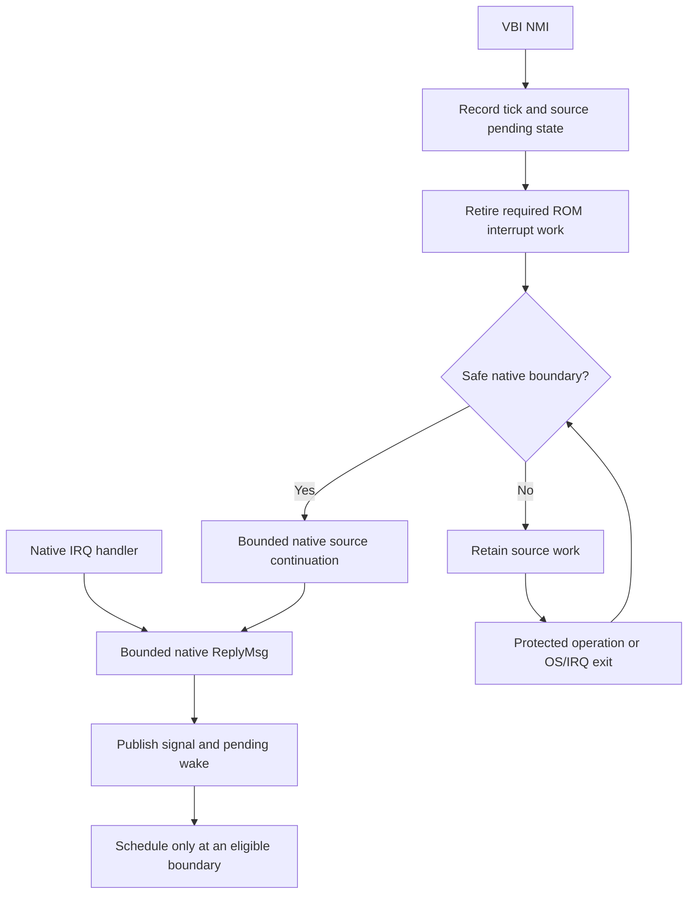

# ReplyMsg from interrupt context

[Implementation plans](README.md) · [Current port contract](../reference/ports.md) ·
[timer.device design](timer-device-design.md)

The [IR0–IR5 implementation plan](interrupt-reply-implementation-plan.md) assigns
code changes, dependencies and executable acceptance gates to this design.

Status: implementation/design record, 2026-10-05. Native ReplyMsg and controlled continuations are implemented; see the
[execution record](../history/interrupt-reply.md) for development results and the
remaining 125k timer-load timing gate. This page preserves the design baseline,
not a release qualification claim.

## Decision

Extend the existing `ReplyMsg` operation with a bounded native interrupt entry.
Use one queue-publication mechanism for Task and interrupt replies, protect all
operations on the same queues, and notify recipients through the existing
interrupt-to-signal wake mechanism. Publication does not schedule a Task inside
an interrupt handler.

Exec816 controls its NMI path. The early VBI handler records time and pending
work; it does not edit message queues. NMI-origin device work runs through a
native continuation after the ROM activation has retired, at a boundary where
the adapter can prove shared state is consistent. If interrupted work is still
protected, retain the notification and run it when protection ends. Never spin
in NMI waiting for the interrupted code to release a lock.

This follows classic Amiga Exec's allowance for `ReplyMsg` from interrupts,
adapted to the 65816's IRQ/NMI and native/emulation transitions. It adds no
`WaitTimed`, new COP signature or timer-specific kernel operation. It does
require changes to generic message internals and a documented native platform
continuation interface; these are real implementation work, not existing
capabilities. [Amiga ReplyMsg contract][amiga-reply]

The first consumer is the proposed timer driver, which can then operate without
a worker Task. Timer queues, deadlines, cancellation and open/close policy stay
in the driver. Existing SIO, console and display drivers are not automatically
migrated to a new completion model by this change.

## Existing mechanisms and gaps

The [current port path](../../lib/exec/task-ports.inc) serializes Task calls under
SWITCHING but assumes IRQ/NMI never reads its queues. `SendMessage` changes the
node type, appends through `EXECLISTS.AddTail`, then posts the port signal.
The 24-bit links and the 32-bit signal mask need multiple memory accesses.

The [assembly GetMsg path](../../platform/altirraos/fast-getmsg.inc) removes a
head using several stores. [I/O collection](../../lib/io/task-io.inc) can remove
a particular reply from the middle of that same list. Protecting interrupt
append alone would leave both consumers unsafe.

There is already an IRQ-safe native signal publisher and a separate retained
wake queue. The [NMI/IRQ return path](../../platform/altirraos/preemptive.s)
checks SWITCHING, IRQ depth, OS activity and the interrupted I flag before
entering scheduling. These are foundations to extend, not proof that message
publication is already safe. Task ready-list policy remains in Exec.

## Proposed public contract

The operation continues to return ownership through the message's reply port:
set `NT_REPLYMSG`, append once, then announce arrival. A null reply port follows
the existing `NT_FREEMSG` behavior and does not free storage. FIFO order is the
order of completed queue publications; simultaneous hardware events have no
additional cross-device ordering guarantee.

| Calling context | Proposed behavior |
| --- | --- |
| Ordinary Task | Existing `EXEC.ReplyMsg` binding and COP service; use the common protected publication implementation. |
| Adapter-owned native IRQ activation | Public native ReplyMsg entry; queue and signal publication completes before it returns, with no scheduling. |
| Native continuation for deferred interrupt work | Same native entry and synchronous publication guarantee. |
| Early emulation-mode VBI/NMI, live ROM frame or unnormalized interrupt entry | Do not call ReplyMsg here. Record retained source work and request its native continuation. |

Deferral happens **before calling ReplyMsg**. Do not make ReplyMsg return while
the message is secretly waiting in another completion queue: that would change
its publication and lifetime semantics. The driver retains ownership until the
continuation commits completion and calls ReplyMsg.

The initial scope does not make all Exec operations callable from interrupts.
Allocation, waits, port creation/deletion, arbitrary device callbacks and ordinary
C/Action! bindings remain subject to their current context rules. `PutMsg` and
`GetMsg` remain Task-facing in this slice, though their internals must tolerate
concurrent interrupt replies. No application callbacks or software-interrupt
port actions are introduced; supported port actions remain PA_SIGNAL/PA_IGNORE.

### Native binding

Provide a documented public assembly binding for the same ReplyMsg operation,
not a private timer import. Proposed entry requirements are E=0, M=X=0, I=1,
and a fully saved outer interrupt context. Pass the message's low 16 address
bits in A and bank byte in X, with X's high byte zero. Return with A/X/Y, P,
D, DBR and the entry stack position preserved. Final names and exact frame
sizes belong in generated ABI declarations and emitted-code probes.

Keep the existing Task COP selector and packet unchanged. The native entry
does not recursively issue COP, borrow the Action! kernel stack, use the
interrupted Task's compiler scratch, or modify its saved continuation. It uses
checked activation-local storage and explicit far accesses. A public native
binding is an interface addition, not an alternate Task API or profile.

The adapter admits the interrupt frame and its stack bounds before calling a
driver. Drivers provide valid, owned messages and stable reply endpoints.
Perform bounded structural/context checks; never allocate or scan the heap in
an ISR. Invalid pointers, duplicate replies and unsupported contexts are
contract violations, not recoverable queue-full conditions. Generate bindings
from the port/platform ABI inputs and keep public interfaces under the existing
interface licence policy.

## Queue transactions

Task scheduling exclusion and IRQ exclusion have different roles. Preserve
SWITCHING for kernel context ownership. Add short IRQ-masked transactions for
port links and their completion state. All Task and native interrupt paths
must use the same rules; preserve the incoming interrupt mask on return.
Every transaction must also be covered by an NMI-visible exclusion: the Task
gateway's SWITCHING ownership, an admitted IRQ/continuation activation, or an
explicit publication guard. An I=1 bit by itself is insufficient once the
return protocol permits completion in specifically validated masked frames.

| Operation | Required atomic portion |
| --- | --- |
| PutMsg / ReplyMsg | Snapshot the stable endpoint, set node state and append all links, then publish the signal while the queue is complete. |
| GetMsg | Read the head/sentinel and remove the selected node as one transaction, including the empty and single-node cases. |
| WaitIO collection | Inspect completion state and remove that exact reply atomically; no partially published `NT_REPLYMSG` may be collected. |
| CheckIO / WaitPort head observation | Observe a consistent completion state/head. Waiting remains outside the transaction. |
| Port retirement | Require stopped/drained producers and an empty queue before deletion; short exclusion does not replace lifetime ownership. |

Do not protect an entire kernel call, list search or driver operation by masking
IRQs. Prepare immutable arguments and validate extents first. The masked portion
must have fixed, measured cost independent of queue length. Shared signal/wake
updates also remain bounded. If separate queue and signal transactions are
used, retain the recipient and port across both and prove their ordering; a
combined bounded native publication is the preferred initial implementation.

Generic `EXECLISTS` remains caller-synchronized. Do not make every list operation
globally interrupt-masked. Audit every direct access to active message lists,
including fast assembly and exact-request collection; route those accesses
through the shared port mechanism. Inactive port initialization still requires
quiescence. A Task's Forbid region alone is no longer sufficient for hand-editing
an interrupt-replied port. [Amiga Forbid distinction][amiga-forbid]

## Controlled NMI and native continuations

The early NMI path may update the clock and atomically mark a source pending.
It must not traverse a timer queue, alter port links, call compiled driver code,
or enter shared scheduler workspace. Nested NMI during a queue transaction
therefore cannot corrupt that transaction even though SEI does not mask NMI.

Define a reusable native platform facility for deferred interrupt sources:
immutable source IDs and native continuation entries in generated resident
metadata, with enabled/pending/running state in upper RAM. Any built-in driver
can use it; test a non-timer source first. Arbitrary runtime function-pointer
registration and application callbacks are outside this slice. The public
native source-notification entry only records work; dispatch is an adapter
implementation detail, with no new driver-only kernel selector.

Source notifications are coalescing hints. Each source retains authoritative
work in its own bounded state. Use independently writable pending flags rather
than an unprotected read/modify/write bitmap shared with NMI. Claim/acknowledge
the hint before inspecting source state, then rearm it when work remains.
A notification overlapping acknowledgement must either be covered by the
subsequent state inspection or remain pending. Never clear a notification after
the final work check. Prove this protocol with injected NMI between each step.

Native continuation dispatch requires a complete, validated native frame, no
live ROM activation, no kernel stack/DP transition, no active queue transaction
and no recursively running continuation. It must not borrow the kernel's
SWITCHING-protected workspace. Use a separate native service-active guard where
needed; NMI observes that guard and only records further work. Do not clear or
pretend to own an interrupted activation's SWITCHING flag.

Continuations are interrupt routines: bounded native code, no blocking, no
allocation, no public Task-context device dispatch and no compiled callbacks.
They may use the native ReplyMsg entry and audited native driver helpers.
Run with IRQs masked only for the bounded state/port transactions; any IRQ-open
windows require a fully published state and preserved outer frame. Forbid
continues to suppress Task scheduling, not interrupt work. A driver that needs
to defer its own continuation during a longer edit must expose a stable busy
gate and retain pending work; it cannot rely on Forbid alone.

### Guaranteed service opportunities

Audit all return paths, not just `interrupt_schedule`:

- Native IRQ and post-ROM NMI returns, after outer interrupt state permits it.
- Task COP and fast-service exits, after shared kernel state and the selected
  native stack are consistent, before the final restore-only sequence.
- OS bridge exit, after OS_BUSY is retired and a native frame is restored.
- Release of a driver edit gate, and the final work check before a Task would
  sleep or the machine enter idle.

Task-side driver gate release may use the existing Poll gateway when source
work is pending, so its common return path services that work. Do not call a
native continuation directly from an arbitrary compiled driver frame. Native
gate release leaves the obligation to its admitted interrupt return path.

A brief protected operation must not force an already pending completion to
wait for another VBI. Service it at the next eligible boundary. Do not insert a
call in the middle of stack restoration merely because SWITCHING just became
zero: that is still a transition, not a complete callable frame. Preserve the
existing exclusions for genuinely masked foreign/OS contexts.

A notification can arrive after a final pending check. Close that gap with an
explicit return-phase handoff: mark the exit unsafe until state and stack
selection are complete; then publish a completion-safe phase before the final
pending check. NMI before that publication leaves work for the exit check. NMI
after it may run native completion from its own saved frame, including when the
interrupted I bit is still set by the return sequence. Keep scheduling separately
prohibited until its normal conditions hold. The completion-safe phase must stay
valid through the restore-only tail; prove its stack bounds and register
preservation rather than infer them from SWITCHING alone.

This narrowly admitted return phase is not permission to run callbacks on an
arbitrary foreign frame or inside an IRQ-masked queue transaction. Port and
driver edit guards still exclude them. A bare pending check followed by RTI is
not a liveness proof, and repeated unrelated interrupts must not be required to
finish a protected handoff. Reject the implementation slice if it cannot close
this last-check race within the existing stack budget.

Bound both each continuation and total work at one service opportunity. Leave
remaining work pending, provide IRQ opportunities between safe batches, and
define how the bounded backlog progresses before sleeping. Budget exhaustion
may add latency and must be measured; it is distinct from an unconditional
one-frame delay. No unbounded drain-to-empty loop is permitted under sustained
hardware input.

## Signals, scheduling and ownership

Complete every queue link and result field before announcing the port signal.
Generalize the existing native wake publisher to a validated, retained port
recipient without calling Task-side Signal or ready-list policy recursively.
Preserve its atomic relationship with Wait publication, SetSignal and wake-node
claiming. The interrupt routine may record a pending wake; only the scheduler
at an eligible boundary makes the corresponding scheduling decision.
If native completion posts a wake after kernel policy has already selected a
return Task, the common exit must reconsider that selection when scheduling is
allowed. In particular, do not restore idle with a retained runnable wake and
wait for another VBI. Reentry is a new scheduling activation only after the
previous kernel activation is fully retired, never a recursive call into it.

The producer retains the recipient Task and endpoint for its full asynchronous
lifetime. Keep the port, signal allocation and message stable until producers
are stopped, pending source work and wakes are drained, and replies collected.
A Task lease protects Task removal, not arbitrary port deletion or premature
FreeSignal; those remain explicit caller ownership obligations. The interrupt
entry must not create a new lease after publication has already become possible.

After publication, neither driver nor reply primitive may access the message
again. Keep any final wake/return metadata in activation-local storage. Check
immediate collection/free/reuse after interrupt return as well as after Task
replies. PA_IGNORE queues work without waking a Task; null reply ports only
retire the message type. Neither case creates a storage-freeing protocol.

Signals may be stale or coalesced. Existing drain/check/Wait loops remain valid;
there must be no clear-signal gap between checking a queue and sleeping. WaitIO
still collects only its requested reply, leaving unrelated traffic intact.
The arrival of a reply does not guarantee immediate recipient execution.

## Device cancellation and timer integration

ReplyMsg does not decide whether an operation has completed. Each driver must
serialize expiry/completion versus AbortIO, commit one terminal result, detach
all private references and call ReplyMsg once. IRQ-safe publication alone does
not make a driver's pending queue interrupt-safe.

For timer.device, keep the raw VBI path to clock/pending publication. A bounded
native timer continuation selects due requests and commits their results.
Task-side BeginIO/AbortIO and that continuation share a driver ownership protocol:
Task edits are serialized with other Tasks, a stable edit gate defers native
timer work during preparation, and short masked commits publish queue changes.
Release the edit gate with a pending-work handoff. NMI never waits on it.

Expiry wins only when the driver commits the success result. If AbortIO commits
first, it removes the timer and replies with IOERR_ABORTED. Reaching a deadline
alone is not a terminal result. Once either result is published, cancellation
leaves it unchanged. No request is freed or reused until its reply is collected.
This preserves ordinary SendIO/WaitIO semantics without adding a timer worker.

The adapter dispatches generic native sources; it does not inspect timer
deadlines, device queues, cancellation flags or open counts. Timer native
continuations and their state belong to the driver. Broader driver migrations
require their own emitted-code and lifetime checks.

## Scope, memory and verification

Target **0 additional fixed bank-zero reservation and 0 additional per-Task
reservation**. Native code, continuation metadata and persistent state belong
in upper memory; use activation-local scratch within existing interrupt
headroom. No Task or private interrupt stack is presumed. Measure the complete
IRQ plus nested-NMI stack peak on every admitted entry path, including OS
coexistence. If it does not fit, report the full reservation change, guards,
alignment and spare capacity before expanding anything.

Avoiding the proposed timer worker leaves one ordinary Task slot available:
1,024 stack bytes, 32 guard bytes and 256 DP bytes remain available in the
existing pool. That is 1,312 bytes of avoided occupancy, not reclaimed physical
memory or a smaller bank-zero reservation.

Measure masked cycles per append, dequeue and exact-reply collection; reply to
signal latency; deferred-source delay; worst simultaneous-completion burst;
and SIO/pointer behavior under load. Keep code-bank placement and the actual
65816 clock/ROM/emulator configuration pinned. The comparison is against the
current message path and proposed timer worker, not a claim that fewer Tasks
automatically makes every operation faster.

| Slice | Observable acceptance |
| --- | --- |
| IR0: native contract and ownership | Generated entry/source definitions, audited queue-access inventory, memory/stack budget and a non-timer interrupt fixture. |
| IR1: shared port transactions | Task behavior preserved while append, fast GetMsg, exact WaitIO collection and observations use consistent protection; empty/single/multiple-node and bank-crossing cases. |
| IR2: native IRQ ReplyMsg | Real IRQ replies, retained signal recipients, PA_SIGNAL/PA_IGNORE/null cases, no recursive COP or scheduling, complete register/DP/stack restoration. |
| IR3: controlled NMI and deferred sources | Interrupts at every guard/flag/restore boundary; pending work progresses through kernel and OS exits without requiring a second tick; bounded batches and no idle-with-work failure. |
| IR4: races and coexistence | Reply versus Wait/SetSignal, abort versus completion, immediate request reuse, mixed reply ports, shutdown/slot reuse, nested IRQ/NMI and SIO/pointer load. |
| IR5: timer adoption gate | Native timer queue/edit protocol, bounded expiry bursts and zero timer-worker admission; compare completion/input latency and stack use before revising implemented reference contracts. |

Run focused emitted-code tests under the [two-tier policy](../contributing/testing.md).
Use raw/optimized probes for new native bindings, record access and context
preservation; optimized behavioral, integration and timing checks otherwise.
Force IRQ/NMI at each link write and around pending acknowledgement, guard
release, signal publication and final return. Include CPU-bound Tasks that make
no voluntary Exec calls, plus a sleeping sole client, so progress does not rely
on accidental polling. Preserve stack/domain guards and OS restoration checks.

Documentation checks alone do not qualify this behavior. Update current
reference contracts only with their passing implementation slice. Actual
reservation delta for this note is **0 bytes fixed and 0 bytes per Task**.

[amiga-reply]: https://developer.amigaos3.net/autodocs/exec.library/ReplyMsg.html
[amiga-forbid]: https://developer.amigaos3.net/autodocs/exec.library/Forbid.html
